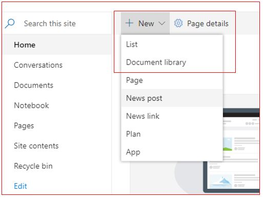
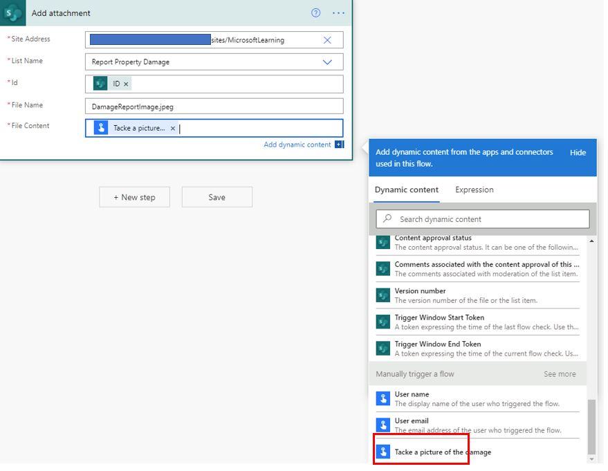
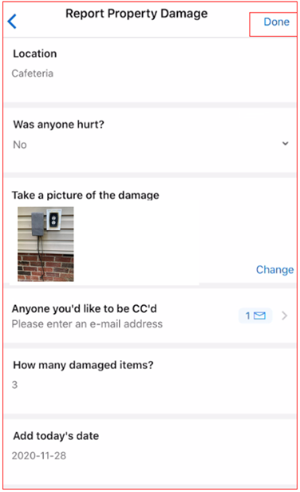

In this unit, you will create a flow button that will allow a user to report damage
that was noticed on the company's property. The data will be saved on a SharePoint
list.

1. Go to the SharePoint online site of your choice.

1. On the upper left of the SharePoint site, select the **+ New** drop-down menu and then select **List**.

    

1. On the right most side of the screen is the **Create list** option. Give the list a name,
    such as **Reported Property Damage**. Select **Create**. You will be automatically redirected
    to the new list. The list will automatically have the **Title** field option available.

1. Select **Settings**, which is available on the upper-right of the screen
    and looks like a gear icon. Hovering your mouse over the icon will show the
    **Settings** option. Next, select **List settings**, which will take you
    to the **Reported property damage settings** page. In the middle of the
    screen, you will see the **Columns** section, which already has the **Title** option available.

    

1. Select **Title** and change the column name from **Title** to
    **Location**. Scroll down and select **OK**, which is available on the
    lower right of the screen.

1. Below the columns, select **Create column**.

1. Enter **Was anyone hurt?** as the column name. Confirm **Single line of
    text** as the type of column. Scroll down and select **OK** on the lower right of the screen.

1. Follow the previous two steps to add the **Email** and **How many damaged items** columns.

1. Select **Create column**. Add **Date submitted** as the column
    name and, this time, select **Date and Time** as the type of column.
    Scroll down and select **OK** on the lower right of the screen.

    

    The following screenshot shows an example of all the columns.

    

1. [Go to Power Automate](https://flow.microsoft.com/?azure-portal=true) and sign in.

1. On the left vertical menu, select **+ Create**.

1. On the top of the page is the **Three ways to make a flow** heading. Select the
    **Start from blank** option from the menu and then select the **Instant flow** option.

1. Enter **Report Property Damage** as your **Flow name** and select the
    **Manually trigger a flow** option.

1. Select **Create** to start building the button flow.

   You are now in the flow studio with the flow title and the **Manually trigger a flow**
   trigger already added.

    

1. Select the **Manually trigger a flow** trigger and then select **+ Add an input**.

1. Select **Text**. Replace the **Input text** with **Location**.

1. Select **+ Add an input** and select **Yes/No**. Replace **Yes/No** with **Was anyone hurt?**

1. Select **+ Add an input** and select **File**. Replace **File Content** with **Take a picture of the damage**.

1. Select **+ Add an input** and select **Email**. Replace **Email** with
    **Anyone you'd like to be Cc'd?**

1. Select **+ Add an input** and select **Number**. Replace **Number** with **How many damaged items?**

1. Select **+ Add an input** and select **Date**. Replace **Trigger date** with **Add today's date**.

1. Select **+ New step** and search for SharePoint. Under **Actions**, select **Create item**.

1. In the **Create item** action, for **Site Address**, select the
    drop-down arrow, which is available to the right and then select the
    site where your list is available. If the site doesn't appear,
    then select **Enter custom value** and paste the site URL.

1. In the **List Name** field, select the **Reported Property Damage** list that you previously created.
    After you have selected the list, the column names will appear below it.

1. In the **Location** field on the right, and then in the **Dynamic Content** section, select **Location**.

    

1. Do the same for the other fields. After you have completed the steps, the result should look like the following image.

    

1. Select **+ New step** and search for SharePoint. Under **Actions**,
    select **Add attachment**.

1. For **Site Address**, select the drop-down arrow, which is to the
    right, and then select the site where your list is available. If the site
    doesn't appear, select **Enter custom value** and paste the site URL.

1. In the **List Name** field, select the **Reported Property Damage** list that you previously  
    created. After the list is selected, the column names will appear
    below it.

1. In the **Id** field, select **ID** dynamic content.

    

1. In the **File name** field, enter **```DamageReportImage.jpeg```**.

1. In the **File Content** field, in the **Dynamic Content** section, select
    **Take a picture of the damage**.

    

1. Select **Flow checker**, which is available on the upper right of the screen. If
    you have zero errors and warnings, select the **X** and then select **Save**.

1. You can now test the button by using your smartphone. Open the Power Automate
    app and select the **Buttons** option on the lower horizontal menu. You
    will now see the **Report Property Damage** button. Select this button.

1. Populate all the items in the user input fields and then select **Done**.

    

1. You can return to your SharePoint list and confirm the new item, including the image that has been added.

    

Now, you have successfully created the app by using all six user inputs.
