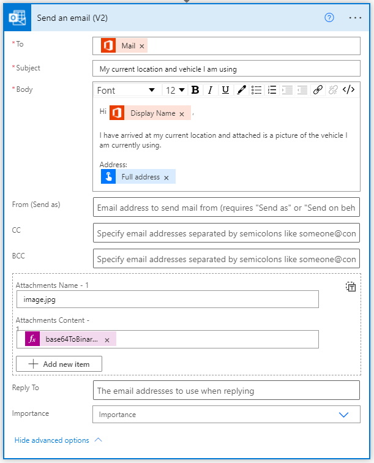

In this unit, you will build a flow that is triggered by a button that will send an email to your manager
of your current location along with a photo of the vehicle that you are using.

1.  [Go to Power Automate](https://flow.microsoft.com/?azure-portal=true) and sign in. 

1.  On the left vertical menu, select **+ Create**.

1.  On the top of the page, you will see the **Three ways to make a flow** drop-down menu. Select **Start from blank** 
	and then select **Instant flow**.

1.  Enter **Notify Your Manager** as your **Flow name** and select the 
	**Manually trigger a flow** option.

1.  Select **Create** to start building the flow.

    You are now in the flow studio with the flow name and the **Manually trigger a flow** 
	trigger already added.

    

1.  Select the **Manually trigger a flow** trigger and then select **+ Add an input**.

1.  Select **File** and rename **File Content** to **Image**.

1.  Select **+ New step** and search for **Office 365 Users**. Under **Actions**, select the **Get manager (V2)** option.

1. In the **User (UPN)** field, from the **Dynamic content** section, select **User email**.

    

1. Select **+ New step** and search for Outlook. Under **Actions**, select the **Send an email (V2)** option.

1. In the **To** field, in the **Dynamic content** section, under **Get manager (V2)**, select **Mail**. You might have to select **See more** to find **Mail**.

   

12. In the **Subject** field, enter ```My current location and vehicle I am using```.

13. In the **Body** field, enter the following text:

    ```
    Hi
	
    I have arrived at my current location and attached is a picture of the vehicle I am currently using.
	
    Address:
    ```

14. In the **Body** field, after the word **Hi**, select **Display Name**, which is available in the **Dynamic content** section under **Get manager (V2)**.

15. In the **Body** field, below **Address:**, select **Full address**, which is available in the **Dynamic content** section under **Manually trigger a flow**. You might have to scroll down a bit to find it. The following screenshot shows what the **Send an email (V2)** action looks like.

    

16. Select **Flow checker,** which is available on the upper right of the screen. If you have zero errors and warnings, select the **X** and then select **Save**.

17. You can now test the button by using your smartphone. Open the app and select the **Buttons** option on the lower horizontal menu. Select the **Notify Your Manager** button. To add an image, select the **paper clip icon** and add an image by taking a new picture with your camera or by using an existing image from your photo library.

Your manager will get an email with an image attached.
