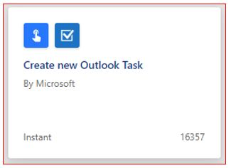
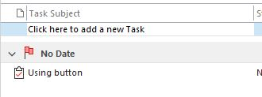

This exercise shows you how to use an existing button template to
add a new Outlook task rather than creating a button flow from blank, which
you did earlier in this module.

This exercise uses the **Create new Outlook Task** template.

Follow these steps:

1.  [Go to Power Automate](https://flow.microsoft.com/?azure-portal=true) and sign in. 

1.  On the left vertical menu, select **Templates**.

1.  Below the **Search templates...** search box are several options such as **All flows**, **Featured**, **Shared with me**, and so on. Find and select the **Button** option.

    

1.  Find the **Create new Outlook Task** template and select it.

    

1.  Select **sign in**.

    A temporary authentication pop-up window might appear and require you to add your username and password.

1.  Select **Create Flow**.

    Your new flow will automatically be created.

1.  You can now test the button by using your smart phone. Open the app and select the **Buttons** option 
    on the bottom horizontal menu. Select the **Create new Outlook Task** button.

1.  Add a task name and task description and then select **Done**, which is available on the upper-right 
    side of the app.

    

1.  To confirm that the flow has run successfully, go to Outlook on your local machine and select the **Task icon** on the lower left of the screen.

1.  Verify that you see the new task.

	

