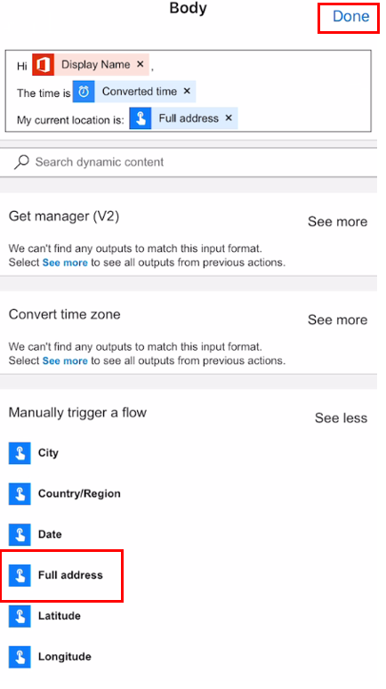
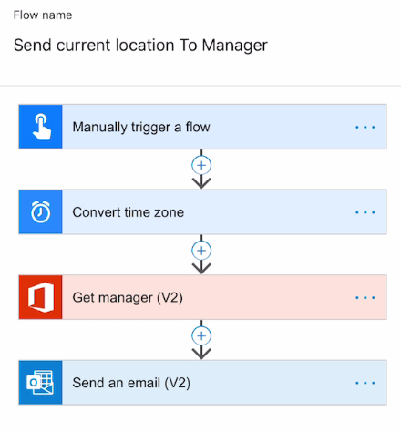
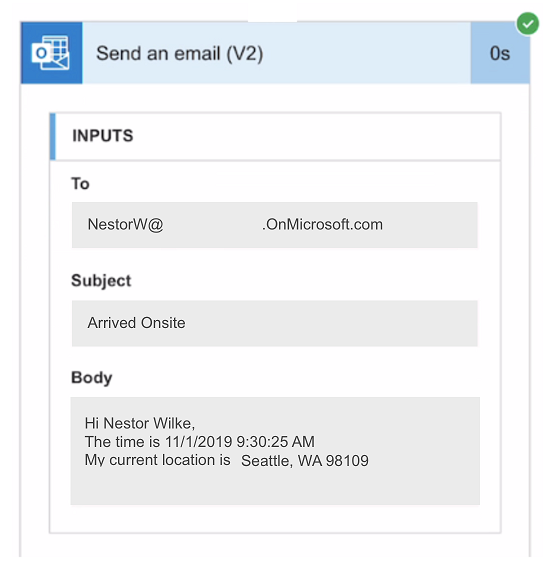

Are you a field service analyst who is delayed for the next appointment due to traffic? Or your current appointment has taken longer than expected and will be delayed for your next?

Don't you wish there was an easier way to let your manager know your current location so that your next appointment can be handed off to someone else?

This unit describes how to build a flow that is triggered by a button that
will send an email with your current location to your manager. The flow will be built
entirely from the Power Automate app on your smart phone.

1. In the Microsoft Power Automate app, select the **Flows** icon that
    is available in the lower portion of the app. Select the **+** icon
    on the upper right of the app.

1. A menu option will slide upward from the lower part of the app. Select the
    **Create from blank** option.

1. In the **Connectors** option, select **Flow button for mobile**. If you don't
    see the option, then search for it in **Search all connectors and triggers** and then
    select it when you've found it.

1. In the **Manually trigger a flow** trigger, select **+**,
    **Add an input**, and then **Text**. Select **Input**,
    delete **Input**, and then enter **Reason**. Select **Done** in the upper right of the page.

1. Select **+** and then **New step**.

1. Select **Add an action**.

1. Search for **Time**. Select **Date Time** and then select **Date Time Convert time zone**.

   :::image type="icon" source="../media/date-time-connector-icon.png":::

1. Select **Base time** and then select the **Timestamp** option from **Manually trigger a flow**
    and then select **Done**.

   

1. For both **Source time zone** and **Destination time zone**, select the same time zone that works for your geographic location. This example uses the **(UTC-05:00) Eastern Time (US & Canada)** option. After you have selected the time zone, select **Done** on the upper right of the screen.

1. For **Format String**, select **General date/time pattern (short time) - Monday, June 15, 2009 1:45 PM (g)**.

1. In the **Connectors** option, select **Office 365 Users**. If you
    don't see the selection, then search for it in **Search all connectors and
    triggers** and then select it when you've found it.

1. Select **Office 365 Users Get Manager (V2)**.

1. Select **User email** from **Manually trigger a flow** and then select **Done**.

   :::image type="icon" source="../media/user-email-trigger-action.png":::

    

1. Select **+ New step**.

1. Select **Add an action**.

1. In the **Connectors** option, select **Office 365 Outlook**. If you
    don't see the selection, search for it in **Search all connectors and
    triggers** and then select it when you've found it.

1. Select **Office 365 Outlook Send an email (V2)**.

1. Select **To**. In the **Get manager (V2)** option, select **See
    more**, select **Mail**, and then select **Done**.

1. Select **Subject**, enter **Arrived Onsite**, and then select **Done**.

1. Select **Body** and then enter the following text:

    ```Hi.```

    Then, next to **Get Manager (V2)**, select **See more**. Select **Display Name** and then **Done**.

    

1. Select **Body** again and then enter the following text:

   ```r
   I have arrived at the location.

   The time is
   ```

    

    Next to **Convert time zone**, select **See more**, select
    **Converted time**, and then select **Done**.

    

1. Select **Body** again and then enter the following text:

    

    ```My current location is:```

1. Select **Manually trigger a flow > See more > Full address**. Select **Done**.

    

1. Give your flow a name such as **Send current location to Manager**
    and then select **Create** on the upper right of the screen.

    

1. In the next screen, select **Done**.

1. On the lower horizontal menu, select **Buttons** and then select your new **Send current location to Manager** option.

1. Your manager will receive an email.

    
