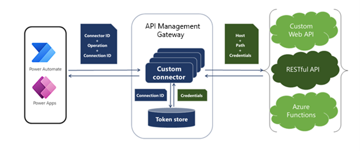

Custom connectors can provide access to custom or partner APIs that are accessible through public endpoints. Many of the APIs that are accessible in this manner are secured and require authentication. Custom connector infrastructure provides several methods to help you make the underlying API more secure. The following table shows the authentication schemes that are supported.

|     Scheme                       |     Notes                                                                                                                                                                                                                                                       |
|----------------------------------|-----------------------------------------------------------------------------------------------------------------------------------------------------------------------------------------------------------------------------------------------------------------|
|     No authentication            |     No authentication   is required. Anyone can use the connector anonymously.                                                                                                                                                                                  |
|     Basic   authentication       |     Included in   standard [Basic Authentication](https://swagger.io/docs/specification/2-0/authentication/basic-authentication/?azure-portal=true) Open API specification.                                                                                                                                                                                       |
|     API Key                      |     Included in   standard [API Key](https://swagger.io/docs/specification/2-0/authentication/api-keys/?azure-portal=true) Open API specification.                                                                                                                                                                                                    |
|     OAuth 2.0                    |     This scheme   is only available for online connectors. In addition to support for generic   OAuth 2.0, the platform provides implementations for specific services,   including Microsoft Azure Active Directory (Azure AD), GitHub, Microsoft account, and more.    |
|     Windows   authentication     |     This scheme   is available only for connections that use [on-premises data gateway](/data-integration/gateway/service-gateway-onprem/?azure-portal=true).                                                                                                                                                                           |

## Azure API Management gateway

Custom connectors are supported by Microsoft Azure API Management infrastructure, so it's beneficial to understand how this infrastructure helps facilitate secure API access.

> [!div class="mx-imgBorder"]
> 

When the target API is on-premises, the use of the connection is the same, but as the following image shows, the API is accessed through the on-premises gateway.

> [!div class="mx-imgBorder"]
> 

When a connection to the underlying API is created, the API Management gateway stores the API credentials or tokens, depending on the type of authentication used, on a per-connection basis in a token store. Because only an authenticated user can create a connection, the connections are always authenticated. Anonymous access is not provided to the instance of a custom connector in the API Management gateway, which allows the gateway to more securely store API credentials on a per-connection basis and then use them as required.

This solution enables authentication at the connection level. After a connection has been created, you don't need to authenticate API again when a custom connector is used interactively in an app in Microsoft Power Apps, in an automated Microsoft Power Automate flow, or in a Microsoft Azure Logic Apps workflow. Depending on how connectors and connections are shared, credentials are collected at the different stages of a custom connector life cycle.

## Connector and connections sharing

After a maker configures a custom connector and then provides a more secure API, they have a choice of how to share the connector and connections. The manner that the connector and the connections are managed and shared have implications on the connector's security.

The rest of this module explores how to configure custom connectors for the different types of authentication.

