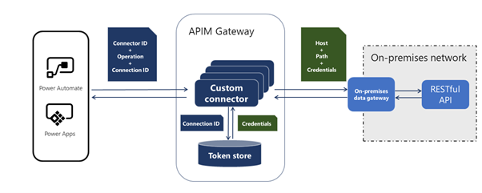

Custom connectors can provide access to custom or third-party APIs that are accessible via public endpoints. Many of the APIs accessible in this manner are secured and require authentication. Custom connector infrastructure provides variety of methods to secure the underlying API. The following authentication schemes are supported:

|     Scheme                       |     Notes                                                                                                                                                                                                                                                       |
|----------------------------------|-----------------------------------------------------------------------------------------------------------------------------------------------------------------------------------------------------------------------------------------------------------------|
|     No authentication            |     No authentication   is required. Anyone can use the connector anonymously.                                                                                                                                                                                  |
|     Basic   authentication       |     Included in   standard [Basic Authentication](https://swagger.io/docs/specification/2-0/authentication/basic-authentication/?azure-portal=true) Open API specification.                                                                                                                                                                                       |
|     API Key                      |     Included in   standard [API Key](https://swagger.io/docs/specification/2-0/authentication/api-keys/?azure-portal=true) Open API specification.                                                                                                                                                                                                    |
|     OAuth 2.0                    |     This scheme   is only available for online connectors. In addition to support for generic   OAuth 2.0, the platform provides implementations for specific services   including Azure Active Directory (Azure AD), GitHub, Microsoft account, and   more.    |
|     Windows   authentication     |     This scheme   is available only for connections using [on-premises data gateway](https://docs.microsoft.com/data-integration/gateway/service-gateway-onprem/?azure-portal=true).                                                                                                                                                                           |

## Azure API management gateway

Custom connectors are supported by Azure API Management infrastructure and it helps to understand how this infrastructure facilitates secure API access.

> [!div class="mx-imgBorder"]
> 

When the target API is on-premises the use of the connection is the same, but as you can see in the following image the API is accessed via the on-premises gateway.

> [!div class="mx-imgBorder"]
> 

When a connection to the underlying API is created, the APIM gateway stores the API credentials or tokens, depending on type of the authentication used, on a per connection basis in a token store. Since only an authenticated user can create a connection, the connections are always authenticated. There's no anonymous access to the instance of a custom connector in APIM gateway. That allows APIM gateway to securely store API credentials on a per connection basis and use them as required.

This solution enables authentication at the connection level and, once a connection is created, there's no need to authenticate API again when a custom connector is used either interactively in a Power Apps app, or in an automated Power Automate flow or a Logic Apps workflow. Depending on how connectors and connections are shared, credentials are collected at the different stages of a custom connector lifecycle.

## Connector and connections sharing

After a maker configures a custom connector and secures the API, they have a choice of how to share the connector and connections. How the connector itself and the connections are managed and shared have implications on the connector's security.

In the rest of this module, we'll explore how to configure custom connectors for the different types of authentication.

