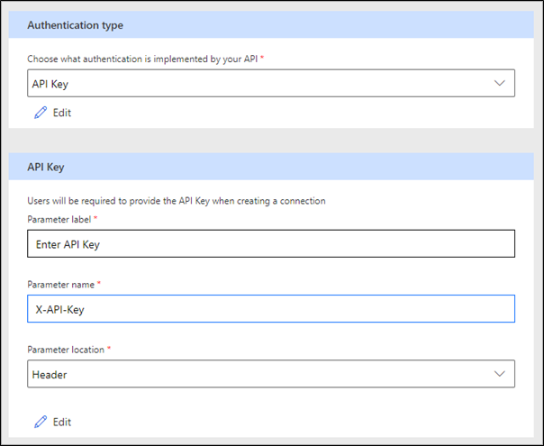
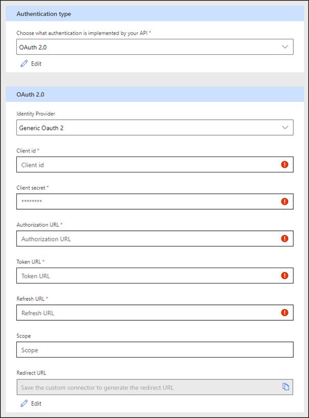

Before using any connector in Azure Logic Apps, Power Automate, or Power Apps, the user needs to create a connection by authenticating to the network service. When creating a custom connector, you can define how the person who will be using the connector will authenticate. You can select the type of authentication on the **Security** tab in the online connector wizard. Additional information that you need to provide will depend on the selected authentication scheme.

## No authentication

When the **No authentication** option is selected, no further information is required. The user won't need authentication to create a connection to the custom connector, and any anonymous user can use the connector. This option would be used only when the API allows anonymous use.

## Basic authentication 

The simplest type of authentication is **Basic authentication**, where the user will provide the user name and password to create the connection.

The values that you enter under the **Parameter label** column aren't the actual user name or password; they're labels for these fields that the user will see while creating the connection.

> [!div class="mx-imgBorder"]
> 

In the preceding example, the user will be prompted to enter **User** and **Password** to create a connection. You should match the labels to the names that are used by the API to clarify to someone who is creating a connection what values to use with that connection.

Any service connection that uses **Basic authentication** must use secure HTTPS protocol to avoid sending unencrypted credentials over the wire.

## API Key authentication

**API Key** is a popular authentication scheme that is used by web services. For example, Microsoft Azure Functions includes code parameters as part of the default template.

> [!div class="mx-imgBorder"]
> 

Make sure that you define the following values:

-   **Parameter label** - The label for the user prompt when a new connection is created.

-   **Parameter name** - The name of the parameter that will contain the key value during each service request.

-   **Parameter location** - Gives makers an option to send the API key in the request header or the query string when they are calling the underlying service.

In the previous example, the user who is creating a new connection will see the following prompt.

> [!div class="mx-imgBorder"]
> 

The supplied value will be sent to the underlying service as a custom X-API-Key request header.

The default Azure Functions template can use code as the parameter name and then send it as part of the query by setting the parameter location to **Query** so that the service URL will be similar to [https://functionurl.azurewebsites.net?code=user-supplied-code](https://functionurl.azurewebsites.net?code=user-supplied-code/?azure-portal=true).

Similar to **Basic authentication**, we recommended that you use the **API Key** authentication scheme only with HTTPS protocol to avoid sending the keys unencrypted.

## OAuth 2.0 authentication

The **OAuth 2.0** authentication scheme is only available for online connectors. Other than providing support for Generic OAuth 2.0, the platform provides implementations for specific services, including Azure Active Directory (Azure AD), GitHub, Microsoft account, and more. Prebuilt identity provider templates, when selected, fill in many of the fields that are required by OAuth 2.0, with provider-specific values reducing what you need to provide.

> [!div class="mx-imgBorder"]
> 

Additional information that will be collected depends on the identity provider. The Generic OAuth 2.0 provider requires the following parameters.

|     Parameter            |     Description                                                                                                                                                                                                  |
|--------------------------|------------------------------------------------------------------------------------------------------------------------------------------------------------------------------------------------------------------|
|     Client ID            |     OAuth app identifier in the target system, entered manually or   generated by the provider when the app is registered.                                                                                       |
|     Client secret        |     Secret associated with the OAuth app, generated by the provider. Most of the providers can also revoke   existing secrets and issue new ones.                                      |
|     Authorization URL    |     URL used to sign in the user and authorize the   application, for example:     `https://www.facebook.com/v9.0/dialog/oauth` or `https://login.salesforce.com/services/oauth2/authorize`.                         |
|     Token URL            |     URL used to fetch a token after the app has been authorized   by the user, for example:     `https://graph.facebook.com/v9.0/oauth/access_token` or `https://mycompany.salesforce.com/mycompany.salesforce.com`.    |
|     Refresh URL          |     URL used to fetch a new token by using a refresh token   after the original one has expired. This URL is usually the same as the Token URL   for most services.                                                       |
|     Scope                |     String representing the permissions that you seek   from the user. Leave this parameter blank or refer to the provider documentation to   specify the permission scope that your app requires.                          |

Make sure that you register the connector with the identity provider as a client application; specific registration details are provider-dependent and documented by the identity provider. For example, to authenticate by using Facebook, a maker would create a Facebook app by using their development tools. Because the **Client ID** and **Client secret** parameters are part of OAuth 2.0 specifications, they're provided by all OAuth 2.0 identity providers as part of the app registration. One value that needs to be included with the app registration is **Redirect URL**. This value in the connector configuration is initially empty but becomes available when the configuration is saved. It can then be copied and saved with the connector registration with the identity provider.

Most of the specific providers only require client ID, client secret, and optional scope because all URLs are predefined for a specific service.

> [!div class="mx-imgBorder"]
> 

After the connector has been published and made available for users, they will be asked to enter their credentials for signing in to the service during the connection creation process. These credentials will be used by the application to get an authorization token. For every request, this authorization token will be sent to your service through the standard authorization header.

The authorization token is short-lived, and the connector runtime will use the refresh process to renew so that users of the connector are not involved in the refresh process.

## Windows authentication

The Windows authentication option is available only for connections that use [on-premises data gateway](https://docs.microsoft.com/data-integration/gateway/service-gateway-onprem/?azure-portal=true), when the **Connect via on-premises data gateway** check box is set on the **General** tab. No additional information is required for the Windows authentication scheme.

When a new connection is created, the user will need to provide Windows credentials for the service and then select one of the installed on-premises gateways.

> [!div class="mx-imgBorder"]
> 

Open API specification that is used by the platform includes both [API Key](https://swagger.io/docs/specification/2-0/authentication/api-keys/?azure-portal=true) and [Basic authentication](https://swagger.io/docs/specification/2-0/authentication/basic-authentication/?azure-portal=true) definitions. You can also modify them directly online by using the Swagger editor. Other authentication schemes store authentication information separately as the extended properties of the connector. While this information is not available for direct source editing online, you can modify it by using [the paconn tool](https://docs.microsoft.com/connectors/custom-connectors/paconn-cli/?azure-portal=true). The Command-Line Interface (CLI) allows scripting of the connector deployment process where automated deployment is required.

Custom connectors support several authentication schemes to accommodate requirements for allowing access to secure REST API services. When API services are deployed and secured within an Azure AD environment, the connector's infrastructure delivers other benefits. You will learn more about Azure AD specifics in the next topic.
