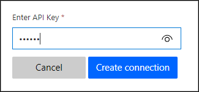
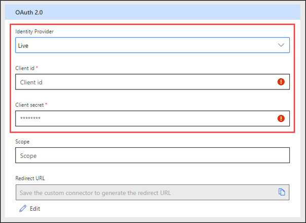

Before using any connector in Azure Logic Apps, Power Automate, or Power Apps, the user needs to create a connection by authenticating to the backend service. When creating a custom connector, you can define how the user using the connector will authenticate. You can select the type of authentication in the Security tab in the online connector wizard. Additional information you need to provide will depend on the authentication scheme selected.

## No authentication

No further information is required when this option is selected. The user will not need any authentication to create a connection to the custom connector and any anonymous user can use the connector. This would be used only when the API allows anonymous use.

## Basic authentication 

This is the simplest type of authentication, where the user will have to provide the username and password to create the connection.

The values you enter under the "Parameter Label" column are not the actual username or password. They are labels for these fields that the user will see while creating the connection.

> [!div class="mx-imgBorder"]
> 

For the example as shown above, user will be prompted to enter "User" and "Password" to create a connection. You should match the labels to the names used by the API to make it clear to someone creating a connection what values to use with that connection.

Any service connection using this authentication scheme must use secure https protocol to avoid sending unencrypted credentials over the wire.

## API key

API Key is a very popular authentication scheme used by the web services. For example, Azure Functions include code parameter as part of the default template.

> [!div class="mx-imgBorder"]
> 

The following values need to be defined:

-   **Parameter label**. This is the label for the user prompt when a new connection is created.

-   **Parameter name**. This is the name of the parameter that will contain the key value during each service request.

-   **Parameter location**. This field gives maker an option to send the API key in the request header or the query string when calling the underlying service.

In our sample configuration above, the user creating new connection will see the following prompt:

> [!div class="mx-imgBorder"]
> 

The supplied value will be sent to the underlying service as a custom X-API-Key request header.

Default Azure Functions template can use code as the parameter name and send it as part of the query by setting parameter location to query so that the service URL will be similar to [https://functionurl.azurewebsites.net?code=user-supplied-code](https://functionurl.azurewebsites.net?code=user-supplied-code/?azure-portal=true).

As with basic authentication, it's recommended to use this authentication scheme only with https protocol to avoid sending the keys unencrypted.

## OAuth 2.0

This scheme is only available for online connectors. Besides support for generic OAuth 2.0, platform provides implementations for specific services including Azure Active Directory, GitHub, Microsoft account, and more. Pre-built identity provider templates, when selected, fill in many of the fields required by OAuth 2.0 with provider-specific values reducing what you need to provide.

> [!div class="mx-imgBorder"]
> 

Additional information collected depending on the identity provider. Generic OAuth 2.0 provider requires the following parameters:

|     Parameter            |     Description                                                                                                                                                                                                  |
|--------------------------|------------------------------------------------------------------------------------------------------------------------------------------------------------------------------------------------------------------|
|     Client ID            |     OAuth app identifier in the target system, entered manually or   generated by the provider when the app is registered.                                                                                       |
|     Client Secret        |     Secret associated with the OAuth app, usually   generated by the provider. Most of the providers also have ability to revoke   existing secrets and issue the new ones.                                      |
|     Authorization URL    |     URL used to sign in the user and authorize the   application. For example:     `https://www.facebook.com/v9.0/dialog/oauth`; `https://login.salesforce.com/services/oauth2/authorize`                         |
|     Token URL            |     URL used to fetch a token once the app is authorized   by the end user. For example:     `https://graph.facebook.com/v9.0/oauth/access_token`; `https://mycompany.salesforce.com/mycompany.salesforce.com`    |
|     Refresh URL          |     URL used to fetch new token using a refresh token   after the original one has expired. This is usually the same as the Token URL   for most services.                                                       |
|     Scope                |     String representing the permissions that you seek   from the end user. Leave this blank or refer to the provider documentation to   specify the permission scope your app requires.                          |

The connector itself will have to be registered with the identity provider as a client application, specific registration details are provider-dependent and documented by the identity provider themselves. For example, to authenticate using Facebook, maker would need to create a Facebook app using their development tools. Since Client id and client secret are part of OAuth 2.0 specifications, they are provided by all OAuth 2.0 identity providers as part of the app registration. One of the values that needs to be included with the app registration is the Redirect URL. This value in the connector configuration is initially empty but becomes available when the configuration is saved. It can then be copied and saved with the connector registration with the identity provider.

Most of the specific providers only require client id, client secret, and optional scope because all URLs are predefined for a specific service.

> [!div class="mx-imgBorder"]
> 

After the connector is published and available for the users, they will be asked to enter the credentials for login to the service during the connection creation process. These credentials will be used by the application to get an authorization token. For every request, this authorization token will be sent to your service through the standard authorization header.

The authorization token is short-lived, and the connector runtime will use the refresh process to renew so users of the connector are not involved in the refresh process.

## Windows authentication

This option is available only for connections using [on-premises data gateway](https://docs.microsoft.com/data-integration/gateway/service-gateway-onprem/?azure-portal=true), when connect via on-premises data gateway checkbox is set on the general tab. No additional information is required for Windows authentication scheme.

When a new connection is created the user needs to provide Windows credentials for the service and select one of the installed the on-premises gateway.

> [!div class="mx-imgBorder"]
> 

Open API specification used by the platform includes both [API Key](https://swagger.io/docs/specification/2-0/authentication/api-keys/?azure-portal=true) and [Basic Authentication](https://swagger.io/docs/specification/2-0/authentication/basic-authentication/?azure-portal=true) definitions. They can also be modified directly online using the Swagger editor. Other authentication schemes store authentication information separately, as the extended properties of the connector. While this information is not available for direct source editing online, it can be modified using [the paconn tool](https://docs.microsoft.com/en-us/connectors/custom-connectors/paconn-cli/?azure-portal=true). The CLI allows scripting of the connector deployment process where automated deployment is required.

Custom connectors support several authentication schemes to accommodate requirements to allow access to secure REST API services. When API services are deployed and secured within an Azure Active Directory environment, connectors infrastructure delivers some additional benefits. You will learn more about Azure AD specifics in the next topic.