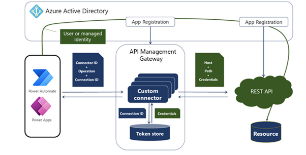
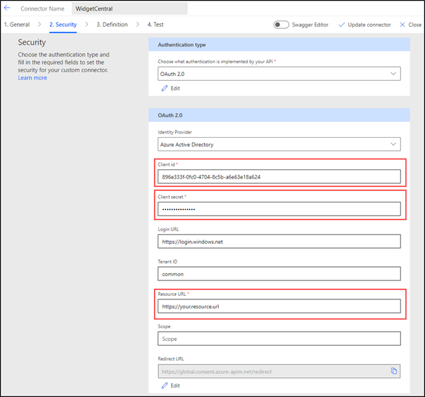

Azure Active Directory (Azure AD) authentication is a recommended authentication scheme. Unlike other approaches, it has the following unique attributes:

-   It allows authentication on behalf of the user consuming the connection. It means that users cannot get access to the resources that they do not already have access to. The target service maintains responsibility for enforcing what is permitted for the authenticated user.

-   The target service knows the identity of the user performing the connection thus allowing more checks using Active Directory information without explicitly asking a user for further details.

-   It supports [managed identities](https://docs.microsoft.com/azure/active-directory/managed-identities-azure-resources/overview/?azure-portal=true) where controlled access to the underlying resource eliminates the need for both developers and users having to manage credentials.

The internals of the Azure AD secured custom connector are similar to a generic secured connector.

> [!div class="mx-imgBorder"]
> 

The main difference is that both custom connector itself and the target app service are registered as the apps within the Azure AD. That allows maker to apply appropriate permissions and pass the calling user identity from a Power Apps app, Power Automate flow, or Logic Apps workflow through to the underlying service.

The service can be either an existing service registered in Azure AD like Microsoft Graph API or a custom service implemented using, for example, either Azure Functions or Azure App Service. The important characteristic of the service is that it protects and authorizes access to the secured resources using Azure AD identity of the caller.

## Securing the service

If an organization already has a service implementation using either Azure Functions or Azure App Service, adding Azure AD authentication is a simple configuration exercise.

> [!div class="mx-imgBorder"]
> 

1.  Select authentication/authorization blade

1.  Enable service authentication

1.  Set default action on unauthorized access

1.  Configure and register app in Azure Active Directory

Enabling the Azure AD authentication makes the caller identity information available to the underlying service that can now use this information.

## Securing the connector

Callers access the underlying service only via custom connector. To allow the connector to pass through the caller identity, it needs to be registered as a separate app in Azure AD. In addition, it needs to be granted *delegated permissions* to the API service to be able to perform actions *on behalf of* the caller.

> [!div class="mx-imgBorder"]
> 

Because the custom connector will be accessing the API on behalf of the user, consent is required. Usually, users are prompted for consent when a connection is created by the custom connector. Some of the permissions may require administrative consent that can be granted by an administrator for all users in the organization.

After the custom connector is registered in Azure AD, it can now be configured using custom connector wizard.

> [!div class="mx-imgBorder"]
> 

Select OAuth 2.0 as the authentication type and set identity provider to Active Directory. The following parameters are required:

-   ***Client ID***: ID of the Azure AD app that will identify the connector.

-   ***Secret***: Secret created during the Azure AD app registration.

-   ***Resource URL***: Resource identifier for your service.

Once configuration is saved, the Redirect URL will become available to add as a valid callback to the app registration.

The configuration is stored in apiProperties.json file and developers can also use [paconn command line tooling](https://docs.microsoft.com/connectors/custom-connectors/paconn-cli/?azure-portal=true) to update the configuration as required. For example, secret key, instead of being defined by the maker, can be managed and rotated automatically as part of the enterprise deployment.

## Checklist for securing connectors with Azure Active Directory

1.  Register two Azure AD apps.

    1.  One to identify and protect API service.

    1.  Second to identify and protect your connector.

1.  Delegate permissions. Allow your connector's registered app to make "on-behalf" calls to your service's identity.

1.  Secure your connector using client ID, secret, and resource URL.

1.  Add redirect URLs to the connector app registration.

1.  If your service is secured with Cross-Origin Resource Sharing (CORS) scheme, allow list Azure API Management domains ('usually azure-apim.net') for CORS on your service.

Setting up Azure AD authentication involves more steps of registering apps and identities in Azure AD but has more benefits making it a preferred scheme for securing custom connectors.