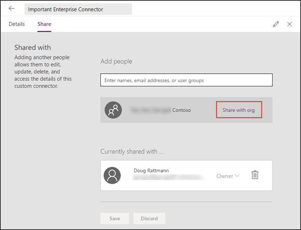

Public connectors are automatically available to all users. Custom connectors need to be [shared with the users in your organization](https://docs.microsoft.com/connectors/custom-connectors/share) before they can be used. After a maker configures a custom connector and secures the API, they have a choice of how to share the connector and connections to make them available to other users.

## Logic apps

Custom connectors in Logic Apps are visible and available to the connector's author and users who have the same Azure Active Directory tenant and Azure subscription for Logic Apps in the region where those apps are deployed. No additional steps are required for sharing.

## Standalone connectors

Custom connectors created outside of a solution can be shared explicitly within the same environment. To share the connector or to view the sharing status, open the connector from the list of custom connectors and switch to the share tab.

> [!div class="mx-imgBorder"]
> 

Custom connectors can be shared with individual users, user groups, or the entire organization. Organization sharing only allows use of the connector (can view). User and group sharing adds the ability to share the connector with others (can view + share) and to author the connector (can edit).

> [!div class="mx-imgBorder"]
> 

Once a custom connector is available, makers can start building assets like canvas apps or cloud flows that use the connector. When a maker creates a new connection, they will need to provide their own set of credentials to be used. When the app or cloud flow using the connection is shared with other users, the maker has a choice of either sharing the existing connection or asking the users to provide their own set of credentials.

Individual connections can also be shared explicitly. This adds flexibility for the maker to select between securing the connection itself or delegating the permission management to the connector.

The other option to make a custom connector available to other users is to [share an app](https://docs.microsoft.com/powerapps/share-app/?azure-portal=true) or [share a cloud flow](https://docs.microsoft.com/power-automate/create-team-flows/?azure-portal=true) that uses the connector. Connectors shared via an app or a cloud flow can only be used within that app or flow.

> [!IMPORTANT]
> As a maker you should be aware of the dependencies taken on your custom connector by other users. When a connector is shared, deleting the connector will delete all associated connections.

## Connectors in solutions

Custom connectors created as a solution asset can be moved between environments. That allows custom connectors to be included in the application lifecycle like any other component.

Connections cannot be within the solution. Instead, a connection reference can be created and included in the solution. A connection reference can also be created and included implicitly when an app or a flow using the custom connector, is added to the solution.

Included connection reference simply "points" to the connection outside the solution. When a solution containing the connector reference is imported in the target environment, the user is prompted to provide a connection that will be used in that reference (and create a new one if required). Apps and flows included in the solution will now use that connection.

User access to the connectors and connection references included in solutions is no longer controlled by sharing. Standard Dataverse [role-based security](https://docs.microsoft.com/power-platform/admin/wp-security-cds#role-based-security/?azure-portal=true) is used instead and access is controlled by tables Connector and Connection Reference, respectively.

> [!div class="mx-imgBorder"]
> 

This approach provides greater flexibility compared to the simple sharing and supports additional scenarios. For example, by selecting appropriate scope for the privileges, connectors can be restricted to a specific business unit.

## Sharing outside the organization

There are a few options to share a custom connector outside of the organization where the connector was created.

-   [Certify custom connector](https://docs.microsoft.com/connectors/custom-connectors/submit-certification/?azure-portal=true) to make it publicly available.

-   Open source the custom connector configuration files.

-   Use a solution to transport the connector across.

-   Create a complete copy of the connector by downloading and sharing the configuration files.

Makers can distribute custom connectors and connections within the organization by simple sharing. However, for additional flexibility and control, using solutions is recommended to share connectors between the environments or organizations.