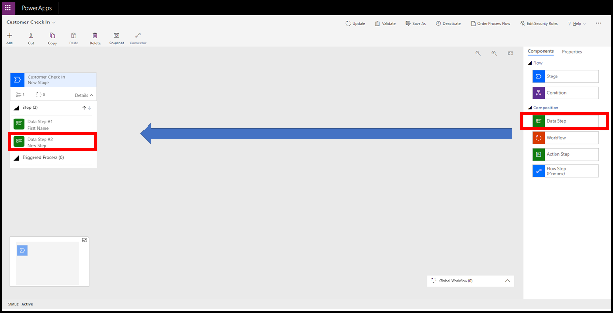
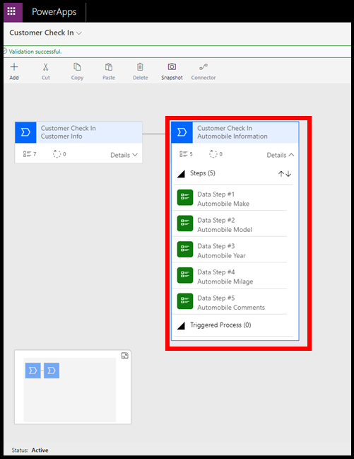

We are ready to start building an immersive business process flow 
with Power Automate and Common Data Service. Remember, all data
associated with any business process flow is always stored in one or
more entities within Common Data Service and business process flows.

> [!NOTE]
> You will need access to an account that has permission to create entities and fields in Common Data Service to complete this exercise, and a PowerApps or Dynamics 365 License. Ask your Power Platform administrator for proper permissions or log in and create a personal Power Apps and Power Automate development environment using the Community License plan (it's free!) by accessing the [Power Apps Community Plan](https://powerapps.microsoft.com/communityplan/?azure-portal=true) page.

### Scenario

You work for SmogChecksRUs, a rapidly growing auto repair company 
that specializes in performing automotive smog checks and other
auto services. SmogChecksRUs has been using an Excel spreadsheet to
collect customer and vehicle information, but now marketing has asked
for a better way to collect information so they can follow up with
customers and schedule checkups every two years, improve customer
retention, and increase sales.

Management believes improved data collection and standardized processes
will improve customer satisfaction, improve customer loyalty, and
increase recurring business and overall sales revenue. You have decided
to create an immersive business flow using Power Automate to meet
management goals. Let's get started.

### Create an immersive business process flow

1. Go to [Power Automate](https://preview.flow.microsoft.com/?azure-portal=true) and sign
in to your local instance. 

1. Make sure to select the proper environment in the top right-hand side of the screen.

	

1. Select My Flows in the menu on the left side of the screen, and then select the **Business process flows** tab.

	

1. Select the **+ New** button on the top left-hand side of the screen.

	

1. Enter a **Flow name** of "Customer Check In" and select **None (Immersive Business Process)** 
under the entity dropdown and select the **Create** button as shown below. Wait a minute for the 
entity to be created, and then the Business process flow Editor will launch.

   

1. In the Business process flow Editor, you can start adding fields to the 
new Entity (customercheckin) that was automatically created in the previous step. 
Select the **Customer Check In New Stage** as shown below.

   

1. Select the New Stage within the designer, and rename the Stage to
**Collect Customer Information**, and then select the **Apply** button as shown
in the screenshot below.

   

	Next, we will add some fields to the new **CollectCustomerInfo** entity in Common Data Service so we can capture customer information.

1. Select the **Collect Customer Info** stage, and then the **Click to add fields and forms** hyperlink as shown below.

	

	

1. Now let's add some fields. Add fields to the collectcustomerinfo entity by selecting the **Add Field** button as shown below.

   

1. Add each of the following field listed below - type the name and data type and
then select the **Done** button each time you add a new field, as shown in the screen below.

   

	- Entry Date - Date Only
	- First Name - Text
	- Last Name - Text
	- Phone Number - Phone
	- Address - Text
	- City - Text
	- State - Text
	- Postal Code - Text
	- Phone Number - Phone Number
	- Comments - Text Area

1. When you are finished, select the **Save Entity** button to save 
the new fields. Make sure to select the **Save Entity** button or none
of the fields will be added.

   

1.	Close the current tab of the browser showing the entity fields, and 
return to the business process flow designer screen.

### Add fields as steps and finish the flow

Now we are ready to add the fields as Steps in the first Stage in
the **Customer Check In** business process flow. 

1. Refresh your browser, and then select the **Customer Check In** Stage.

	

1. Select Data Step # 1, and then enter the following as shown below:

	-   Step Name - Enter First Name.
		
	-   Data Field - Select **First Name** from the drop-down menu.
		
	-   Select the Required checkbox.
		
	-   Select the **Apply** button.
		
	

1. Select the Components tab and drag a Data Step under data Step 1
as shown below.

   

1. Select Data Step #2 and enter in the following information.

	-   Step Name - Last Name
	
	-   Data Field - Select **Last Name** from the drop-down menu.
	
	-   Select the Required checkbox.
	
	-   Select the **Apply** button.

	

1. Select the **Components** tab, and drag additional data steps and add
fields we added earlier under Stage One. (Entry Date, Address, City, State, etc.).

1. When you are done, Stage 1 should look as shown below. If all
looks correct, then select the **Update** button in the ribbon.

   

	> [!NOTE]
	> When the data process flow is used, data will be saved into the
	fields we created in the customercheckin entity in Common Data Service.

	Now we want to collect information about the automobile being serviced so let's add a new stage and add fields about the automobile to the customercheckinentity.

1. Select the **Components** tab and drag a new stage to the right of
Stage 1. Make sure to drop it into the **+** sign. The new stage should
look like the screenshot below.

   

1. Now, repeat the steps we covered for Stage 1, and add the following fields and steps.

	-   Automobile Make - Text
	
	-   Automobile Model - Text
	
	-   Automobile Year - Number
	
	-   Automobile Mileage - Number
	
	-   Automobile Comments - Text Area

1. Make sure to save the entity after you add the new fields.

1. When you are done adding the data steps, make sure to select the **Update**
button in the ribbon. Your completed Stage 2 should look like the screenshot below.

