The following scenario and exercise will help you practice building an immersive business process flow with Power Automate and Microsoft Dataverse. Remember, all data that is associated with any business process flow is always stored in one or more tables within Dataverse and business process flows.

> [!NOTE]
> To complete this exercise, you will need access to an account that has permission to create tables and columns in Dataverse and you need a Power Apps or Dynamics 365 license. Ask your Power Platform administrator for proper permissions or sign in and create a personal Power Apps and Power Automate development environment by using the Power Apps Community Plan (which is free). Sign up by accessing the [Power Apps Community Plan](https://powerapps.microsoft.com/communityplan/?azure-portal=true) page.

## Scenario

You work for SmogChecksRUs, a rapidly growing auto repair company that specializes in performing automotive smog checks and other auto services. SmogChecksRUs has been using a Microsoft Excel spreadsheet to collect customer and vehicle information, but now the marketing department has asked for a better way to collect information so they can follow up with customers and schedule checkups every two years, improve customer retention, and increase sales.

Management believes that improved data collection and standardized processes will improve customer satisfaction, improve customer loyalty, and increase recurring business and overall sales revenue. You have decided to create an immersive business flow by using Power Automate to meet management goals.

## Create an immersive business process flow

1.  Go to [Power Automate](https://preview.flow.microsoft.com/?azure-portal=true) and sign in to your local instance.

1.  Select the proper environment in the upper-right corner of the screen.

1.  Select **My Flows** on the menu on the left side of the screen and then select the **Business process flows** tab.

	> [!div class="mx-imgBorder"]
	> [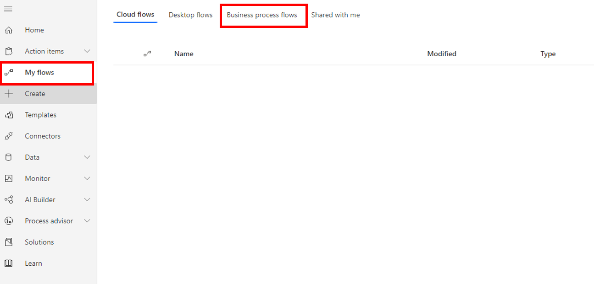](../media/4-business-process-flows-power-automate.png#lightbox)

1.  Select the **+ New** button on the upper-left corner of the screen.

	> [!div class="mx-imgBorder"]
	> [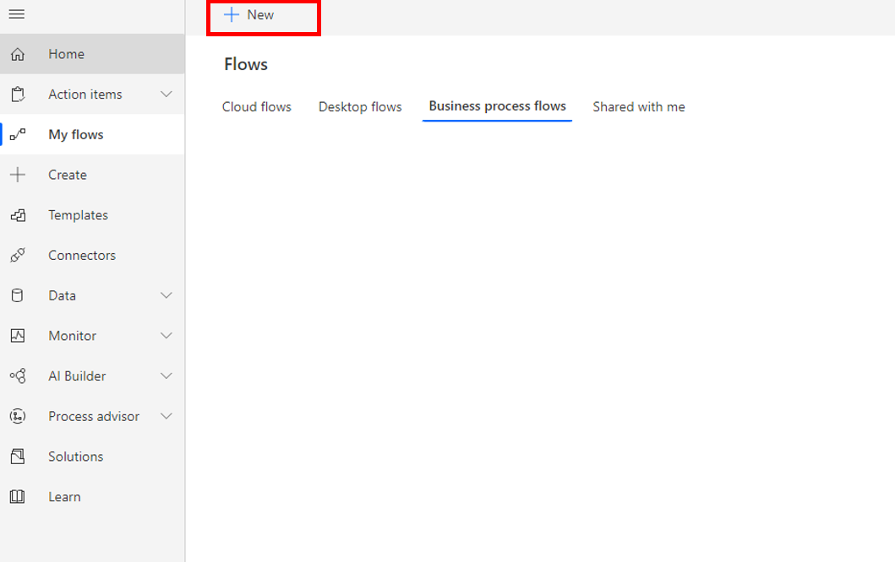](../media/5-new-flow-button.png#lightbox)

1.  Enter **Customer Check In** as the **Flow name**, select **None (Immersive Business Process)** under the table drop-down list, and then select the **Create** button, as shown in the following screenshot. Wait a minute for the table to be created, and then the **Business process flow** editor will launch.

	> [!div class="mx-imgBorder"]
	> [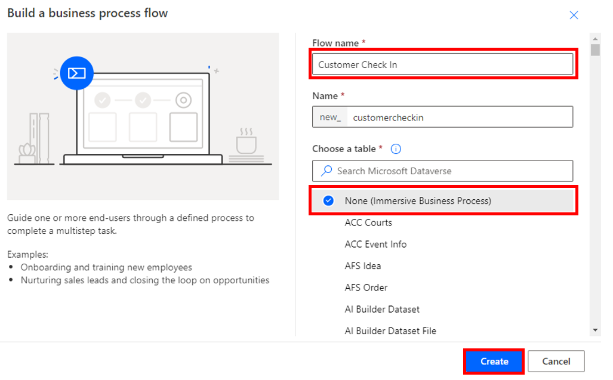](../media/6-name-new-business-process-flow.png#lightbox)

1.  In the **Business process flow** editor, add columns to the new table (customercheckin) that was automatically created in the previous step. Select **Customer Check In New Stage**, as shown in the following figure.

	> [!div class="mx-imgBorder"]
	> [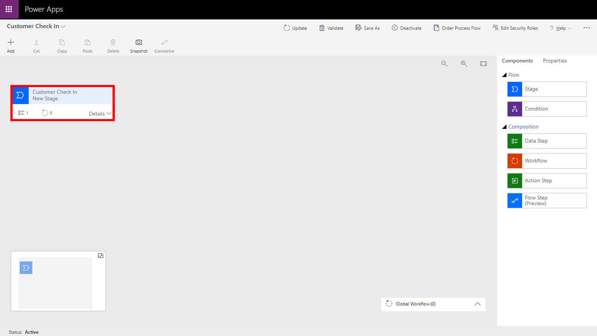](../media/7-select-stage-one-business-process-flow-editor.png#lightbox)    

1.  Select **New Stage** within the designer, rename the Stage to **Collect Customer Info**, and then select the **Apply** button, as shown in the following screenshot.

	> [!div class="mx-imgBorder"]
	> [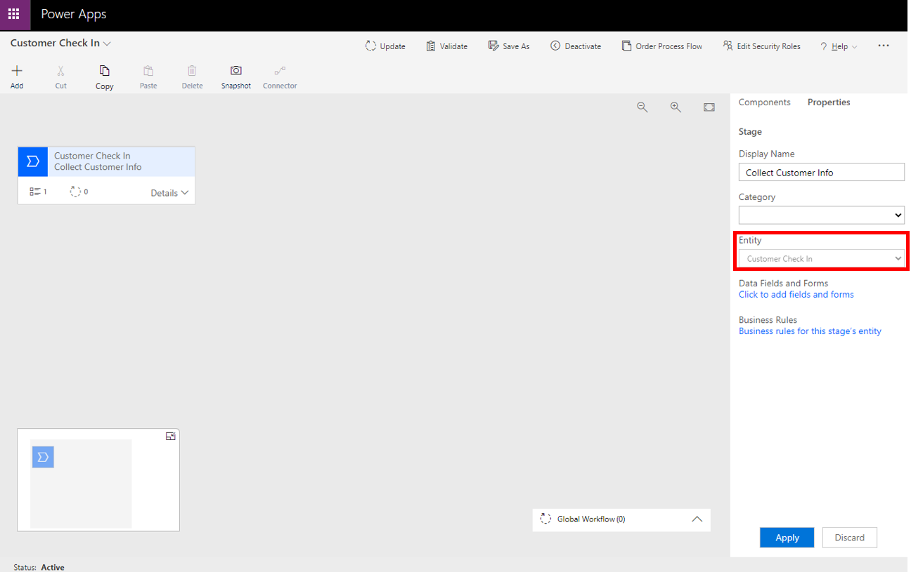](../media/8-name-stage-one-business-process-flow-editor.png#lightbox)    

    Next, you will add columns to the new **CollectCustomerInfo** table in Dataverse so you can capture customer information.

1.  Select the **Collect Customer Info** stage and then select the **Click to add fields and forms** hyperlink, as shown in the following figure.

	> [!div class="mx-imgBorder"]
	> [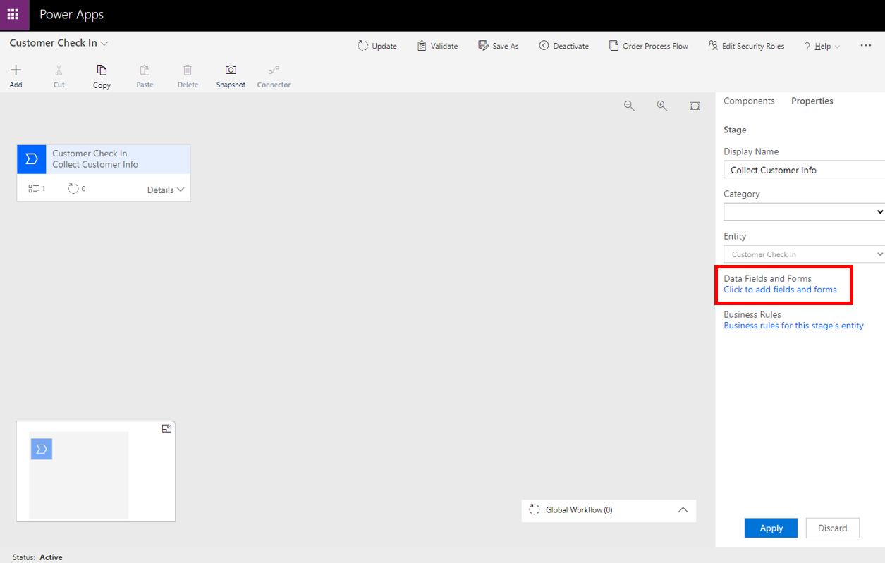](../media/9-select-click-add-fields-forms-hyperlink.png#lightbox) 

	> [!div class="mx-imgBorder"]
	> [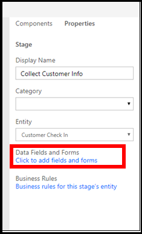](../media/10-select-click-add-fields-forms-hyperlink.png#lightbox)   

	> [!NOTE]
	> If you select **Click to add field and forms** link from Power Automate, you may see the classic UI. To see the modern UI, Open Power Apps in a new window and sign-in. On the left, select Data, select Tables, then select the CollectCustomerInfo table from the list and click **Edit**. Find and select the **Customer Check In table**. Add the columns as listed in the next step.

1.  Add column to the collectcustomerinfo table by selecting the **Add Column** button, as shown in the following screenshot.

	> [!div class="mx-imgBorder"]
	>     

1. Add each of the columns from the following list. Enter the name and data type and then select the **Done** button each time you add a new column, as shown in the following screen.

	> [!div class="mx-imgBorder"]
	> [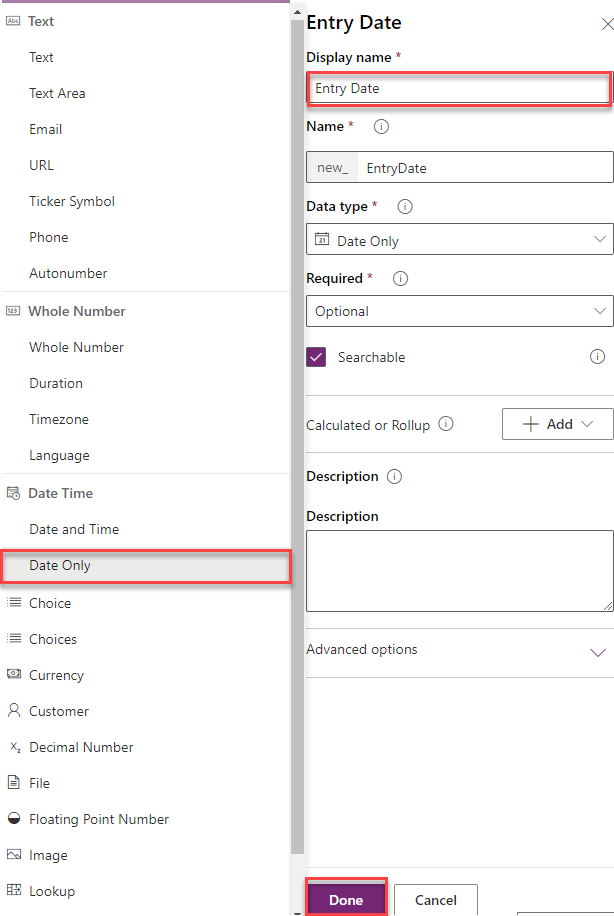](../media/12-create-entry-date-field.png#lightbox)    

    -   Entry Date - Date Only

    -   First Name - Text

    -   Last Name - Text

    -   Address - Text

    -   City - Text

    -   State - Text

    -   Postal Code - Text

    -   Phone Number - Phone

    -   Comments - Text Area

1. When you are finished, select the **Save Table** button to save the new columns. Make sure that you select the **Save Table** button or none of the columns will be added.

	> [!div class="mx-imgBorder"]
	> [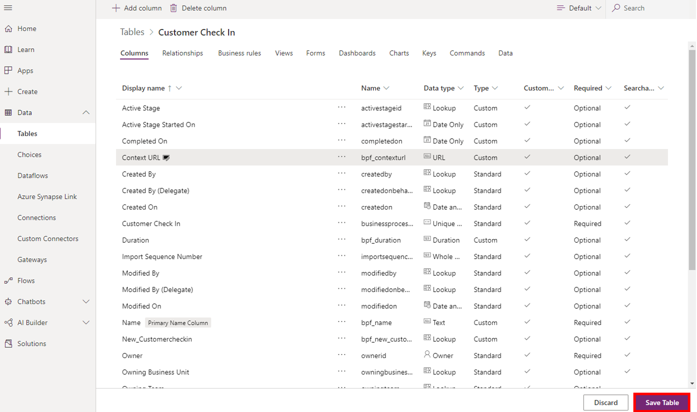](../media/13-select-save-table-button.png#lightbox)    

1. Close the current tab of the browser that is showing the table columns, and then return to the business process flow designer screen.

## Add columns as steps and finish the flow

Now, you will add the columns as Steps in the first Stage in the **Customer Check In** business process flow.

1.  Refresh your browser and then select the **Customer Check In** Stage.

1.  Select the **Details** down arrow to Expand

	> [!div class="mx-imgBorder"]
	> [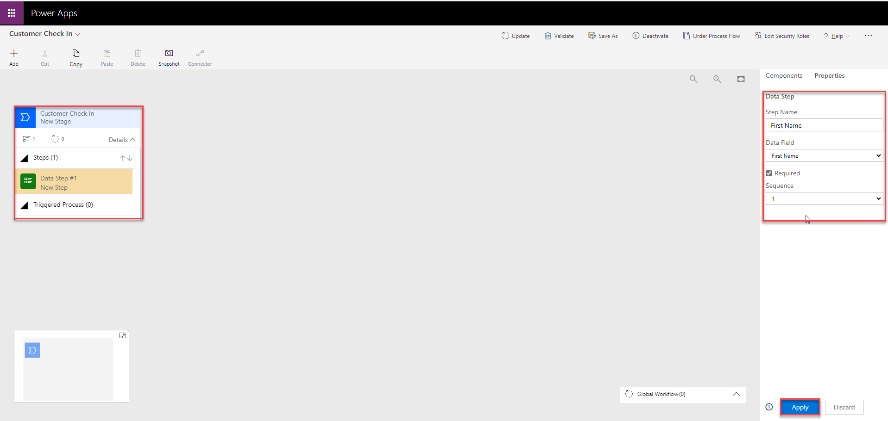](../media/14-add-data-step.png#lightbox)    

1.  Select **Data Step \# 1**, and then enter the following information:

    -   Step Name - Enter **First Name**.

    -   Data Field - Select **First Name** from the drop-down menu.

    -   Select the **Required** check box.

    -   Select the **Apply** button.

	> [!div class="mx-imgBorder"]
	> 

1.  Select the **Components** tab and then drag a Data Step under **Data Step \#1**, as shown in the following figure.

	> [!div class="mx-imgBorder"]
	>     

1.  Select **Data Step \#2** and enter the following information:

    -   Step Name - Enter **Last Name**.

    -   Data Field - Select **Last Name** from the drop-down menu.

    -   Select the **Required** check box.

    -   Select the **Apply** button.

	> [!div class="mx-imgBorder"]
	>     

1.  Select the **Components** tab, and then drag more data steps and add columns that were added earlier under Stage One (Entry Date, Address, City, State, and so on).

1.  When you are done, Stage 1 should appear as shown in the following figure. If all appears correct, select the **Update** button in the ribbon.

	> [!div class="mx-imgBorder"]
	> [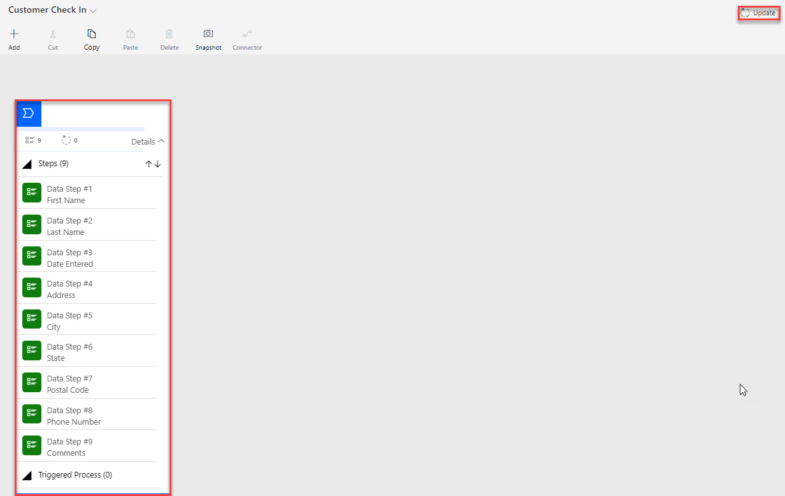](../media/18-all-data-steps-stage-one.png#lightbox)    

	> [!NOTE]
	> When the data process flow is used, data will be saved into the columns that you created in the customercheckin table in Dataverse.

    Now, you will collect information about the automobile being serviced, so you'll add a new stage and add columns about the automobile to the customercheckin table.

1.  Select the **Components** tab and drag a new stage to the right of Stage 1. Make sure to drop the new stage into the plus (**+**) sign. The new stage should resemble the following screenshot.

	> [!div class="mx-imgBorder"]
	> 

1.  Repeat the steps that were covered for Stage 1, and then add the following columns and steps:

    -   Automobile Make - Text

    -   Automobile Model - Text

    -   Automobile Year - Whole Number

    -   Automobile Mileage - Whole Number

    -   Automobile Comments - Text Area
1. Make sure to save the table after you add the new columns.

1. When you are done adding the data steps, select the **Update** button in the ribbon. Your completed Stage 2 should look like the following screenshot.

	> [!div class="mx-imgBorder"]
	> 

