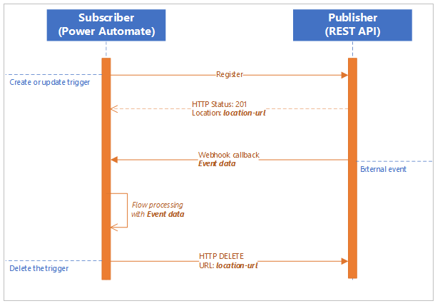
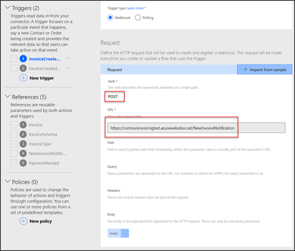

Webhooks are popular HTTP-based implementations of a more generic publisher-subscriber notification pattern. They provide a way for notifications to be delivered to an external service (subscriber) whenever certain events occur within a system (publisher).

Power Automate and Azure Logic Apps allow makers to use webhooks as triggers. In this scenario, triggers will play the role of a subscriber who is registering and unregistering webhooks on a maker's behalf. The registration occurs when a step in a cloud flow or Logic Apps workflow is created or updated. When the step is removed, the platform unregisters the webhook.

The following screenshot shows an example of the interaction between subscriber and publisher.

> [!div class="mx-imgBorder"]
> [](../media/subscriber-publisher-interaction.png#lightbox)

Responsibilities of the parties are outlined in the following table.

|     Publisher (custom connector OpenAPI)                                                                                                                                                            |     Subscriber (Power Automate/Logic Apps)                                                                                      |
|-----------------------------------------------------------------------------------------------------------------------------------------------------------------------------------------------------|---------------------------------------------------------------------------------------------------------------------------------|
|     Provides the subscription registration endpoint.                                                                                                                                                |     Calls the subscription registration endpoint when a trigger is   created or updated in a flow.                              |
|     Specifies the notification contract, that is, what object will be   passed with each notification.     Must include the Location HTTP header in the 201 response at   the time that a webhook is created.    |     Provides the URL of the automatically generated endpoint that will   accept the notification messages.                      |
|     Maintains the register of subscribers and their notification   endpoints.                                                                                                                       |     Receives and stores location information that will be used to   deregister the webhook.                                     |
|     Issues a POST request to every registered endpoint and passes the   relevant data in the body of the message.                                                                                   |     Receives notifications, validates them against the schema that is defined   by the custom connector, and then triggers the automation.    |
|     Deregisters/removes the endpoints in response to the DELETE message.                                                                                                                                |     Issues a DELETE message to deregister the webhook when the trigger   step is deleted.                                       |

Webhooks provide the notification mechanism only, and they don't support manipulation of the data. Often, a webhook implementation is complemented by one or more actions that are designed to support data or object retrieval and manipulation.

## API requirements

To provide webhook support that is required by custom connectors, the API implementation must provide the following parameters:

-   An endpoint that accepts the registration message and returns location information

-   A definition of the message body that is sent with the notification messages

-   An endpoint to accept DELETE message to remove webhook registration

Usually, the API implementation maintains an internal list of active subscribers, where each subscriber is identified by a unique URL. To return this URL to the subscriber, the successful webhook creation is required to return an HTTP 201 response and include a **Location** HTTP header. The value of this location will be used later by the subscriber to delete the webhook registration.

## Create a webhook trigger

Custom connectors use OpenAPI to describe the publisher API implementation, as required by webhooks. To define a webhook trigger in a custom connector, you need to include three essential parts in the OpenAPI definition:

-   A POST message that describes webhook registration

-   Content definition for the webhook responses

-   A DELETE message that describes the webhook tear-down process

### Registration message

The trigger definition must include a POST method that is used to register a webhook. It's defined similarly to actions.

> [!div class="mx-imgBorder"]
> [](../media/trigger-post-method.png#lightbox)

The OpenAPI specification version that is used by Power Platform doesn't differentiate actions and triggers. The custom connector definition uses the **x-ms-trigger** custom extension to declare a trigger.

```
paths:
  /webhooks:
    post:
      operationId: OrderCreated
      x-ms-trigger: single
```

The presence of the **x-ms-trigger** extension indicates that the method is a trigger and not an action. When a trigger is created by using the wizard, this extension is added automatically. However, when a custom connector is created from the external OpenAPI definitions, the import process always creates actions. In this scenario, you need to re-create triggers by using the wizard and then remove the corresponding action definitions.

Possible values for the **x-ms-trigger** extension are **single** or **batch** to differentiate between an object and array responses. A single object is included when a webhook raises a notification for each change. This approach is the most common with webhooks. When multiple changes are combined into a single notification, an array of objects is sent. This approach is typically used in polling triggers and will be discussed later in the module.

### Webhook response

Custom connector definitions can describe the content of the incoming webhook responses from your service when an event occurs. While it isn't mandatory, this definition identifies the dynamic values that are available to the maker at design time in the dynamic content list.

> [!NOTE]
> This response is not of the request that creates and registers the webhook. This data is sent by your service when an event occurs.

> [!div class="mx-imgBorder"]
> [](../media/webhook-response.png#lightbox)

The custom **x-ms-notification-content** property is another extension that is used in OpenAPI to define the webhook response schema.

```yaml
paths:
  /webhooks:
    x-ms-notification-content:
      description: Order
      schema:
        type: object
        properties:
          id: {type: integer, format: int32, description: id}
          order_key: {type: string, description: order_key}
          status: {type: string, description: status}
          currency: {type: string, description: currency}
          date_created: {type: string, description: date_created}
          total: {type: number, description: total, format: decimal}
```

> [!TIP]
> A webhook response definition doesn't need to contain the entire contents of the response, only the portions that you want to expose to the flow makers at design time in the dynamic content list.

Data that is sent with the webhook response doesn't need to, and might not, contain all properties that you need from the underlying object. In these situations, you would want to create other actions in the custom connector for information retrieval. For example, a web store might only send a new order identifier with the "When a new order is created" notification. Then, the custom connector can define an action, such as "Get Order Details," that accepts an order identifier and returns expanded information about the order.

The reverse is also true. Webhook responses might provide excessive information that isn't required or needed under normal circumstances. You only need to describe the data that you want to show in Power Automate or Logic Apps maker interface. If the maker needs access to more data that is sent in the notification, they can use JSON functions to directly extract these properties from the received message.

### Delete message

For Power Automate or Logic Apps to delete a webhook, the API must include a **Location** HTTP header in the response at the time that the webhook is created.

> [!IMPORTANT]
> You must define the path of the delete webhook request as an internal action. This action will send a DELETE request to the URL that is specified in the location header.

If this action isn't defined, or if the API doesn't include the location header, webhooks will be created but not deleted, potentially causing issues in the API implementation at runtime.

Webhooks implementation offers a flexible mechanism to provide trigger support in a custom connector. However, not every API supports webhook integrations. Polling implementation offers an alternative way to create triggers in the custom connectors.
