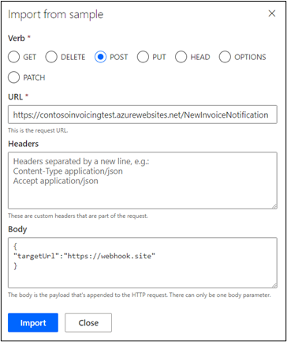
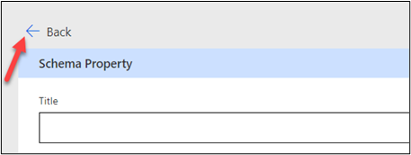
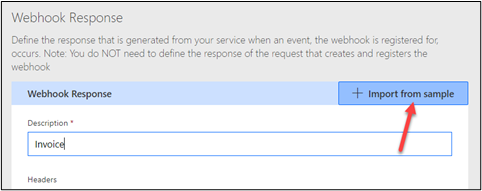
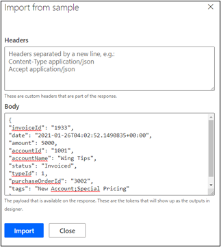
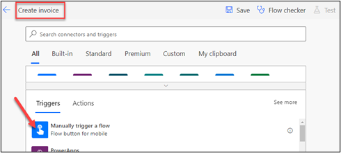
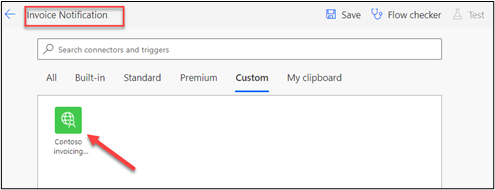
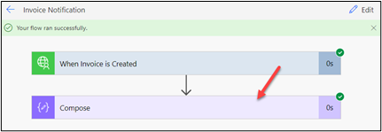
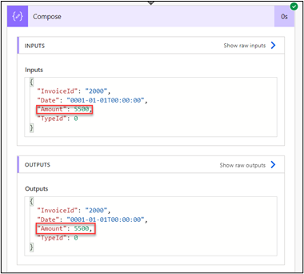

In this exercise, you'll add a webhook trigger to the custom connector for an existing Contoso Invoicing API.

> [!IMPORTANT]
> Use a test environment with Microsoft Dataverse provisioned. If you do not have one you can sign up for the [community plan](https://powerapps.microsoft.com/communityplan/?azure-portal=true).

## Task 1: Import solution with the custom connector

In this task, you'll import an unmanaged solution that contains prebuilt custom connector for Contoso Invoicing API.

1.  Navigate to [Power Apps maker portal](https://make.powerapps.com/?azure-portal=true) and make sure you are in the correct environment.

1.  Select **Solutions** and select **Import**.

1.  Select **Browse**.

1.  Select the ContosoInvoicingTriggers_1_0_0_0.zip solution and select **Open**.

1.  Select **Next**.

1.  Select **Import** and wait for the import to complete. You should get a success message after the import completes.

1.  Select **Publish all customizations** and wait for the publish to complete.

1.  Select to open the **Contoso importing triggers** solution you imported.

1.  You should see **Contoso invoicing triggers** custom connector component.

	> [!div class="mx-imgBorder"]
	> [](../media/contoso-invoicing-trigger.png#lightbox)

1. In a new tab, navigate to [Contoso invoicing](https://contosoinvoicing.azurewebsites.net/?azure-portal=true).

1. Select the **API Key** link.

	> [!div class="mx-imgBorder"]
	> [](../media/api-key-link.png#lightbox)

1. Copy the **API Key** and keep it on a notepad. You'll use it a few times in this exercise.

1. Go back to [Power Apps maker portal](https://make.powerapps.com/?azure-portal=true) and make sure you are in the environment.

1. Select **Solutions** and select to open the **Contoso invoicing triggers** solution.

1. Select to open the **Contoso invoicing triggers** custom connector.

1. Select **Edit**.

	> [!div class="mx-imgBorder"]
	> [](../media/edit.png#lightbox)

1. Enter `contosoinvoicing.azurewebsites.net` for **Host**.

1. Select **Update Connector**.

1. Select **Test** and select **+ New Connection**.

	> [!div class="mx-imgBorder"]
	> [](../media/new-connection.png#lightbox)

1. Paste the **API Key** and select **Create connection**.

	> [!div class="mx-imgBorder"]
	> [](../media/create-connection.png#lightbox)

1. Select **Refresh**. The connection you created should get select automatically.

1. Scroll down to the **Operations** section, select **ListInvoice**, and select **Test operation**.

	> [!div class="mx-imgBorder"]
	> [](../media/test-operation.png#lightbox)

1. You should see a list of invoices in the **Body** section.
    
	> [!div class="mx-imgBorder"]
	> [](../media/body-section.png#lightbox)

1. Don't navigate away from this page.

## Task 2: Add webhook trigger

1.  Select **Definition**.

	> [!div class="mx-imgBorder"]
	> [](../media/definition.png#lightbox)

1.  Scroll down to the **Triggers** section and select **+ New trigger**.

1.  Provide the values below.

    1.  **Summary**: When Invoice is Created

    1.  **Description**: When Invoice is Created

    1.  **Operation ID**: InvoiceCreated

    1.  **Trigger type**: Webhook

	> [!div class="mx-imgBorder"]
	> [](../media/new-trigger-values.png#lightbox)

1.  Go to the **Request** section and select **+ Import from sample**.

	> [!div class="mx-imgBorder"]
	> [](../media/import-sample.png#lightbox)

1.  Provide the values below and select **Import**. With other APIs, you would get the sample from the API documentation.

    1.  **Verb**: POST

    1.  URL: `https://contosoinvoicing.azurewebsites.net/NewInvoiceNotification`

    1.  Body:
		```json
		{
		"targetUrl":"https://webhook.site"
		}
		```

	> [!div class="mx-imgBorder"]
	> [](../media/import-values.png#lightbox)

1.  Scroll to **Trigger configuration** and select **targetUrl** for **Callback URL parameter**. This allows the targetUrl to be populated at runtime by the custom connector.


	> [!div class="mx-imgBorder"]
	> [](../media/trigger-configuration.png#lightbox)

1.  Scroll back up to the **Request** section, select **Body** and select **Edit**.

	> [!div class="mx-imgBorder"]
	> [](../media/body-edit.png#lightbox)

1.  Select **targetUrl** and select **Edit**.

	> [!div class="mx-imgBorder"]
	> [](../media/url-edit.png#lightbox)

1.  Select **Yes** for **Is required** and select **Internal** for **Visibility**.

	> [!div class="mx-imgBorder"]
	> [](../media/required-internal.png#lightbox)

1. Select the **Back** button.

	> [!div class="mx-imgBorder"]
	> [](../media/back.png#lightbox)

1. Select the **Back** button again.

1. Scroll down to the **Webhook Response** section, enter **Invoice** for **Description**, and select **+ Import from sample.** The Webhook Response defines what will be sent to your flow when the triggering event occurs.

	> [!div class="mx-imgBorder"]
	> [](../media/webhook-response-import.png#lightbox)

1. Paste the sample json below in the **Body** and select **Import**.

	```json
	{
	"invoiceId": "1933",
	"date": "2021-01-26T04:02:52.1490835+00:00",
	"amount": 5000,
	"accountId": "1001",
	"accountName": "Wing Tips",
	"status": "Invoiced",
	"typeId": 1,
	"purchaseOrderId": "3002",
	"tags": "New Account;Special Pricing"
	}
	```
	> [!div class="mx-imgBorder"]
	> [](../media/body-import.png#lightbox)

1. Select **Update connector**.

	> [!NOTE]
	> If you receive an error message about "all paths must being with '/'", open swagger, find the line containing '':{} and delete it.

1. Select **Close**.

## Task 3: Testing the trigger

1.  Navigate to [Power Apps maker portal](https://make.powerapps.com/?azure-portal=true) and make sure you are in the environment.

1.  Select **Solutions** and select to open the **Contoso invoicing triggers** solution.

1.  Select **+ New** and select **Cloud flow**.

1.  Enter **Create invoice** for name and select **Manually trigger a flow** for trigger.

	> [!div class="mx-imgBorder"]
	> [](../media/create-invoice-trigger.png#lightbox)

1.  Select **+ Add an input**.

1.  Select **Number** for the **Input type**.

	> [!div class="mx-imgBorder"]
	> [](../media/number-input.png#lightbox)

1.  Enter **Amount** for input name and select **+ New step.**

	> [!div class="mx-imgBorder"]
	> [](../media/new-step.png#lightbox)

1.  Select the **Custom** tab and select to select the **Contoso invoicing** custom connector.

	> [!div class="mx-imgBorder"]
	> [](../media/contoso-invoicing-connector.png#lightbox)

1.  Select to select the **Add Invoice** action.

1. Enter **Contoso connection** for **Name**, paste the **API Key** you copied in task 1, and select **Create**. You must use the same API key in both flows or your trigger flow won't run.

	> [!div class="mx-imgBorder"]
	> [](../media/contoso-invoicing-triggers-details.png#lightbox)

1. Select the **amount** field and select **Amount** from the dynamic content pane.

	> [!div class="mx-imgBorder"]
	> [](../media/amount-field.png#lightbox)

1. Select **Save**.

1. Keep this browser tab or window open, switch to solution browser tab or window, and select **Done**.

	> [!div class="mx-imgBorder"]
	> [](../media/done.png#lightbox)

1. Select **+ New** and select **Cloud flow** again.

1. Enter **Invoice notification** for name, select the **Custom** tab, and select to select the **Contoso invoicing** custom connector.

	> [!div class="mx-imgBorder"]
	> [](../media/invoice-notification.png#lightbox)

1. Select to select the **When Invoice is Created** trigger.

1. Select **+ New step**.

1. Search for compose and select **Compose** action.

1. Select the **Inputs** field and select **body** from the dynamic content pane.

	> [!div class="mx-imgBorder"]
	> [](../media/body.png#lightbox)

1. Select **Save**.

1. Select **Test**.

1. Select **Manually** and select **Save & Test**. The flow will start and wait for notifications.

1. Switch to the **Create invoice** flow browser tab or window.

1. Select **Test**.

1. Select **Manually** and select **Save & Test**.

1. Select **Continue**.

1. Enter **5500** for **Amount** and select **Run flow**.

1. Select **Done**.

1. Switch to the **Invoice notification** flow. The flow should run successfully.

1. Select to expand the **Compose** action.

	> [!div class="mx-imgBorder"]
	> [](../media/compose-action.png#lightbox)

1. The **Inputs** and **Outputs** should show the amount you provided in the **Create invoice** flow.

	> [!div class="mx-imgBorder"]
	> [](../media/inputs-outputs.png#lightbox)
