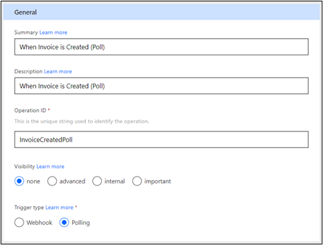
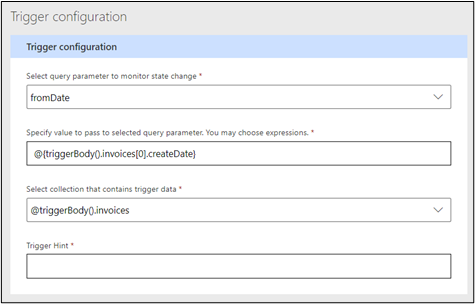
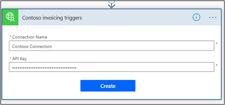
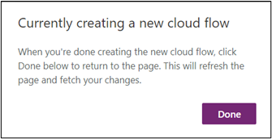
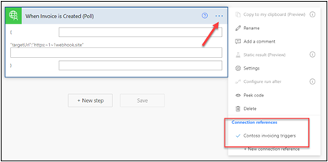

In this exercise, you'll add a polling trigger to the custom connector for an existing Contoso Invoicing API.

> [!IMPORTANT]
> Use a test environment with Microsoft Dataverse provisioned. If you don't have one you can sign up for the [community plan](https://powerapps.microsoft.com/communityplan/?azure-portal=true).

## Task 1: Import solution with the custom connector

> [!NOTE]
> You can continue using the connector you created and modified in **Unit 4: Implement a webhook trigger**. If you completed that exercise, you can skip to **Task 2.**

In this task, you import an unmanaged solution that contains prebuilt custom connector for Contoso Invoicing API.

1.  Navigate to [Power Apps maker portal](https://make.powerapps.com/?azure-portal=true) and make sure you are in the correct environment.

1.  Select **Solutions** and select **Import**.

1.  Select **Browse**.

1.  Select the **ContosoInvoicingTriggers_1_0_0_0.zip** solution and select **Open**.

1.  Select **Next**.

1.  Select **Import** and wait for the import to complete. You should get a success message after the import completes.

1.  Select **Publish all customizations** and wait for the publish to complete.

1.  Select to open the **Contoso importing triggers** solution you imported.

1.  You should see **Contoso invoicing triggers** custom connector component.

	> [!div class="mx-imgBorder"]
	> [](../media/contoso-invoicing-trigger.png#lightbox)

1. Navigate to [Contoso invoicing](https://contosoinvoicing.azurewebsites.net/?azure-portal=true).

1. Select on the **API Key** link.

	> [!div class="mx-imgBorder"]
	> [](../media/api-key-link.png#lightbox)

1. Copy the **API Key** and keep it on a notepad.

1. Go back to [Power Apps maker portal](https://make.powerapps.com/?azure-portal=true) and make sure you are in the environment.

1. Select **Solutions** and select to open the **Contoso invoicing triggers** solution.

1. Select to open the **Contoso invoicing triggers** custom connector.

1. Select **Edit**.

	> [!div class="mx-imgBorder"]
	> [](../media/edit.png#lightbox)

1. Enter contosoinvoicing.azurewebsites.net in **Host**.

1. Select **Update connector**.

1. Select **Test** and select **+ New Connector**.

	> [!div class="mx-imgBorder"]
	> [](../media/new-connection.png#lightbox)

1. Paste the **API Key** and select **Create connection**.

	> [!div class="mx-imgBorder"]
	> [](../media/create-connection.png#lightbox)

1. Select **Refresh**. The connection you created should get select automatically.

1. Scroll down to the **Operations** section, select **ListInvoice**, and select **Test operation**.

	> [!div class="mx-imgBorder"]
	> [](../media/test-operation.png#lightbox)

1. You should see a list of invoices in the **Body** section.

	> [!div class="mx-imgBorder"]
	> [](../media/body-section.png#lightbox)

1. Don't navigate away from this page.

## Task 2: Add polling trigger

If you skipped the prior task, navigate to your Contoso invoicing triggers custom connector and select edit.

1.  Select **Definition**.

	> [!div class="mx-imgBorder"]
	> [](../media/definition.png#lightbox)

1.  Scroll down to the **Triggers** section and select **+ New trigger**.

1.  Provide the values below.

    1.  **Summary**: When Invoice is Created (Poll)

    1.  **Description**: When Invoice is Created (Poll)

    1.  **Operation ID**: InvoiceCreatedPoll

    1.  **Trigger type**: Polling

	> [!div class="mx-imgBorder"]
	> [](../media/polling-trigger-type.png#lightbox)

1.  Go to the **Request** section and select **+ Import from sample**.

	> [!div class="mx-imgBorder"]
	> [](../media/import-sample.png#lightbox)

1.  Provide the values below and select **Import**.

    1.  **Verb**: GET

    1.  **URL**: `https://contosoinvoicing.azurewebsites.net/ListInvoices?fromDate=`

1.  Select on **...** button of **fromDate** and select **Edit**.

	> [!div class="mx-imgBorder"]
	> [](../media/query-edit.png#lightbox)

1.  Select **Internal** for **Visibility** and select on the **Back** button.

	> [!div class="mx-imgBorder"]
	> [](../media/internal-back.png#lightbox)

1.  Scroll down to the **Response** section and select **+ Add default response**.

1.  Paste the json below in the **Body** field and select **Import.**

	```json
	{
	  "invoices": [
	    {
	      "invoiceId": "1933",
	      "date": "2021-01-26T04:02:52.1490835Z",
	      "createDate": "2021-01-25T04:02:52.1490835Z",
	      "amount": 5000,
	      "accountId": "1001",
	      "accountName": "Wing Tips",
	      "status": "Invoiced",
	      "typeId": 1,
	      "purchaseOrderId": "3002",
	      "tags": "New Account;Special Pricing"
	    }
	  ]
	}
	```

	> [!div class="mx-imgBorder"]
	> [](../media/headers-body.png#lightbox)

1. Go to the **Trigger configuration** section and provide the value below.

    1.  **Select query parameter to monitor state change:** fromDate

    1.  **Specify value to pass to selected query parameter. You may choose expressions**: @{triggerBody().invoices[0].createDate}

    1.  **Select collection that contains trigger data**: @triggerBody().invoices

	> [!div class="mx-imgBorder"]
	> [](../media/trigger-configuration-section.png#lightbox)

1. Select on the **Update connector** button located on the top of the screen and wait for the connector to be updated.

## Task 3: Testing the trigger

If you have already completed Unit 4 and create the Create invoice cloud flow, skip to step 14.

1.  Navigate to [Power Apps maker portal](https://make.powerapps.com/?azure-portal=true) and make sure you are in the environment.

1.  Select **Solutions** and select to open the **Contoso invoicing triggers** solution.

1.  Select **+ New** and select **Cloud flow**.

1.  Enter **Create invoice** for name and select **Manually trigger a flow** for trigger.

	> [!div class="mx-imgBorder"]
	> [](../media/create-invoice-trigger.png#lightbox)

1.  Select **+ Add an input**.

1.  Select **Number** for the **Input type**.

	> [!div class="mx-imgBorder"]
	> [](../media/number-input.png#lightbox)

1.  Enter **Amount** for input name and select **+ New step.**

	> [!div class="mx-imgBorder"]
	> [](../media/new-step.png#lightbox)

1.  Select the **Custom** tab and select to select the **Contoso invoicing** custom connector.

	> [!div class="mx-imgBorder"]
	> [](../media/contoso-invoicing-connector.png#lightbox)

1.  Select to select the **Add Invoice** action.

1. Enter **Contoso connection** for **Name**, paste the **API Key** you copied in task 1, and select **Create**.

	> [!div class="mx-imgBorder"]
	> [](../media/contoso-invoicing-triggers-details.png#lightbox)

1. Select on the **amount** field and select **Amount** from the dynamic content pane.

	> [!div class="mx-imgBorder"]
	> [](../media/amount-field.png#lightbox)

1. Select **Save**.

1. Keep this browser tab or window open, switch to solution browser tab or window, and select **Done**.

	> [!div class="mx-imgBorder"]
	> [](../media/done.png#lightbox)

1. Select **+ New** and select **Cloud flow** again.

1. Enter **Invoice notification poll** for name, select the **Custom** tab, and select to select the **Contoso invoicing** custom connector.

	> [!div class="mx-imgBorder"]
	> [](../media/invoice-notification-poll.png#lightbox)

1. Select to select the **When Invoice is Created (Poll)** trigger.

	> [!div class="mx-imgBorder"]
	> [](../media/poll-trigger.png#lightbox)

1. Select on the **... Menu** button of the trigger and make sure Connection reference is selected.

	> [!div class="mx-imgBorder"]
	> [](../media/connection-reference.png#lightbox)

1. Select **+ New step**.

1. Search for compose and select **Compose** action.

1. Select on the **Inputs** field and select **body** form the dynamic content pane.

	> [!div class="mx-imgBorder"]
	> [](../media/body.png#lightbox)

1. Select **Save** and wait for the flow to be saved.

1. Select **Test**.

1. Select **Manually** and select **Save & Test**. The flow will start and wait for notifications.

1. Switch to the **Create invoice** flow browser tab or window.

1. Select **Test**.

1. Select **Manually** and select **Save & Test**.

1. Enter **6500** for Amount and select **Run flow**.

1. Select **Done**.

1. The flow should run successfully. Select **Edit**.

	> [!div class="mx-imgBorder"]
	> [](../media/edit-icon.png#lightbox)

1. Select **Test** again.

1. Select **Manually** and select **Save & Test**.

1. Enter **8800** for Amount and select **Run flow**.

1. Select **Done**.

1. Th flow should run successfully again.

1. Switch to the **Invoice notification poll** flow. This flow should run successfully.

	> [!NOTE]
	> Unlike webhook trigger, this one might take about a minute to find out!

1. Select to expand the **Compose** action step.

	> [!div class="mx-imgBorder"]
	> [](../media/compose-step.png#lightbox)

1. Review the **Outputs** and select on the button

	> [!div class="mx-imgBorder"]
	> [](../media/outputs-review.png#lightbox)

1. You should see two run results for the two invoices you created.

	> [!div class="mx-imgBorder"]
	> [](../media/run-history.png#lightbox)