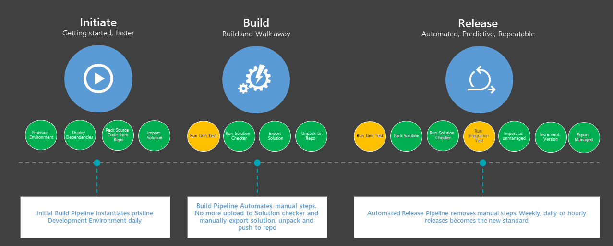
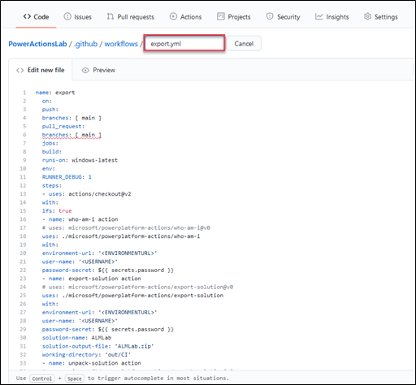

An important part of implementing application lifecycle management (ALM) for your custom connectors is having a repeatable process that allows you to modify connector definitions and have these changes recorded in a source control system. While the steps to accomplish these tasks can be performed manually, having an automated process is better to ensure consistency and repeatability.

To support the building of these automations, Microsoft provides build tasks for Azure DevOps and actions for GitHub. By using these tools, you can build automation to support the following principles:

-   **Development environments are disposable** - Your development environment should be a workspace where you build your custom connector. You should not rely on it as the source of truth. Source control should be used to store the official latest source. You should be able to re-create a new development environment anytime from source control.

-   **Source control contains the latest source** - When you reach a working version of your connector solution, contents should be checked into source control. You can use Azure DevOps, GitHub, or your other preferred source control tool. Labeling and branching can be used as appropriate for your process and needs.

-   **Deploy managed solutions** - When the solution that contains your custom connector is installed in non-development environments, you should deploy a managed solution. The managed solution should be built from the contents of source control and not directly from development. This approach ensures that your source control always contains a copy of what is deployed in your non-development environments.

You can use Power Platform tooling, along with any other available GitHub Actions or Azure DevOps tasks, to compose your build and release workflows. Automations that teams commonly put in place include provisioning development environments, exporting from a development environment to source control, generating builds, and releasing solutions. The following diagram illustrates examples of automations that you might consider.

> [!div class="mx-imgBorder"]
> 

Whether you use Azure DevOps or GitHub Actions is your preference. Both offer similar capabilities for automating the life cycles of Power Platform solutions.

## Azure DevOps

Azure DevOps uses build and release pipelines to implement automation. Generally, pipelines are used to build and prepare artifacts and release deploy to downstream environments. Building a Power Platform pipeline is done visually by adding build tasks. The following screenshot is an example of a pipeline that uses the build tasks.

> [!div class="mx-imgBorder"]
> 

## GitHub

GitHub uses GitHub Actions to create similar workflows. To build a GitHub Action, you need to specify the tasks by using YAML. The following screenshot shows an example of a workflow to export a solution.

> [!div class="mx-imgBorder"]
> 

## Common build tasks

Regardless of whether you use Azure DevOps or GitHub, the following table explains some of the common tasks.

|     Task               |     Purpose                                                                                                                                                                                                                             |
|------------------------|-----------------------------------------------------------------------------------------------------------------------------------------------------------------------------------------------------------------------------------------|
|     Export solution    |     Export is how you get a copy of your solution   in a zip file format from your development environment.   Export can also be used to support managed   solutions that are ready for installation in non-development environments.      |
|     Import solution    |     Import is how you install a solution zip file   into an environment.   When a solution   already exists in an environment, it is treated as an upgrade to the existing   solution.                                                    |
|     Unpack solution    |     The unpack solution task takes the zip file   and breaks it down into individual files that are appropriate for storing in   source control.                                                                                        |
|     Pack solution      |     The pack solution task takes the individual   files from source control or any folder and puts them back into a single zip   file that is ready for import.                                                                                 |

Review the [complete list](https://docs.microsoft.com/power-platform/alm/devops-build-tool-tasks/?azure-portal=true) of Azure DevOps build tasks for more specifics on each.

Review the [complete list](https://docs.microsoft.com/power-platform/alm/devops-github-available-actions/?azure-portal=true) of GitHub actions for more specifics on each.

## Custom connectors and solutions

One important aspect of the connector life cycle is the ability to save connector definitions and configurations in text form as opposed to a simple binary upload of a zip archive. Recording changes in text form allows effective team collaboration because any conflict can be resolved by using a standard source control merge process.

Custom connectors can be included in a Dataverse solution and transported between the environments. Solutions are exported as zip archives that contain all solution components, including custom connectors. Azure DevOps and GitHub include custom steps that allow you to unpack the solutions down to individual components, including custom connectors definitions. That feature allows you to analyze and visualize code commits and pull requests to identify changes and resolve conflicts if necessary.
