In this exercise, you will export a solution containing a custom connector into GitHub using the Power Platform GitHub actions.

> [!IMPORTANT]
> Use a test environment with Microsoft Dataverse provisioned. If you do not have one you can sign up for the [community plan](https://powerapps.microsoft.com/communityplan/?azure-portal=true). A GitHub account is also required to complete the exercise. You can sign up for one for free at [GitHub.com](https://GitHub.com/?azure-portal=true).

## Task 1: Import solution

In this task, you will import an unmanaged solution that contains a Contoso Invoicing custom connector. You will use this connector to complete the tasks in this exercise.

1.  Navigate to [Power Apps maker portal](https://make.powerapps.com/?azure-portal=true) and make sure you are in the correct environment.

1.  Select **Solutions** and select **Import**.

1.  Select **Browse**.

1.  Select the ContosoInvoicingALM_1_0_0_0.zip solution and select **Open**.

1.  Select **Next**.

1.  Select **Import** and wait for the import to complete. You should get a success message after the import completes.

1.  Select **Publish all customizations** and wait for the publish to complete.

1.  Select to open the **Contoso Invoicing - ALM** solution you imported.

1.  You should see the **Contoso Invoicing - ALM** custom connector component.

1. In the upper right corner of the screen select the Settings icon and choose Session details.

	> [!div class="mx-imgBorder"]
	> [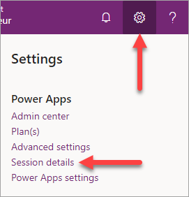](../media/exercise-1.png#lightbox)

1. In the Power Apps session details dialog, select Instance url value and copy it for use later in the exercise.

	> [!div class="mx-imgBorder"]
	> 

## Task 2: Create a GitHub repository

1.  Navigate to [GitHub](https://GitHub.com/?azure-portal=true) and select **Create repository**.

1.  Type ContosoInvoiceALM for the repository name.

1.  Select Add a README file.

1.  Select **Create repository**.

1.  In the new repository, select the **Settings** icon.

1.  Select **Secrets**. Secrets are environment variables that are encrypted. Anyone with collaborator access to this repository can use these secrets for Actions. You will create three secrets that will ensure our action we create does not have any sensitive information in it.

1.  Select **New repository secret**.

1.  Enter **environment** in the **Name** field.

1.  Paste your environment URL you copied in the last task, in the **Value** field.

	> [!div class="mx-imgBorder"]
	> [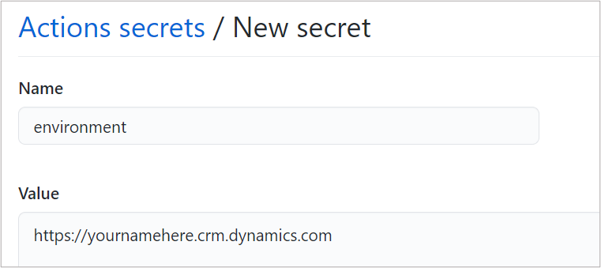](../media/exercise-3.png#lightbox)

1. Select **Add Secret**.

1. Add another secret with a name of **user** with the value containing the **email** of the account you use to access the environment.

1. Add another secret with a name of **password** with the value containing the **password** of the account you use to access the environment.

1. After adding the secrets your list of values should look like the following:

	> [!div class="mx-imgBorder"]
	> 

## Task 3: Create a GitHub Action

1.  In the repository navigation, select the **Action** menu item.

	> [!div class="mx-imgBorder"]
	> 

1.  Select the **setup a workflow yourself**.

	> [!div class="mx-imgBorder"]
	> 

1.  In the **Edit new file** area clear out the YAML that was provided.

	> [!div class="mx-imgBorder"]
	> [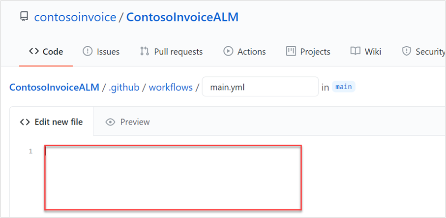](../media/exercise-7.png#lightbox)

1.  Open the provided export-and-branch-solution.yml file and paste the contents into the Edit new file area.

	> [!div class="mx-imgBorder"]
	> [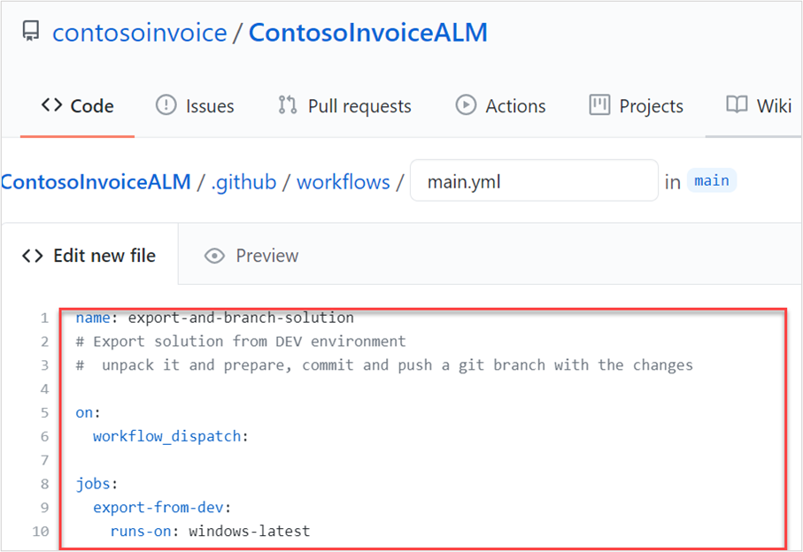](../media/exercise-8.png#lightbox)

1.  You have added the following four steps 1) Who am I to test connection, 2) Export solution, 3) Unpack the solution and 4) Create a branch and check in the solution files.

	> [!div class="mx-imgBorder"]
	> 

1.  Select **Start commit** on right side, then select **Commit new file**. This will save your action you built.

	> [!div class="mx-imgBorder"]
	> [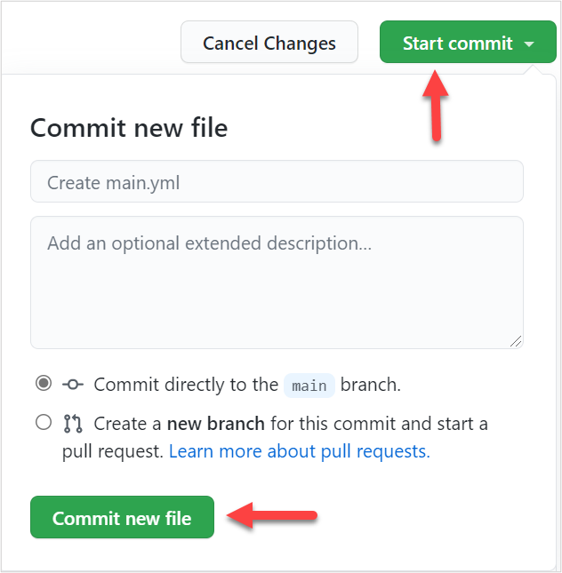](../media/exercise-10.png#lightbox)

1.  Your action has been saved and is ready to run.

## Task 4: Run the export action

1.  Navigate to repository **Actions**.

	> [!div class="mx-imgBorder"]
	> 

1.  Select the **export-and-branch-solution** action and then select **Run workflow**.

	> [!div class="mx-imgBorder"]
	> 

1.  With Use workflow from **main** branch-selected select **Run workflow**.

	> [!div class="mx-imgBorder"]
	> [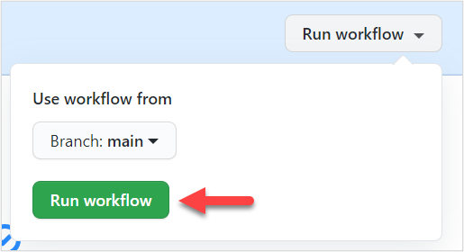](../media/exercise-13.png#lightbox)

1.  Monitor the workflow progress until it has completed successfully.

	> [!div class="mx-imgBorder"]
	> 

1.  Select **Code** in the navigation and then select **branches**.

	> [!div class="mx-imgBorder"]
	> [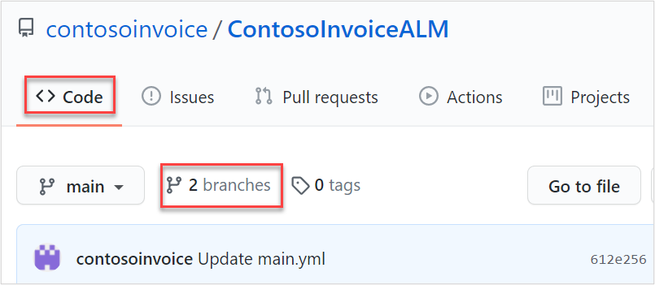](../media/exercise-15.png#lightbox)

1.  You should see the branch that was created by the GitHub Action execution. Currently this is not merged in with your main branch. Select **New pull request** to start the merge process.

	> [!div class="mx-imgBorder"]
	> [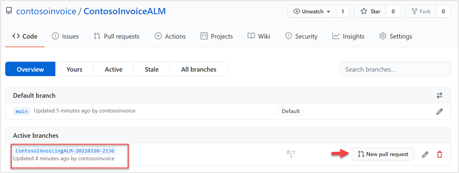](../media/exercise-16.png#lightbox)

1.  In the comments area type **Initial version of connector.**

1.  Select the **Create pull request**.

1.  Now typically someone would review and merge, but since it is just you, you should approve the pull request yourself.

1. Expand **Merge pull request** and select **Squash and merge.**

	> [!div class="mx-imgBorder"]
	> [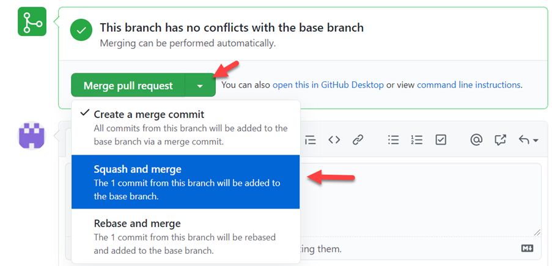](../media/exercise-17.png#lightbox)

1. Select **Squash and merge** then select **Confirm squash and merge.**

1. Your branch with your changes has now been merged.

1. Select Code and select **solutions/ContosoInvoiciningALM**. This folder contains the solution files that were created. You can browse content of this folder what was extracted from the solution and stored as individual files.

	> [!div class="mx-imgBorder"]
	> [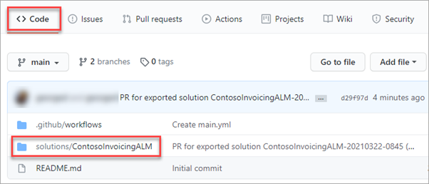](../media/exercise-18.png#lightbox)

## Task 5: Change and record connector definitions

1.  Navigate to [Power Apps maker portal](https://make.powerapps.com/?azure-portal=true) and make sure you are in the correct environment.

1.  Select **Solutions** then select **Contoso Invoicing - ALM** solution.

1.  Select ... next to the custom connector component and select **Edit**.

	> [!div class="mx-imgBorder"]
	> [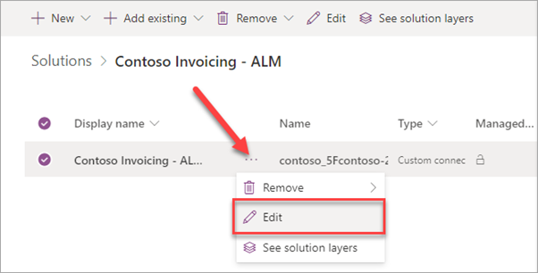](../media/exercise-19.png#lightbox)

1.  Change **Icon background color** to **#0066ff** and select **Update connector**.

	> [!div class="mx-imgBorder"]
	> [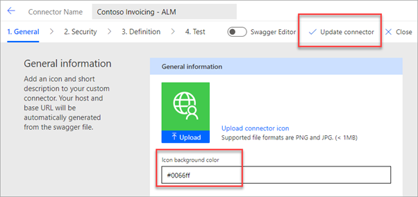](../media/exercise-20.png#lightbox)

1.  Repeat steps 1-12 of the **Task 4** to run the workflow, create new pull request, and merge the code into the main branch.

1.  Select **Code** in the navigation then select the pull request name to open the details.

	> [!div class="mx-imgBorder"]
	> 

1.  Verify the recorded change in icon color from #007ee5 to #0066ff

	> [!div class="mx-imgBorder"]
	> [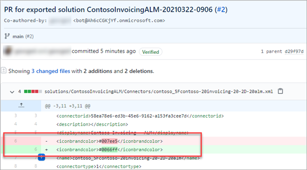](../media/exercise-22.png#lightbox)

> [!NOTE]
> There could be other automatic changes applied when you save the connector, for example, icon format may change from jpeg to png.

You now have an automated process to export and record your custom connector changes in a source control system.