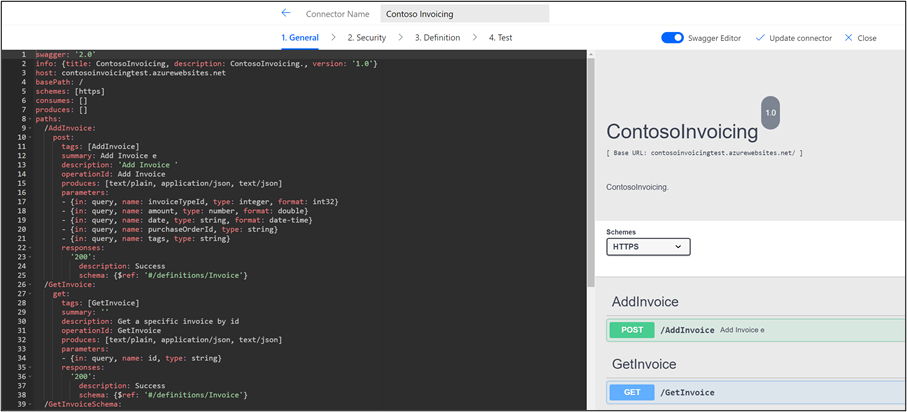

Power Platform custom connectors use OpenAPI (also known as Swagger) definitions to describe authentication, actions, triggers, and their parameters. The OpenAPI specification allows you to define extensions that augment the core definition to handle specific scenarios. Microsoft has defined several extensions to the OpenAPI definition to allow configuring specific features supported by custom connectors.

Each of these extensions can be identified by looking for x-ms-\<name\> in the OpenAPI definitions. Some of these you've probably already used as you configured a custom connector with the designer. For example, when you input a summary on an action's parameter that uses the x-ms-summary extension to store the value in the definition. There are also several extensions that you can only edit either directly via the designer's Swagger editor, or by exporting the connector's definitions, editing, and importing them back. You can find a [complete list of custom connector supported extensions](https://docs.microsoft.com/connectors/custom-connectors/openapi-extensions/?azure-portal=true). In this module, we'll cover the following extensions and their use:

-   **x-ms-capabilities:** used on the connector and operation level definition to indicate features that are offered

-   **x-ms-encoding:** specify encoding for a path parameter

-   **x-ms-dynamic-values and x-ms-dynamic-list:** provide a list of options for user to select input parameters for an operation

-   **x-ms-dynamic-schema:** allows making parameters and response dynamic based on results of schema retrieved from an operation on the API

The primary use case for spending the effort to configure these extensions is to make the connector easier to use. For example, without dynamic values for the maker, they would have to know internal unfriendly schema values or strings for type / lookup parameters. By configuring dynamic values an easy to use dropdown list is provided for them to select from.

Keep in mind, some of the extensions require support from the API also. For example, dynamic schema requires the API to support an operation to retrieve the schema. In cases where you don't control the API, it might not be possible to configure these types of extensions.

## Configuring extensions

While some OpenAPI extensions are configured as you work with definitions using the designer, the ones we're covering in this module aren't. To configure these extensions, you must use one of the following approaches:

-   **Import OpenAPI:** When you import an OpenAPI file, it can contain Microsoft OpenAPI extensions.

-   **Power Platform Connectors CLI:** Using the command-line tool paconn you can download the API definition file and edit it using your favorite JSON editor. When you have finished editing, you can use paconn to upload the amended definitions back to your environment. This approach is best when you need to make other changes like to the API Properties file for things like connection parameters.

-   **Built**-**in Swagger editor:** The custom connector designer has a built-in OpenAPI editor that is the quickest way to add OpenAPI extensions.

## Using the Swagger editor

You can make the Swagger editor visible by toggling the Swagger editor switch from any of the steps in the custom designer.

> [!div class="mx-imgBorder"]
> 

Once the editor is engaged you'll see the OpenAPI definition in YAML Ain't Markup Language (YAML) on the left, and validation messages (if any) and an operation list on the right.

> [!div class="mx-imgBorder"]
> 

If you aren't familiar with [YAML](https://yaml.org/?azure-portal=true), it's a human friendly data serialization standard making it possible for you to make changes to it, save it, and have it consumed by the connector runtime.

Most of the changes you'll be making you'll have an example to start from. A good place to look is other connectors in the [Power Platform Connector GitHub repository](https://github.com/microsoft/PowerPlatformConnectors/?azure-portal=true). For example, if you were going to implement an x-ms-capability extension you could search the repository and see how other connectors have configured it.

When using the editor, it's best to make small, focused changes. The editor checks your syntax as you type and tells you in real time if there's a mistake and where the mistake is.

> [!div class="mx-imgBorder"]
> 

Here are some tips for working with YAML in the swagger editor:

-   **Indentation matters:** indentation is a part of YAML specifications so take a minute to observe how indentation is used to further provide configuration specifics

-   **Open and close {}:** if you have an opening { you need a closing }

-   **Open and close []:** if you have an opening [ you need a closing ]

-   **Ctrl-F for Find:** allows you to search within the YAML

-   **Ctrl**-**Z for Undo:** if you notice you made a mistake, using Ctrl-Z will undo your last change

In the rest of this module, you'll explore how to use some of the Microsoft OpenAPI extensions to make your custom connectors easier to use.