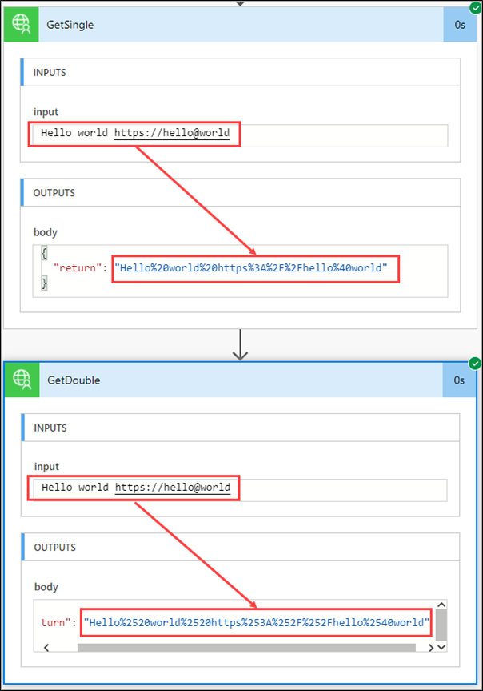

In this unit, we're going to explore how to use the Microsoft OpenAPI extensions x-ms-capabilities and x-ms-url-encoding in your custom connectors.

The x-ms-capabilities extension allows configuring what capabilities are offered by the connector at both the connector level and operation level. Currently, Power Platform custom connectors can be configured for the following options:

-   **chunkTransfer:** operation level

-   **testConnection:** connector level

## Enabling chunk transfer

When handling messages, the connector runtime limits message content to a maximum size. This limit helps reduce overhead created by storing and processing large messages. To handle messages larger than this limit, connectors can chunk a large message into smaller message chunks. That way, you can still transfer large content. When communicating with other services through connectors the runtime can consume large messages but only in chunks. This condition means connectors must also support chunking, and the underlying HTTP message exchange between the connector and these services must use chunking.

For a custom connector to use chunk transfer the following is required:

-   The API must support chunking. You can read more on how this works [here](https://docs.microsoft.com/azure/logic-apps/logic-apps-handle-large-messages?azure-portal=true#chunked-message-handling-for-connectors).

-   Your custom connector must enable the chunk transfer capability extension on the action.

-   The maker using your connector action must enable chunk transfer for the flow step.

In your custom connector definition, you would add the following to the operations definition that you want to enable chunk transfer.

`{chunkTransfer: true}`

> [!div class="mx-imgBorder"]
> 

If you were working with the downloaded apiDefinition.swagger.json file instead of the YAML editor, you would make the following change:

> [!div class="mx-imgBorder"]
> 

Once this change has been made, you won't see any indication of it in the custom connector designer. However, when the action is used in a flow you now will see the following Allow chunking option on the step's settings.

> [!div class="mx-imgBorder"]
> 

Assuming the API supported it, once enabled, large messages would now work and be transferred using chunking.

## Configuring test connection

When you create a connection using a custom connector by default the connection isn't verified whether it's a valid one. For example, if you provided an invalid host URL or an invalid API key, you could create a connection, but it would eventually fail when the connection was used. Using the testConnection OpenAPI extension you can specify an operation on your custom connector that will be run during connection creation to validate the configuration provided.

To implement connection testing, you must have a simple operation defined on your custom connector that returns HTTP 200 (success). This can be an existing operation that you already have configured, or you could create one specifically for testing the connection. If you configure a specific test operation it's recommended to mark it internal, so users don't try to use it. You can also pass static parameters to the operation. For example, if your action took a $top parameter to limit number of records returned you could use parameters to limit results to one record.

In the following example, we have already defined a ListInvoices operation and now we are going to use it to test the connection. The following image shows configuring the testConnection extension:

> [!div class="mx-imgBorder"]
> 

And if you're editing the apiDefinition.swagger.json it would look like the following:

> [!div class="mx-imgBorder"]
> 

## Configure path encoding

The final extension we're going to explore in this unit is x-ms-url-encoding. This extension applies to parameters that are included in the request URL path.

For example, you can define an action to return customers by country with the following request

`https://myapi.myservice.com/customers/{country}`

In this action, country will become a parameter supplied by the user of the connector. Because these parameters are part of the path, they need to be url-encoded. By default, path parameters are single url-encoded. However, in certain scenarios the underlying API may expect the parameters to be double url-encoded to resolve any potential ambiguities introduced by the certain characters such as '@', '/', '\', etc.

To configure double encoding on a path parameter, you would add the following option to the parameter:

x-ms-url-encoding: double

Consider the API that has two methods both simply returning the input path parameter but one of them using double encoding:

> [!div class="mx-imgBorder"]
> 

When we run a Power Automate flow that calls both actions with a complex input, you can see how double encoding passes the same text value to the API except now it's double-encoded.

> [!div class="mx-imgBorder"]
> 

This extension simplifies handling of the parameters where the API expects double url-encoding because a connector user doesn't need to encode the path parameters when calling the actions.

In this unit, we looked at how to configure and use the Microsoft OpenAPI extensions x-ms-capabilities and x-ms-url-encoding in your custom connectors.