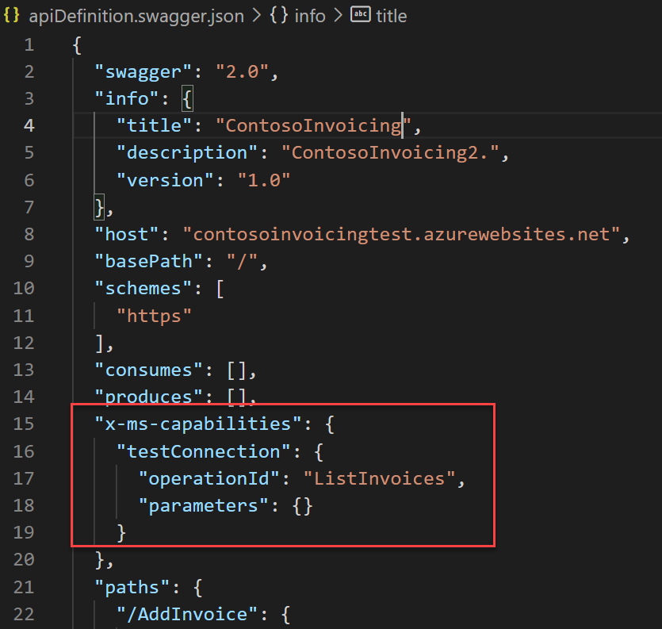
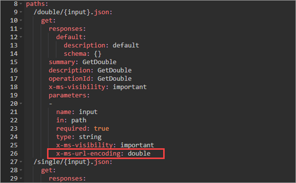

This unit explores how to use the Microsoft OpenAPI extensions **x-ms-capabilities** and **x-ms-url-encoding** in your custom connectors.

The **x-ms-capabilities** extension helps you configure which capabilities are offered by the connector at the connector level and operation level. Currently, Power Platform custom connectors can be configured for the following options:

-   **chunkTransfer** - Operation level

-   **testConnection** - Connector level

## Enable chunk transfer

When handling messages, the connector runtime limits message content to a maximum size. This limit helps reduce overhead that is created by the storing and processing of large messages. To help handle messages that are larger than this limit, connectors can chunk a large message into smaller message chunks. That way, you can still transfer large content. When communicating with other services through connectors, the runtime can consume large messages but only in chunks. This condition means that connectors must also support chunking, and the underlying HTTP message exchange between the connector and these services must use chunking.

For a custom connector to use chunk transfer, the following parameters are required:

-   The API must support chunking. For more information, see [Chunked message handling for connectors](https://docs.microsoft.com/azure/logic-apps/logic-apps-handle-large-messages?azure-portal=true#chunked-message-handling-for-connectors).

-   Your custom connector must enable the chunk transfer capability extension on the action.

-   The maker who is using your connector action must enable chunk transfer for the flow step.

In your custom connector definition, you would add the following logic to the operations definition for which you want to enable chunk transfer.

`{chunkTransfer: true}`

> [!div class="mx-imgBorder"]
> 

If you were working with the downloaded apiDefinition.swagger.json file instead of the YAML editor, you would make the change that is shown in the following screenshot.

> [!div class="mx-imgBorder"]
> 

After this change has been made, indication of the change won't be shown in the custom connector designer. However, when the action is used in a flow, the following **Allow chunking** option will display on the step's settings.

> [!div class="mx-imgBorder"]
> 

Assuming that the API supported it, after chunking has been enabled, large messages would now work and be transferred by using chunking.

## Configure test connection

By default, when you create a connection by using a custom connector, the connection isn't verified as being valid or not. For example, if you provided an invalid host URL or an invalid API key, you could create a connection, but it would eventually fail when the connection was used. By using the **testConnection** OpenAPI extension, you can specify an operation on your custom connector that will be run during connection creation to validate the provided configuration.

To implement connection testing, you must have a simple operation defined on your custom connector that returns HTTP 200 (success). This operation can be an existing one that you have configured already, or you could create one specifically for testing the connection. If you configure a specific test operation, we recommend that you mark it as **internal** so that users don't try to use it. You can also pass static parameters to the operation. For example, if your action took a **$top** parameter to limit the number of records returned, you could use parameters to limit results to one record.

The following example shows the defined ListInvoices operation and how it will be used to test the connection, and it shows configuring of the **testConnection** extension.

> [!div class="mx-imgBorder"]
> 

Editing apiDefinition.swagger.json would look similar to the following image.

> [!div class="mx-imgBorder"]
> 

## Configure path encoding

The **x-ms-url-encoding** extension applies to parameters that are included in the request URL path.

For example, you can define an action to return customers by country with the following request:

`https://myapi.myservice.com/customers/{country}`

In this action, *country* will become a parameter that is supplied by the user of the connector. Because these parameters are part of the path, they need to be URL-encoded. By default, path parameters are single URL-encoded. However, in certain scenarios, the underlying API might expect the parameters to be double URL-encoded to resolve potential ambiguities that are introduced by certain characters such as the at sign (@), slash (/), back slash (\), and so on.

To configure double encoding on a path parameter, you would add the following option to the parameter:

**x-ms-url-encoding: double**

Consider the API that has two methods that return the input path parameter, except one of them uses double encoding, as shown in the following image.

> [!div class="mx-imgBorder"]
> 

When you run a Microsoft Power Automate flow that calls both actions with a complex input, double encoding passes the same text value to the API, except that it's now double-encoded.

> [!div class="mx-imgBorder"]
> 

This extension simplifies handling of the parameters where the API expects double URL encoding because a connector user doesn't need to encode the path parameters when calling the actions.

