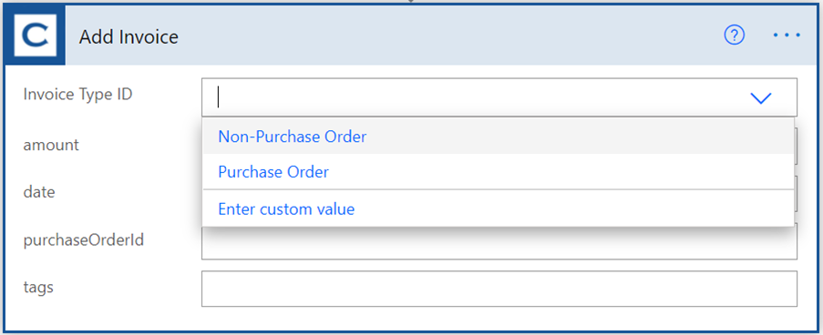

When you configure a parameter for an action on a custom connector the default maker's experience to enter the parameter value is a simple textbox. If you had a parameter on an Add Invoice action named Invoice Type ID, the maker experience would look like the following:

> [!div class="mx-imgBorder"]
> [

As you can see, the maker would need to know the magic values for Invoice Type ID. Which in our example is the following:

|     Value    |     Label                  |
|--------------|----------------------------|
|     1        |     Purchase Order         |
|     2        |     Non-Purchase Order     |

A maker would need to input 1 to indicate the invoice is of type Purchase Order. To make this easier OpenAPI definition, support the enum keyword. You can define an enum with a list of values the maker can choose from.

You can configure an enum using the custom connector designer by editing the parameter configuration. On the configuration if you select static in the Dropdown type area it will let you provide a comma-separated list of values. The following is what the Invoice Type ID configuration would look like:

> [!div class="mx-imgBorder"]
> 

You can also use the Swagger Editor and add the enum:

> [!div class="mx-imgBorder"]
> 

And if you looked at the maker experience in Power Automate it would now look like the following:

> [!div class="mx-imgBorder"]
> 

While that is improved, it still requires the maker to know what the value of 1 or 2 means. You could describe that in the parameter description to make it easier. Using enums is best for self-describing data. For example, if you had a parameter for Days Due and used an enum for 30,60,90 that would be easy to understand and use. Another limitation on using enum is if the API adds new allowable values you must edit the custom connector enum definition and publish the updated version of the connector. To improve the experience further Microsoft added an OpenAPI extension x-ms-dynamic-values.

## Configuring Dynamic values

You can configure the x-ms-dynamic-values extension on a parameter to have the list of values retrieved from the underlying API. The following are some of the benefits of this approach.

-   You can configure a label the user sees in addition to the value.

-   The values returned always represent the correct values from the API.

-   The API can trim the list of values based on security or other needs per user or per connection basis.

-   Other parameter values can be passed to the API to allow filtering of the list returned.

-   Output of one field can be used as input parameter for another API call making it possible to build dependant options, for example, countries and states lists.

The API you're working with must provide an operation that returns an array of valid values and optionally their descriptions. To support our example of Invoice Type ID, the API provided a ListInvoiceTypes operation that returned the following data.

> [!div class="mx-imgBorder"]
> 

In the custom connector designer for the Invoice Type ID parameter, you can configure the x-ms-dynamic-values extension by selecting Dynamic and specifying an Operation ID, and the value and display name properties. The following shows the configuration for Invoice Type ID:

> [!div class="mx-imgBorder"]
> 

You can also configure the x-ms-dynamic-values extension using the Swagger editor.

> [!div class="mx-imgBorder"]
> 

Using the Swagger editor or downloading and editing the JSON is required if you're configuring any parameters on the extension.

Now with the extension configured the maker is presented with a much more user-friendly experience when they use the action.

> [!div class="mx-imgBorder"]
> 

In addition to the x-ms-dynamic-values extension Microsoft has also implemented a newer extension called x-ms-dynamic-list. In concept, both accomplish the same thing making the action's parameter a dropdown list the user can select from. You can think of x-ms-dynamic-values as version 1, and x-ms-dynamic-list as version 2. If you're supporting older existing flows, it's recommended to implement both in your definition. If you're only supporting newly created flows, then use only x-ms-dynamic-list. Extension x-ms-dynamic-list improves the schema for the action parameters making it possible to resolve some ambiguous references. For example, if a request has a path parameter ID and a parameter ID as part of the request body, x-ms-dynamic-list specification allows to differentiate the two parameters while x-ms-dynamic-values wouldn't be able to support this API.

To configure, x-ms-dynamic-list you must directly change the OpenAPI definition as the custom connector designer only configures x-ms-dynamic-values. The following is our x-ms-dynamic-values configuration that we added an x-ms-dynamic-list configuration also:

> [!div class="mx-imgBorder"]
> 

Configuring dynamic values on parameters for a custom connector can make the custom connector a lot more friendly for a maker to use.