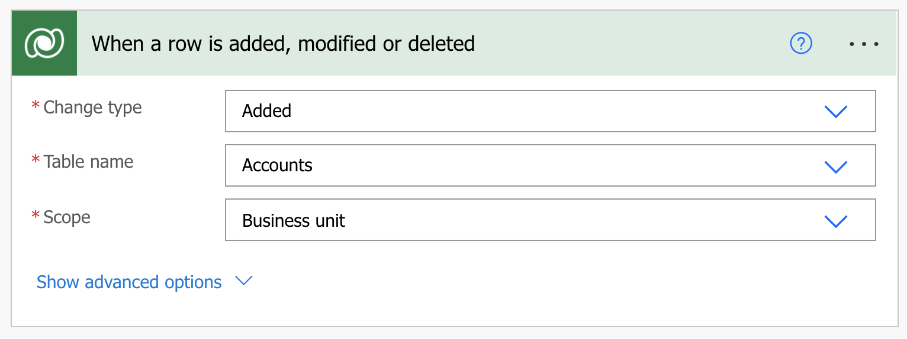

All triggers in Power Automate produce information, called dynamic content. Sometimes this information is only who began the flow by pressing a button, but all of the Dataverse triggers give at minimum a row of data from a table.

When you use a Dataverse trigger, you need to specify the Environment, Entity Name, and Scope. Environments are like buckets to help organize tables, flows, apps, and more. Some organizations only use a single environment, but many have multiple environments for various priorities and developments. Entity is just another word for table. This allows you to specify the exact table where your data is held which should trigger your flow. Scope allows you to specify when the flow runs according to the user triggering it. User means that only actions on a record you own will trigger this flow. A scope of business unit means that actions taken on a record your business unit owns will trigger the flow. Similarly, a trigger with a scope of Parent: Child business unit will be fired on actions taken on a record that your business unit or any child business units owns. A scope of organization means the flow will be triggered for any actions taken on the record, regardless of owner.

> [!div class="mx-imgBorder"]
> 

One trigger allows you to request more inputs. When a user creates, updates, or deletes a record, you do not have the opportunity to ask for more information since the user could be performing those actions from multiple places. However, with the trigger 'When a record is selected' the user triggers the flow from a button on the table inside Dataverse. Since Power Automate knows where the user is performing the action, you can request additional input for use later in the app. Select **Add an input** and specify the type of input desired and a short message to the user. For example, the below requests and email address. The scope is not requested since any user who has access to the table in Dataverse would be able to press the button on any record they had access to.

> [!div class="mx-imgBorder"]
> 

Now that you understand the mechanics of triggers and how to use them, let's take a look at the actions you can perform within your flows.
