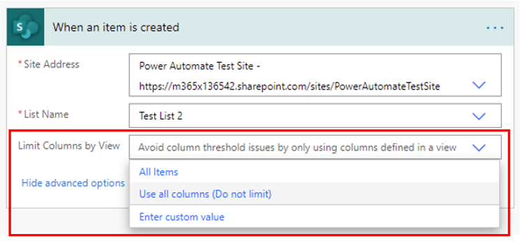
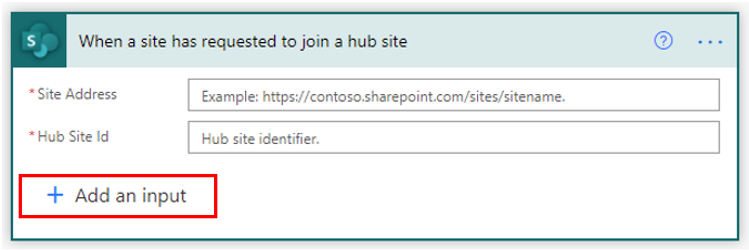
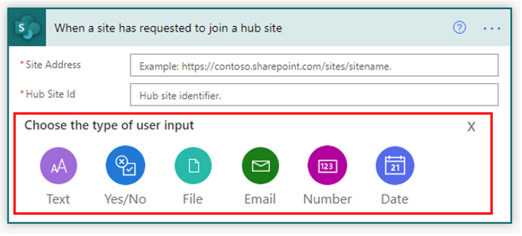

A trigger is the event that starts the flow. For example, if an item is added or edited in a SharePoint list, it will trigger a flow for an action, such as sending an email notification.

## Available SharePoint triggers for a Power Automate flow

SharePoint Connector for Microsoft Power Automate supports the following flow triggers.

| **Trigger** | **Description** |
|-------------|-----------------|
| When an item is created | Triggers when an item is created. |
| When an item is created or modified | Triggers when an item is created and each time that it's modified. |
| When a file is created in a folder | Triggers when a file is created in a SharePoint folder. The trigger doesn't fire if a file is added/updated in a subfolder. If it's required to trigger on subfolders, multiple triggers should be created. |
| For a selected file | This trigger allows you to start a flow for a selected file. Inputs are: **Site Address** and **Library Name**. Outputs are: **Name**, **Link to Item**, and **ID**. |
| For a selected item | This trigger allows you to start a flow for a selected item in a SharePoint list or library. You can use the columns of the list or library as output parameters. For a file, you can use the **identifier** column to get file content. |
| When a file is classified by a content understanding model | Triggers when a Microsoft SharePoint Syntex content understanding model classifies a file, which is shown in the classification date property of the file. |
| When a file is created (properties only) | Triggers when an item is created in a library. Returns only properties that are stored in the library columns. You can add a "Get file content" step and then use the **File identifier** property that is returned by this action to get to the contents of the file. |
| When a file is deleted | Triggers when a file is deleted in a library. Optionally, you can specify a folder to watch as well. When a folder is deleted, the trigger will fire only once for the deleted folder. This trigger can only be used by site collection admins of the site where the list is located. |
| When a site has requested to join a hub site | Triggers a flow on hub site join approval. |
| When an item is deleted | Triggers when an item is deleted in a list. This trigger can only be used by site collection admins of the site where the list is located. |
| When an item or a file is modified | Triggers when an item is created and each time that it's modified. |
| When a file is created or modified in a folder | Triggers when a file is created and each time that it's modified in a SharePoint folder. The trigger doesn't fire if a file is added/updated in a subfolder. If it's required to trigger on subfolders, multiple triggers should be created. |

## Key features and capabilities

The following features are only available for Power Automate.

Some SharePoint triggers have advanced options that help avoid issues such as threshold limits. The following triggers have advanced options.

### When an item is created

For the **When an item is created** trigger, you can select views from the SharePoint list to limit columns by view and avoid threshold issues.

> [!div class="mx-imgBorder"]
> 

The same advanced option is also available for the following triggers:

- When an item is created or modified

- When a file is classified by a content understanding model

- When a file is created (properties only)

- When a file is created or modified (properties only)

- When an item or a file is modified

### When a file is created in a folder

The **When a file is created in a folder** trigger has an advanced option called **Infer Content Type**. This option allows you to retrieve the content type that is tied to the document. This feature can be useful because a content type is a reusable collection of metadata and other settings for documents in a SharePoint library. Content types also enable you to manage the settings for a category of information in a centralized, reusable way.

> [!div class="mx-imgBorder"]
> 

The same advanced option is available for the **When a file is created or modified in a folder** trigger.

### When a site has requested to join a hub site

The **When a site has requested to join a hub site** trigger has an option to add an input.

> [!div class="mx-imgBorder"]
> 

When this trigger is selected, you can choose the type of user input to collect.

> [!div class="mx-imgBorder"]
> 
