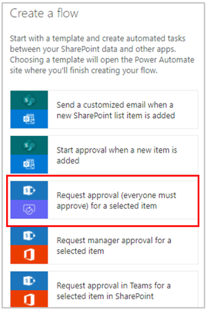

Mail Connection Provider lets you send email notifications. It can be used with both Power Apps and with Power Automate.

## Basic concept of the Mail connector

On actions, no triggers are available for mail. The following action is the only one available.

| **Action** | **Description** |
|------------|-----------------|
| Send an email notification (V3) | Send an email notification to the specified email addresses. |

## Send an email action with dynamic content from SharePoint

The SharePoint connector has a trigger for new items in power automate flows. In this example, we're going to start a workflow process when a new item for a travel reimbursement request has been submitted. Email notifications are sent using the mail connector.

Here's an overview of the column types for the SharePoint list called Travel Reimbursement.

| **Column** | **Type** | **Required** | **Additional information** |
|------------|----------|--------------|----------------------------|
| Title | Single line of text | Yes | |
| Expense Type | Choice | Yes | The following choices are added: Event, Meal, Supplies, Travel, Other |
| Description | Multiple lines of text | Yes | 10 lines of plain text |
| Cost | Currency | Yes | |
| Manager | Person or Group | No | Person |

Here's a screenshot of the SharePoint list. The Created, Created By, Modified and Modified By are automatically added by SharePoint.

> [!div class="mx-imgBorder"]
> 

Go back to the Travel Reimbursement list and from the ribbon, select **Automate**, then **Power Automate**, and select **Create a flow.**

> [!div class="mx-imgBorder"]
> 

Select the **Request approval (everyone must approve) for a selected item** template.

> [!div class="mx-imgBorder"]
> 

Select **Create Flow.**

> [!div class="mx-imgBorder"]
> 

The flow is suspended by default, so you need to turn in on. Also select **Edit** to view the flow design.

> [!div class="mx-imgBorder"]
> 

The flow contains the mail action.

> [!div class="mx-imgBorder"]
> 

You've successfully created an email action flow using Mail with dynamic content from SharePoint.
