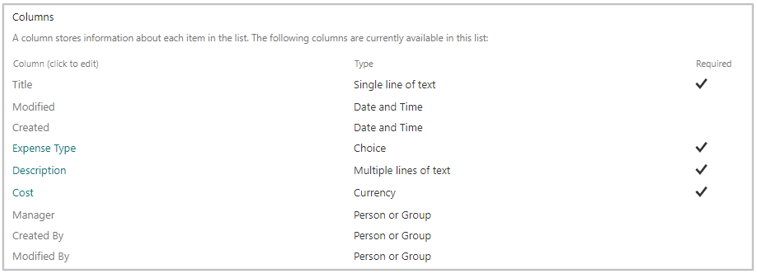

Mail Connection Provider lets you send email notifications, and it can be used with Microsoft Power Apps and Microsoft Power Automate.

## Basic concept of the Mail connector

No triggers are available for mail on actions. The following action is the only one that is available.

| **Action** | **Description** |
|------------|-----------------|
| Send an email notification (V3) | Send an email notification to the specified email addresses. |

## Send an email action with dynamic content from SharePoint

The SharePoint connector has a trigger for new items in Power Automate flows. This example shows a workflow process being started when a new item for a travel reimbursement request has been submitted. Email notifications are sent by using the Mail connector.

The following table provides an overview of the column types for the SharePoint list called **Travel Reimbursement**.

| **Column** | **Type** | **Required** | **Additional information** |
|------------|----------|--------------|----------------------------|
| Title | Single line of text | Yes | |
| Expense Type | Choice | Yes | The following choices are added: Event, Meal, Supplies, Travel, Other |
| Description | Multiple lines of text | Yes | 10 lines of plain text |
| Cost | Currency | Yes | |
| Manager | Person or Group | No | Person |

The following screenshot shows the SharePoint list. SharePoint automatically adds the **Created**, **Created By**, **Modified**, and **Modified By** columns.

> [!div class="mx-imgBorder"]
> 

Return to the **Travel Reimbursement** list and, from the ribbon, select **Automate > Power Automate > Create a flow**.

> [!div class="mx-imgBorder"]
> 

Select the **Request approval (everyone must approve) for a selected item** template.

> [!div class="mx-imgBorder"]
> 

Select **Create Flow**.

> [!div class="mx-imgBorder"]
> 

You need to **Turn on** the flow because it is suspended by default. Select **Edit** to view the flow design.

> [!div class="mx-imgBorder"]
> 

The flow contains the Mail action.

> [!div class="mx-imgBorder"]
> 

You've successfully created an email action flow by using Mail with dynamic content from SharePoint.
