Thanks to Microsoft Power Automate, we can build flows that monitor incoming emails and save its metadata to a SharePoint list and its attachment to a document library.

## Save metadata from emails to SharePoint lists

Microsoft Outlook has a trigger for When a new email arrives. We'll use this to trigger to monitor incoming emails and save its metadata such as to, from, subject, body preview and cc to a SharePoint list. The data will only be captured if the subject has 'Monthly Report' text in it.

Here's an overview of the column types for the SharePoint list called Incoming Emails

| **Column** | **Type** | **Required** | **Additional information** |
|------------|----------|--------------|----------------------------|
| Title | Single line of text | Yes |
| From | Single line of text | No |
| To | Single line of text | No |
| Importance | Single line of text | No |
| CC | Single line of text | No |
| Body Preview | Multiple lines of text | No | Enhanced rich text |
| Received time | Date and Time | No | Date & Time format |
| Has Attachment | Single line of text | No |

Here's a screenshot of the SharePoint list. SharePoint automatically adds the **Created**, **Created By**, **Modified**, and **Modified By** columns.

> [!div class="mx-imgBorder"]
> [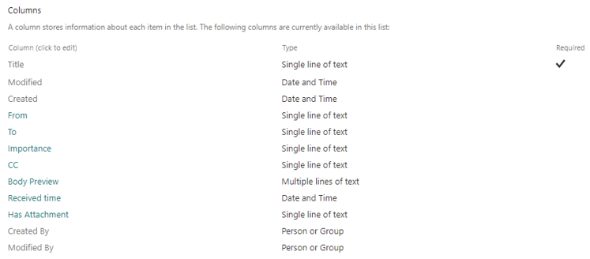](../media/5-01-columns.png#lightbox)

Go to [https://flow.microsoft.com](https://flow.microsoft.com/?azure-portal=true). Select **Templates** and type in **Incoming emails**. Then select the **Activity record for incoming emails in SharePoint with specific subject** template.

> [!div class="mx-imgBorder"]
> [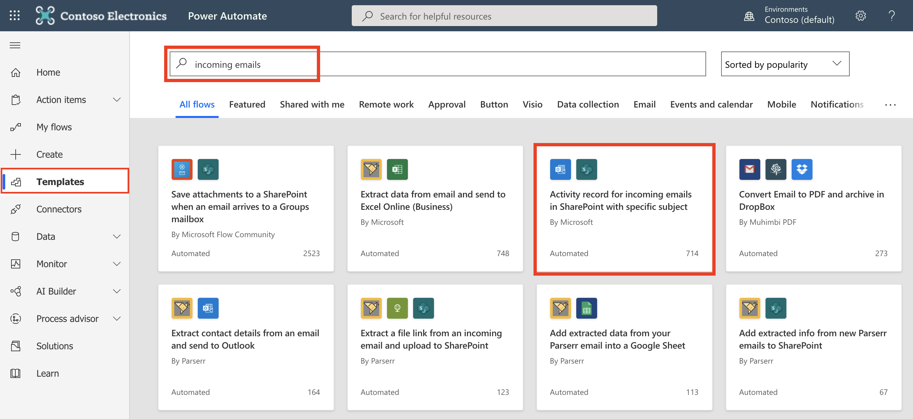](../media/5-02-incoming.png#lightbox)

Select **Continue.**

> [!div class="mx-imgBorder"]
> [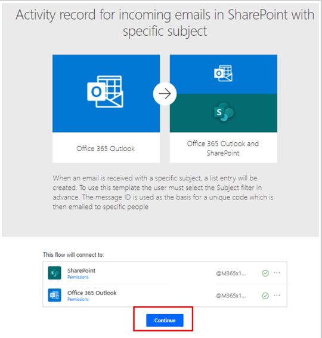](../media/5-03-activity.png#lightbox)

Select **Expand condition.**

> [!div class="mx-imgBorder"]
> [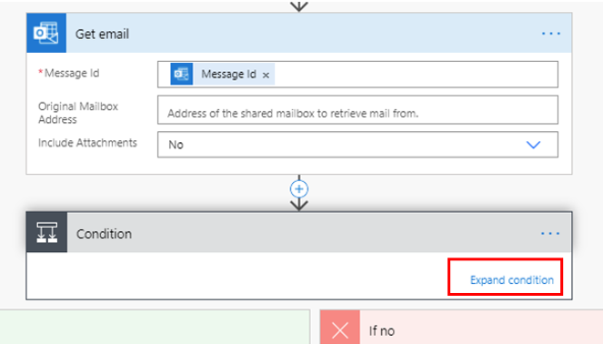](../media/5-04-expand.png#lightbox)

Change the text from test to **Monthly Report.**

> [!div class="mx-imgBorder"]
> 

In Create item add the **Site Address**, **List Name** and then populate the fields using **Dynamic content**. The fields are from **Get email**.

> [!div class="mx-imgBorder"]
> [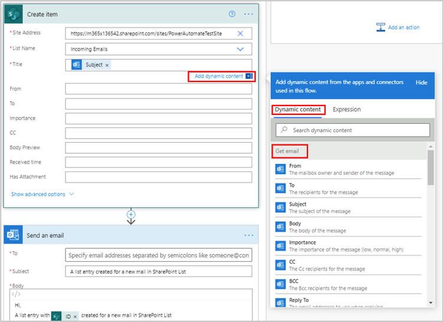](../media/5-06-create.png#lightbox)

This is what it looks like when all the fields are populated.

> [!div class="mx-imgBorder"]
> [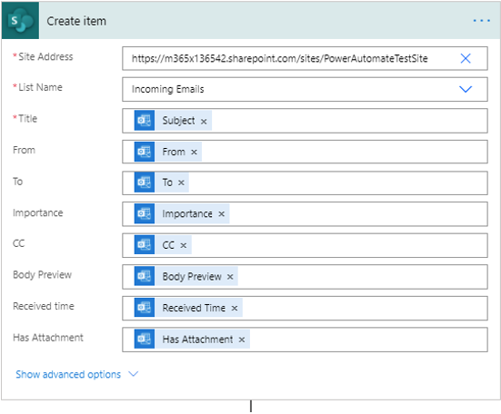](../media/5-07-create-filled.png#lightbox)

You can delete the **Send an email** action.

> [!div class="mx-imgBorder"]
> [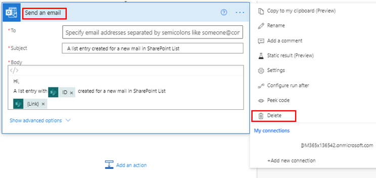](../media/5-08-delete.png#lightbox)

The flow monitors the incoming emails to your inbox and if any of the emails' subject contains Monthly Report, the metadata is captured and saved to the **Incoming Emails** SharePoint list.

> [!div class="mx-imgBorder"]
> 

## Save attachments from emails to SharePoint libraries

Microsoft Outlook has a trigger for When a new email arrives. We'll use this trigger to monitor incoming emails and save the attachments to a SharePoint document library. The trigger is watching to see if the email has attachments and if it has been sent from a specific person with the subject 'Monthly report.'

To create a new document library, select the **settings** gear icon and select **Site contents.**

> [!div class="mx-imgBorder"]
> 

Select **+ New** and select **Document library.**

> [!div class="mx-imgBorder"]
> 

Give the name **Incoming Emails** and select **Create.**

> [!div class="mx-imgBorder"]
> 

Here's an overview of the column types you need to add for the library.

| **Column** | **Type** | **Required** | **Additional information** |
|------------|----------|--------------|----------------------------|
| From Name | Single line of text | No | |
| From Email | Single line of text | No | |

While you are in settings, scroll to the bottom and select **All Documents**, which is in Views.

> [!div class="mx-imgBorder"]
> [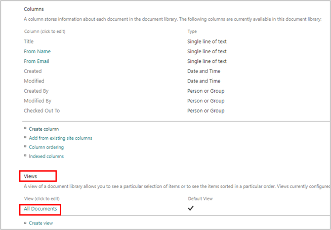](../media/5-13-views.png#lightbox)

Select **File Size**. This is a built-in column that comes with document libraries. Select **OK**.

> [!div class="mx-imgBorder"]
> 

You now have a document library created. Next, go to [https://flow.microsoft.com](https://flow.microsoft.com/?azure-portal=true), select **+ Create** and select **Automated cloud flow**.

> [!div class="mx-imgBorder"]
> 

Select **Skip**.

> [!div class="mx-imgBorder"]
> [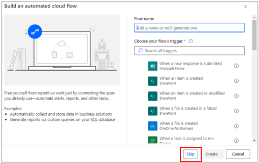](../media/5-16-build.png#lightbox)

Name the flow **Incoming Emails**. In the search bar, look for **Outlook** and then select **When a new email arrives (V3)**.

> [!div class="mx-imgBorder"]
> 

Select **Show advanced option**.

> [!div class="mx-imgBorder"]
> 

Here you add the options to help monitor the incoming emails closely and only capture the attachments from those that match your criteria. We're monitoring the **To**, **From**, **Include Attachments**, and **Subject Filter** fields.

> [!div class="mx-imgBorder"]
> [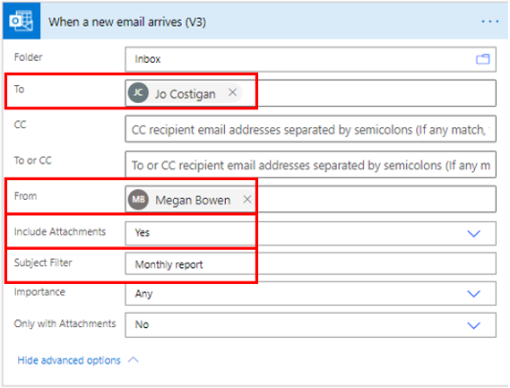](../media/5-19-new-email-options.png#lightbox)

Select **+ Next** step. Search for **SharePoint** and then select **Create file**.

> [!div class="mx-imgBorder"]
> 

Add the **Site address** and **Folder Path**.

> [!div class="mx-imgBorder"]
> [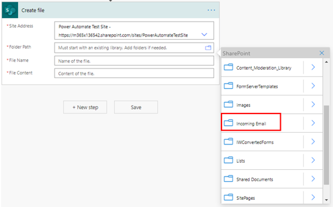](../media/5-21-folder-path.png#lightbox)

For **File name** use **Attachment Name** and for **File Content** use **Attachment Content**.

> [!div class="mx-imgBorder"]
> [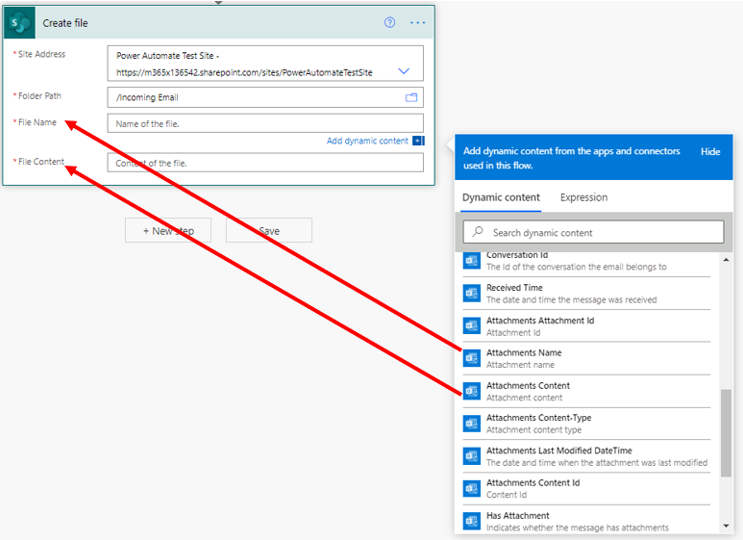](../media/5-22-name-content.png#lightbox)

Once you do, the **Create file** action automatically gets added to **Apply to each**. This is good! It will make sure all the attachments from the email are uploaded to the SharePoint library.

> [!div class="mx-imgBorder"]
> [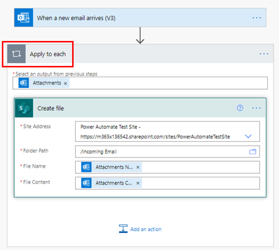](../media/5-23-apply-each.png#lightbox)

Select **Add an action** again, search for SharePoint and this time select **Update files properties**.

Here you add the following:

> [!div class="mx-imgBorder"]
> 

You're done! Make sure you select **Flow checker** and then **Save**.

When Jo Costigan gets an email from Megan Bowen, it has an attachment, and if the Subject contains Monthly report, the attachments are automatically picked up by the flow and saved in the SharePoint library.

> [!div class="mx-imgBorder"]
> 

Here's what the SharePoint library looks like.

> [!div class="mx-imgBorder"]
> [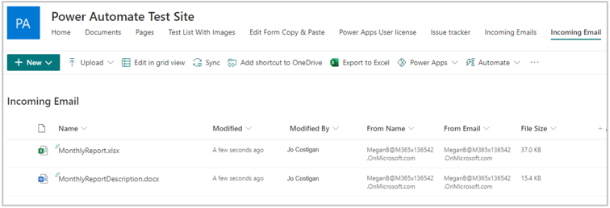](../media/5-26-library.png#lightbox)
