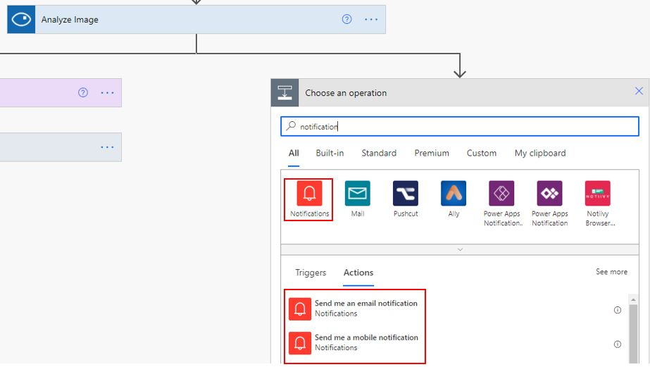
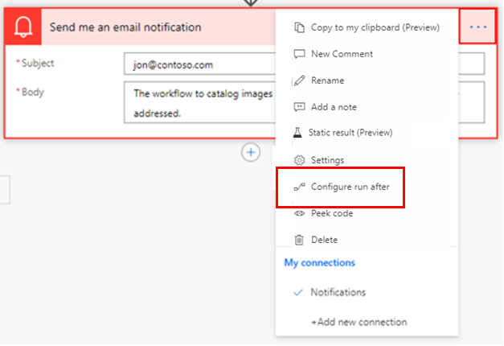

**Configure run after** and email notification comes in handy to swiftly resolve any issues with your workflow run.

## Use Configure run after to handle errors

**Configure run after** first helps you identify which step failed and if it did, bring that to your attention. By default, the selected option is successful, however, the **has failed** is what is used to handle errors.

> [!div class="mx-imgBorder"]
> 

Consider a scenario where after uploading an image to a SharePoint library, you would like to send it to Azure Cognitive Services, an Artificial Intelligence, and Machine Learning service, to analyze the image. After the image is analyzed, all the tags created by Cognitive Services can be saved in SharePoint if you set up a workflow.

The first step is to send the image, that is, the file content to the **Analyze Image** step in the flow.

> [!div class="mx-imgBorder"]
> 

Since multiple tags are received, they're first added to an array variable and the variable is saved in a property column in the SharePoint library.

## Add a parallel branch to get notified immediately

Adding a parallel branch allows you to add either a mobile or email notification step to inform the maker of the flow that an issue has occurred.

Below, after the Analyze Image step, a parallel branch has been added.

> [!div class="mx-imgBorder"]
> 

A **Send me an email notification** parallel step has been selected.

> [!div class="mx-imgBorder"]
> 

In the **Configure run after** for the email notification step, has failed, is skipped, and has timed out checkboxes are selected.

> [!div class="mx-imgBorder"]
> 

> [!Note]
> This is directly tied to the success of the previous step, which in this case is the **Analyze Image**. The below screenshot shows that.
>
> [!div class="mx-imgBorder"]
> 

Now you've successfully added a step to handle any errors the **Analyze Image** may undergo. You can repeat this error handling step for other important actions.
