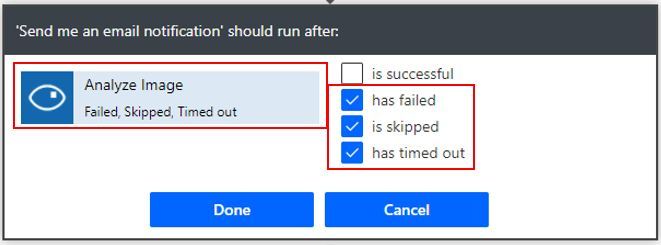

The **Configure run after** option and email notification is beneficial in helping you swiftly resolve issues with your workflow run.

## Use the Configure run after option to handle errors

With the **Configure run after** option, you can identify which step failed and, if it did, bring that to your attention. The **is successful** setting in the notification is the default; however, you would use the **has failed** setting to handle errors.

> [!div class="mx-imgBorder"]
> 

Consider a scenario where, after you have uploaded an image to a SharePoint library, you decide to send it to Microsoft Azure Cognitive Services, an AI and machine learning service, to analyze the image. After the image has been analyzed, you can save all tags that were created by Cognitive Services in SharePoint if you set up a workflow.

The first step is to send the image, or the file content, to the **Analyze Image** action in the flow.

> [!div class="mx-imgBorder"]
> 

Because multiple tags have been received, they're first added to an array variable, and the variable is saved in a property column in the SharePoint library.

## Add a parallel branch for immediate notification

Adding a parallel branch allows you to add a mobile or email notification step to inform the maker of the flow in which an issue has occurred.

The following image shows that, after the **Analyze Image** action, a parallel branch has been added.

> [!div class="mx-imgBorder"]
> 

A **Send me an email notification** parallel step has been selected.

> [!div class="mx-imgBorder"]
> 

In the **Configure run after** action for the email notification step, the **has failed**, **is skipped**, and **has timed out** settings are selected.

> [!div class="mx-imgBorder"]
> 

> [!Note]
> This action is directly tied to the success of the previous step, which in this case is **Analyze Image**, as shown by the following screenshot.
>
> [!div class="mx-imgBorder"]
> 

Now, you've successfully added a step to handle errors that the **Analyze Image** action might encounter. You can repeat this error handling step for other important actions.
