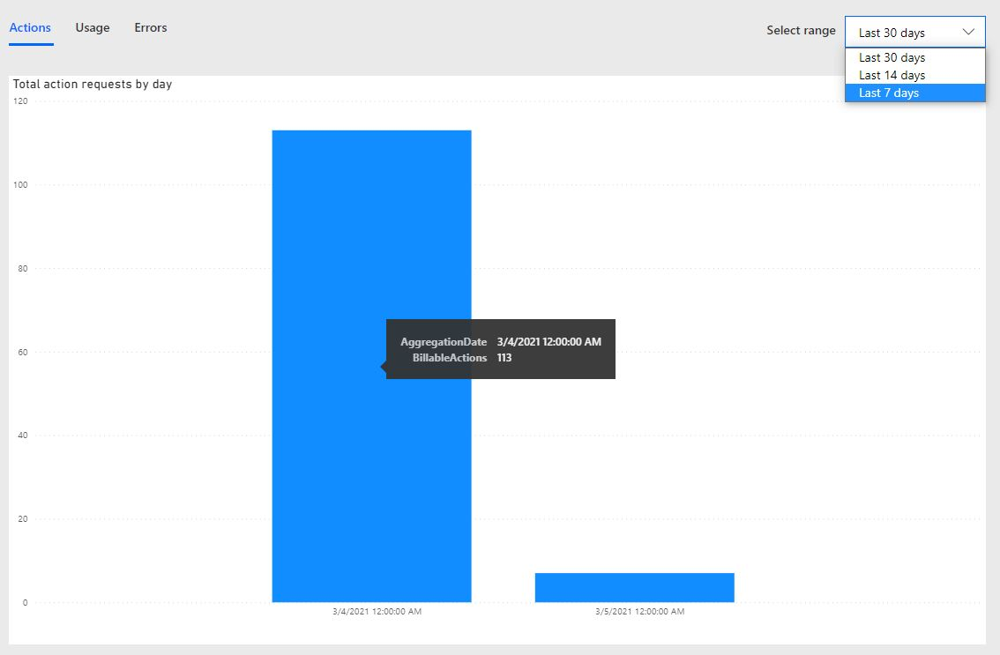

Power Automate has built-in analytics that are available for every flow. The **Analytics** section includes three types: actions, usage, and errors.

> [!div class="mx-imgBorder"]
> 

The **Actions** analytics provide an overview of all action requests by day. The following graph provides important information about how many of these actions are billable. You have the flexibility to change the range to view the last 30, 14, or 7 days.

> [!div class="mx-imgBorder"]
> 

The **Usage** analytics provide a detailed breakdown of all flows that have run in the range that you selected. These visuals provide a good overview of the total number of flows that have run and how many have failed versus run successfully. You have the flexibility to change the range to view the last 30, 14, or 7 days.

> [!div class="mx-imgBorder"]
> 

The **Errors** analytics provide comprehensive details of all errors that your flow has encountered in the range that you selected. The **Error details** visual provides important details that can help you isolate the root cause of the failure.

> [!div class="mx-imgBorder"]
> 

## Built-in errors dashboard

Built-in dashboards are available in Power Automate for environment admins and flow makers.

Environment admins can access analytics for Power Automate in the Microsoft Power Platform admin center. The reports provide insights into runs, usage, errors, types of flows created, shared flows, and details on connectors that are associated with the different flow types, such as automated flows, button flows, scheduled flows, approval flows, and business process flows. These reports are not available for the **UI flows** type.

To access these reports:

1. Go to the navigation bar on the left side of the screen.

1. Select **Analytics**.

1. Select **Power Automate**.

1. View the reports on the right side of the screen.

1. To select the correct environment, select **Change filters**.

> [!div class="mx-imgBorder"]
> 

The out-of-the-box analytics features that are available include:

- Run

- Usage

- Created

- Shared

- Connectors

The following screenshot shows how the **Error** analytics provide an overview of all errors that you have received in that environment.

> [!div class="mx-imgBorder"]
> 

The flow-level analytics has its own error section that provides deep insight for that specific flow.

> [!div class="mx-imgBorder"]
> 

The preceding screenshot shows the **Last Error Detail** column in the **Error details** table. Hovering over the column will provide you with a direct link to the failed run and its details.

> [!div class="mx-imgBorder"]
> 

If you select the link, you'll need to confirm the navigation because it will open another tab in your browser and redirect you to that tab.

> [!div class="mx-imgBorder"]
> 

The following screenshot shows the results after you've selected **OK** and the new browser tab has opened. This page shows you which step has failed and the reason for the failure. Additionally, it provides links to the Power Automate community where you can find questions that have been asked for a similar issue to help you troubleshoot your own.

> [!div class="mx-imgBorder"]
> 

In the previous scenario, the flow failed at the HTTP action and, due to the **Error details** reporting, you know that the error is because of insufficient privileges.

> [!div class="mx-imgBorder"]
> 

As the preceding screenshot shows, the HTTP action is making a **GET** call to Microsoft Graph, and the current user who is running this flow doesn't have access to do so. After the user was provided the correct access level to Microsoft Graph, the flow ran successfully.

> [!div class="mx-imgBorder"]
> 
