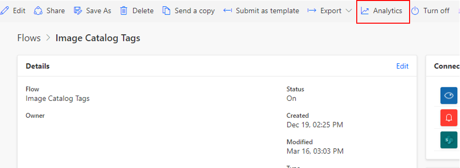
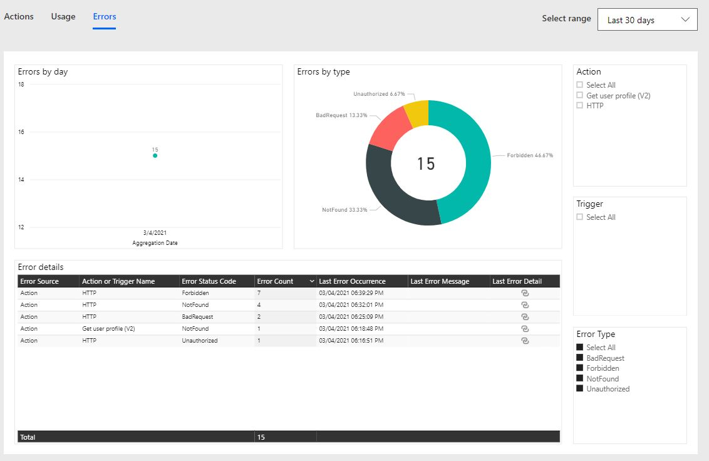
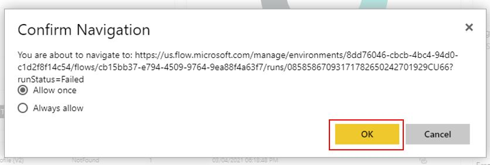
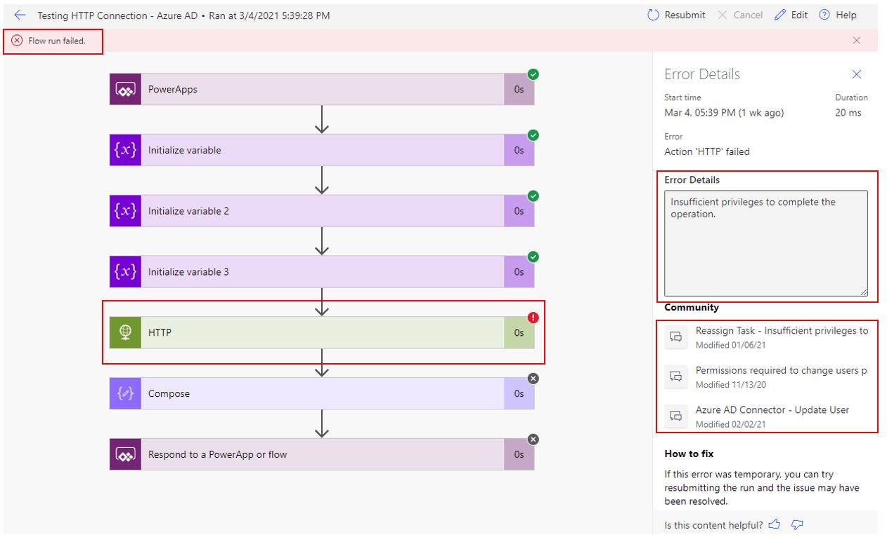

Power Automate has built-in analytics available for every flow. Analytics includes actions, usage, and errors.

> [!div class="mx-imgBorder"]
> 

The **Actions** analytics provides an overview of all the action requests by day. The graph provides important information about how many of these actions are billable. You have the flexibility to change the range to view the last 30, 14, or 7 days.

> [!div class="mx-imgBorder"]
> 

The **Usage** analytics provides a detailed breakdown of all the flows that have run in the range you selected. These visuals provide a good overview of the total number of flows that have run and how many have failed versus run successfully. You have the flexibility to change the range to view the last 30, 14, or 7 days.

> [!div class="mx-imgBorder"]
> 

The **Errors** analytics provides comprehensive details of all the errors you flow has faced in the range you selected. **The Error details** visual provides important details that can help isolate the root cause of the failure.

> [!div class="mx-imgBorder"]
> 

## Built-in errors dashboard

Built-in dashboards are available in Power Automate for both environment admins and flow makers.

Environment admins can access analytics for Power Automate in the Microsoft Power Platform admin center. The reports provide insights into runs, usage, errors, types of flows created, shared flows, and details on connectors associated with all the different flow types like automated flows, button flows, scheduled flows, approval flows, business process flows. These reports are not available for the UI flows type.

To access these reports:

1. Go to the navigation bar on the left side.

1. Select Analytics.

1. Select Microsoft Power Automate.

1. View the reports on the right side.

To select the correct environment, select **Change Filters**.

> [!div class="mx-imgBorder"]
> 

The out-of-box analytics features available include:

- Run

- Usage

- Created

- Shared

- Connectors

Below is a screenshot of how the **Error** analytics can be because it gives you an overview of all the errors you are getting in that environment.

> [!div class="mx-imgBorder"]
> 

The flow level analytics has its own Error section that provides deep insight for that specific flow.

> [!div class="mx-imgBorder"]
> 

In the screenshot above, in **Error** details, you can see the **Last Error Detail** column. Hovering over it will provide you a direct link to the failed run and its details.

> [!div class="mx-imgBorder"]
> 

If you select it, you'll have to confirm the navigation because it will open another tab in your browser and take you there.

> [!div class="mx-imgBorder"]
> 

After you've selected OK and the new browser tab has opened, below is what you will see. You get to see which step failed and what the reason for the failure was. Additionally, it provides links to the Power Automate community where any questions asked for a similar issue can help you troubleshoot.

> [!div class="mx-imgBorder"]
> 

In the above scenario, the flow failed at the HTTP action and thanks to the Error details we know that the error is because of insufficient privileges.

> [!div class="mx-imgBorder"]
> 

As you can see above, the HTTP action is making a GET call to Microsoft Graph and the current user who is running this flow doesn't have access to do so. After the user was provided the correct access level to Microsoft Graph, the flow ran successfully.

> [!div class="mx-imgBorder"]
> 
