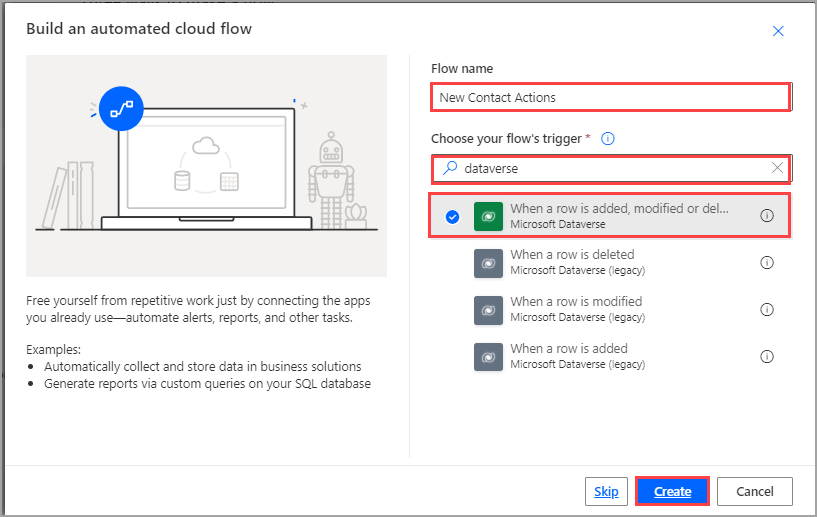

Many scenarios exist in which you would benefit from integrating your data with other programs, but to consider the concepts of integration through Power Automate, we'll consider a new customer. Business relationships are incredibly important for any company, but some businesses are built on them. We want to be alerted the second a contact is added to our database so that we can action on it. The first step is to create a flow and assign a trigger.

Begin in [Power Automate](http://www.powerautomate.com/?azure-portal=true). Select **Create** and then **Automated cloud flow**.

> [!div class="mx-imgBorder"]
> 

Name your flow and search for and select the trigger **When a row is added, modified, or deleted**. This will trigger the flow when a row is added to a table in Dataverse. Select **Create**.

> [!div class="mx-imgBorder"]
> 

To configure your trigger, select the change type, table name, and scope. The change type allows you to specify what type of change on a row will trigger your flow. The environment will be whichever you are building your flow in. Environments are like buckets to help organize tables, flows, apps, and more. Dataverse is built on the Common Data Model, a standardized data schema of more than 250 tables that fit most business needs to help companies organize data between applications. Scope allows you to specify when the flow runs according to the owner of the record.

For this flow, use the Create change type, the table **Contacts**, and the scope **Organization**.

> [!div class="mx-imgBorder"]
> 

Now that you've configured a trigger for your flow, continue to learn how to act on it.
