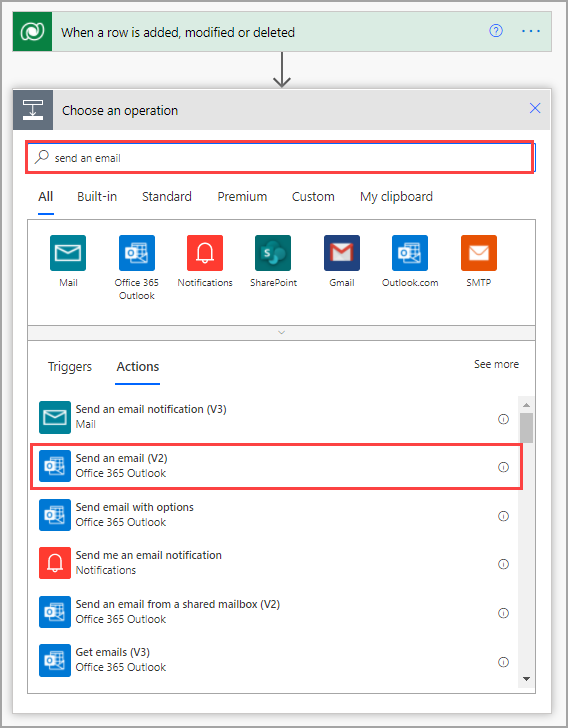

Triggers tell a flow when to begin, but actions tell a flow what to do. There are several actions we want to perform, but first we need to be alerted of the new contact.

Select **New step**.

> [!div class="mx-imgBorder"]
> 

Search for and select **Send an email (V2)**.

> [!div class="mx-imgBorder"]
> 

> [!Tip]
> Always use the latest version of an action to take advantage of new features and updates.

Type your email into the To field and insert a subject. The body of the email will be a combination of text and dynamic content. Dynamic content is information from previous steps in your flow. In this case, the content we have available is from our trigger, or the contacts table. You can search through the dynamic content and select any fields you wish to use. If there's a choice field, the word "Value" will be after the field name. This is so you get the actual text instead of the numerical data that Dataverse stores on the backend.

> [!div class="mx-imgBorder"]
> 

Now you're sending an alert with information about the new contact, but there's still more to do.
