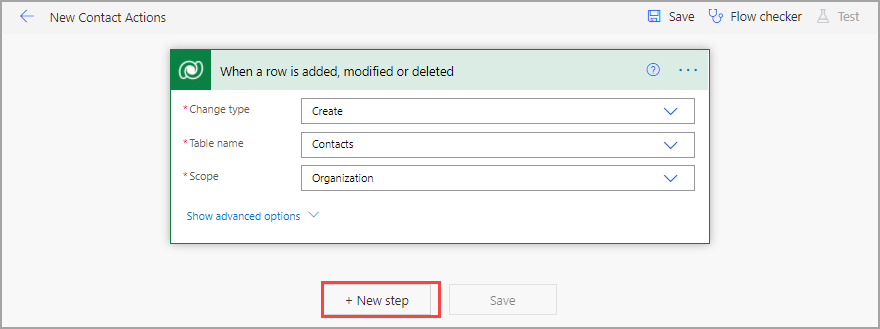
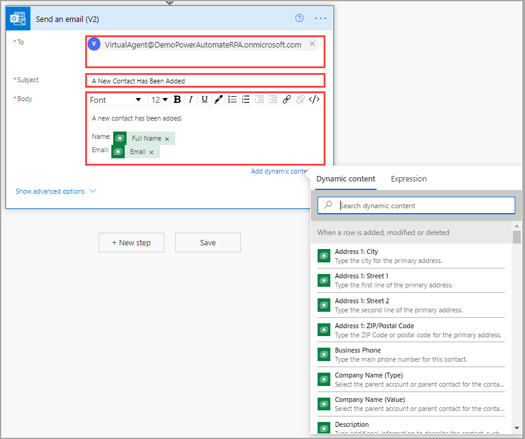

Triggers tell a flow when to begin, but actions tell a flow what to do. Though you want to perform several actions, you first need to be alerted of the new contact.

Select **New step**.

> [!div class="mx-imgBorder"]
> 

Search for and select **Send an email (V2)**.

> [!div class="mx-imgBorder"]
> 

> [!TIP]
> Always use the latest version of an action to take advantage of new features and updates.

Enter your email address into the **To** field and then enter a description in the **Subject** field. The body of the email will be a combination of text and dynamic content. Dynamic content is information from previous steps in your flow. In this case, the available content is from your trigger, or the contacts table. You can search through the dynamic content and select any fields that you want to use. If a **choice** field is available, the word *Value* will be after the field name so that you get the actual text instead of the numerical data that Dataverse stores in the server.

> [!div class="mx-imgBorder"]
> 

Now, you're sending an alert with information about the new contact, but you still have more to do.
