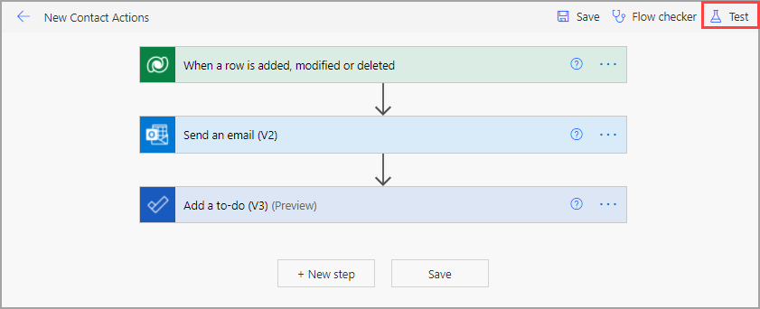
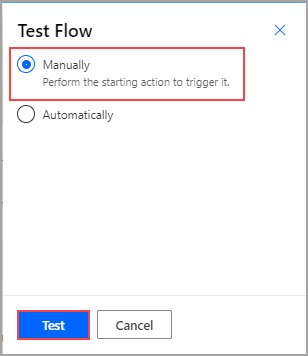
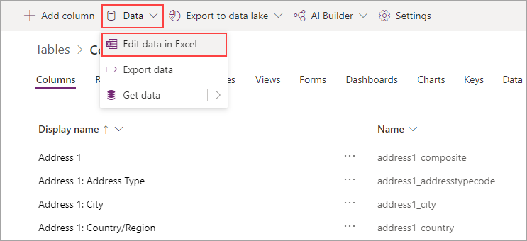
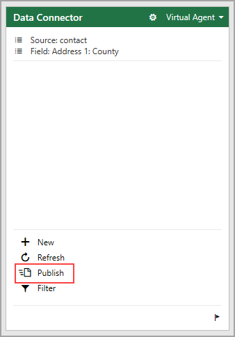
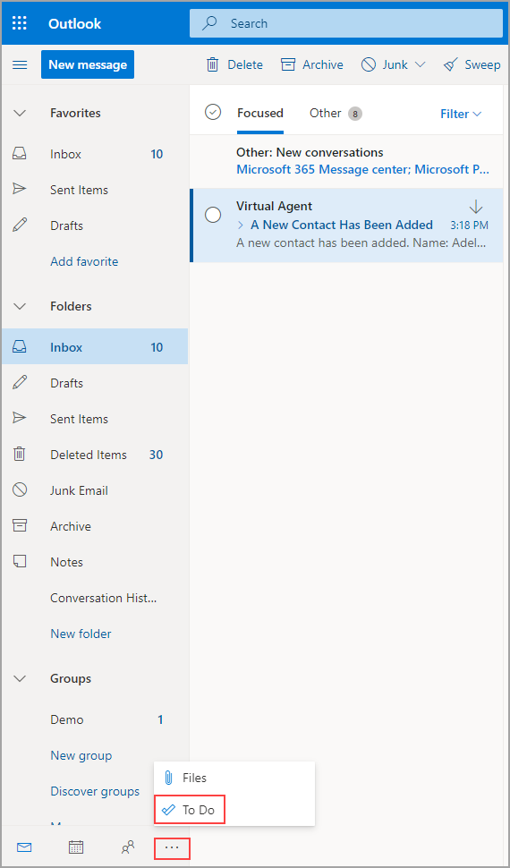
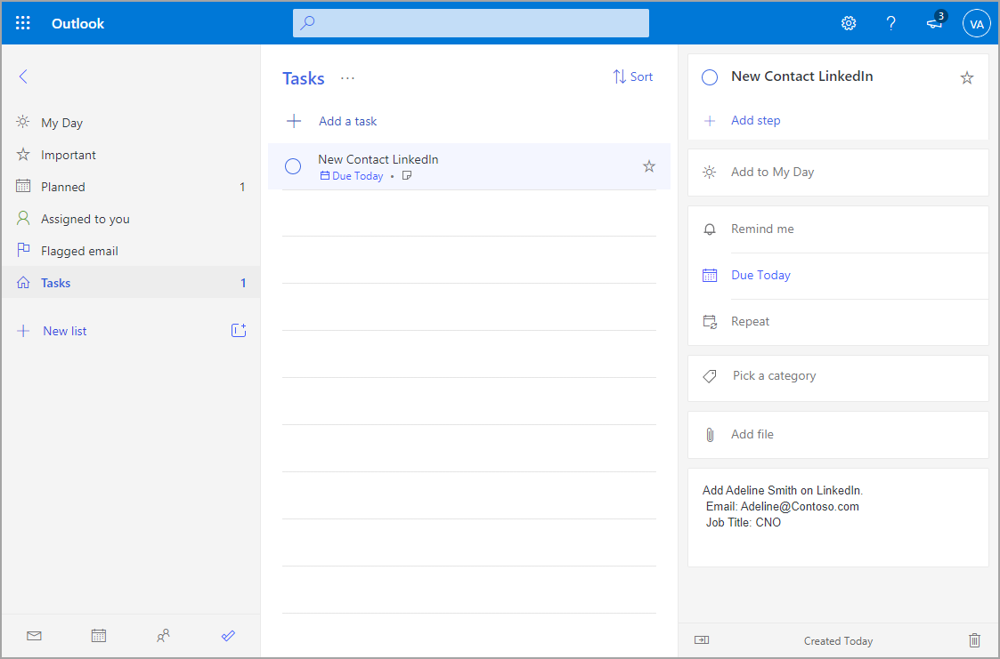

Now that you have a useful flow, it's time to test.

Start by selecting **Save**.

> [!div class="mx-imgBorder"]
> 

Now select **Test** in the upper right corner.

> [!div class="mx-imgBorder"]
> 

If we'd triggered the flow before, we could test automatically, but since this is the first time we're firing the flow, we need to test **manually**. Make your selection and select **Test**.

> [!div class="mx-imgBorder"]
> 

Now we need to add a record to the table. In a new tab, visit [Power Apps](http://www.make.powerapps.com/?azure-portal=true) and select **Data** and then **Tables**. You can search for the table you want or select **Contact**.

> [!div class="mx-imgBorder"]
> 

Select **Data** and **Edit data in Excel**.

> [!div class="mx-imgBorder"]
> 

Sign in and add at least one row of data. No need to add every field, but try to get at least first name, last name, job title, and email. These are some of the fields referenced in the flow. When you're done, select **Publish**.

> [!div class="mx-imgBorder"]
> 

Switch over to the Power Automate tab to check on your flow. You should have a success message.

> [!div class="mx-imgBorder"]
> 

Check your inbox in Outlook. You should have a new email.

> [!div class="mx-imgBorder"]
> 

Select the ellipses at the bottom-left corner and **To-Do**.

> [!div class="mx-imgBorder"]
> 

You should see a new To-Do under the list you specified.

> [!div class="mx-imgBorder"]
> 

Now you know how to take actions on data held in Dataverse!
