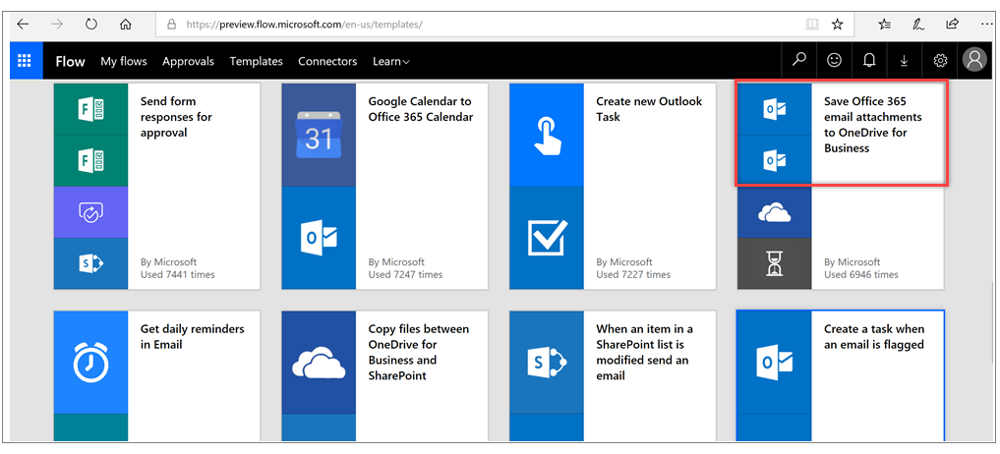
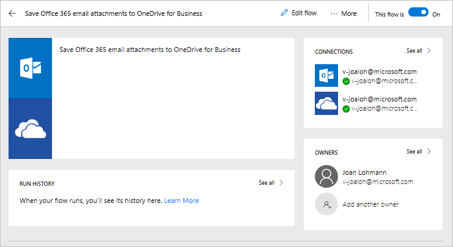
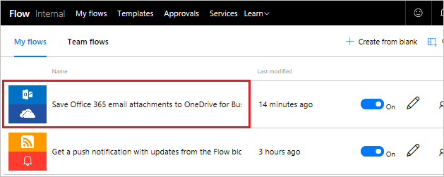

# Create your first flow
In this lesson, you will see more of the Microsoft Flow environment as you build your first flow.

Our many templates will get your flows flowing quickly. They'll help you connect the services you are already using in more meaningful ways.  

## Choose a template
Searching for attachments through email can be time consuming, and this flow saves time by storing all your email attachments into a folder in your OneDrive.

Take a look at the [ Microsoft Flow website](https://ms.flow.microsoft.com), and open the **Templates** menu. As you scroll through the list, you see that Microsoft Flow allows you to connect to many services.

Select the **Save Office 365 email attachments to OneDrive for Business** template.

## Create the flow
This is one of our one click templates, where you only answer relevant questions necessary to build the flow, without punching a line of code.

On the template graphic, there is a description of what the template does and needs to succeed.

You are asked to provide credentials for the Office 365 Outlook and SharePoint services. If you use both services regularly, you will already be signed into them.

1. Select **Create Flow**.

   

    Flow has created a folder on your OneDrive, where it will now automatically place every attachment that gets emailed to your work email.
   
    
   
    
2. Select the **My Flows** menu.
   
    
3. Select the flow you just made to see how it works.
   
    
4. You see a green check mark, indicating that the flow succeeded. 
5. Select **Edit** to see how the Flow is defined.

    
 
1. Select **Succeeded** to see the run history and the results.
   
    
   
    All parts of the flow were successful. 
   
    

## Important concepts in Microsoft Flow
Keep the following in mind when building flows: 
- Every flow has two key parts: a trigger, and one or more actions. 

  You can think of the trigger as the starting action for the flow, which can be things like a new email arriving in your inbox, or when a new item is added to a SharePoint list. 

- Actions are the activities you want to happen when a trigger is invoked. For example, the email trigger will initiate the action of creating a new file in OneDrive.

Other actions could be, send an email, post a Tweet, start an approval, or many others.

These will all come into play later, as you build your own flows from scratch. 

In the next lesson will look at the Microsoft Flow Mobile app and its capabilities. 

