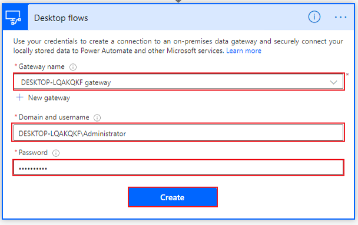

A cloud flow runs in the cloud and accesses services via API. Cloud flows are required to trigger the unattended desktop flow. To begin creating your cloud flow, open [Power Automate](https://us.flow.microsoft.com/?azure-portal=true) and select **My flows** and then **Cloud flows**.

> [!div class="mx-imgBorder"]
> 

Next select **New flow** and then **Instant cloud flow**.

> [!div class="mx-imgBorder"]
> 

Name your flow. Here we have used the name Manual trigger Desktop flow to enter invoice. Choose **Manually trigger a flow**, then select **Create**.

> [!div class="mx-imgBorder"]
> 

Once the screen changes to the flow builder, select **New step** and then search for and select **Run a flow built with Power Automate Desktop**.

> [!div class="mx-imgBorder"]
> 

If you have not already configured your gateway connection, use the dropdown under Gateway name to select the appropriate gateway.

If you don't see your gateway, you may need to delete this step and recreate it in order to refresh the list. If your gateway still does not appear, you may need to restart the gateway on your PC and retry.

The next two fields request your credentials to log into your computer. If you are unsure what to put in the Domain and username field, you can open a Command Prompt window by opening Start, typing CMD and pressing enter. Once the command prompt opens, type "Set user" and press Enter.

Several lines of code will appear. Take the user domain and the username and separate them by a backward slash as seen below. Select **Create**.

> [!div class="mx-imgBorder"]
> 

Once you have connected to your desktop, Power Automate will prompt you for information specific to your desktop flow. Use the dropdown to select the name of your desired flow, in this case Invoicing, and choose **Unattended - Runs in the background without signing in** for your Run Mode.

Once you have selected your desktop flow, any requested input variables will be added for you to fill in. You can use dynamic content from the trigger or other steps in your cloud flow to populate these variables. Here, we will just put placeholders since we are only testing the unattended flow. Select **Save**.

> [!div class="mx-imgBorder"]
> 

That's it! You have created the unattended desktop flow. Now, let's test it!
