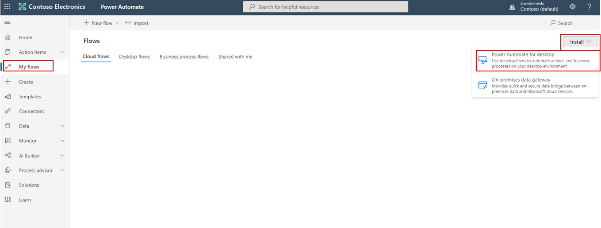
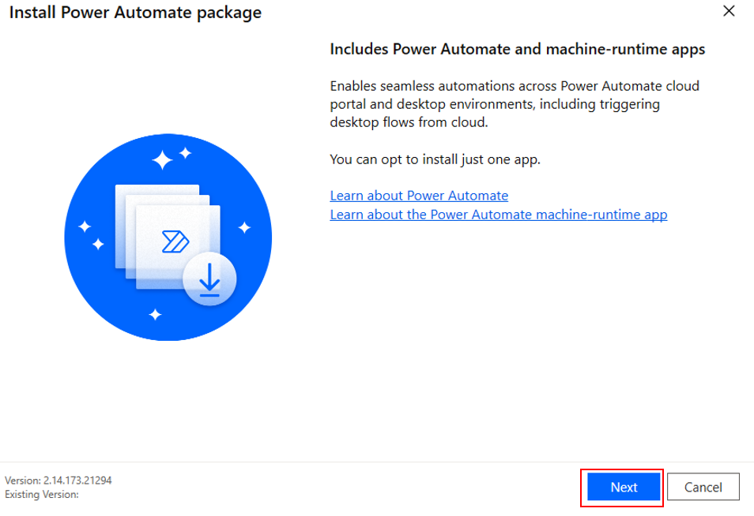

Creating and running automation systems in Power Automate requires that you have access to make changes to the environments in your tenant and that you have the appropriate licenses and permissions. If you don't already have admin access to a valid tenant, you might want to start a [free trial](https://www.microsoft.com/microsoft-365/enterprise/office-365-e3?activetab=pivot%3aoverviewtab/?azure-portal=true). In addition, you will need a Power Automate user plan with attended RPA license to complete this module. You can sign up for a [free trial](https://flow.microsoft.com/pricing/?azure-portal=true) if you don't already have this license.

If you have completed the *Build your first Power Automate Desktop flow* module, you can skip to the next unit.

## Create a trial environment with database

After you have signed in to a valid tenant, go to the [Microsoft Power Platform admin center](https://admin.powerplatform.microsoft.com/environments/?azure-portal=true). You will need to create a trial environment with a database. Select **Environments** and then select your automatically created environment, the **default**.

If you are using an existing tenant rather than creating a trial for this exercise, you can use the default environment or create a new one to keep it separate from your existing solutions.

> [!div class="mx-imgBorder"]
> 

Now that you are in your chosen environment, add a database by selecting **Add database**. In the subsequent dialog box, specify the requested values but keep the defaults and then select **Add**. You might be prompted to sign in again before creating your database; afterward, your database should provision appropriately.

> [!div class="mx-imgBorder"]
> 

Creating your database might take up to one minute, but afterward, you can continue to the next steps.

If you are using a trial environment, consider setting up a profile in your browser to prevent you from being signed out of your existing Microsoft account.

## Software installation

The following exercises will require various software to be installed on your computer. The following steps will guide you through the download and installation of Power Automate Desktop, the required extensions, and the Contoso Invoicing app.

If you have already installed Power Automate Desktop, ensure that you are running the latest available version.

### Power Automate Desktop

Go to [Power Automate](https://flow.microsoft.com/?azure-portal=true) and sign in with the account that you used to create your environment and database. When you have signed in, select **My Flows > Install > Power Automate Desktop**.

> [!div class="mx-imgBorder"]
> 

When the download completes, select the file to open and run the installer. Select **Next**, and on the subsequent screen, select the **By selecting 'Install'** check box and then select **Install**. This action will install Power Automate Desktop and the browser extensions for Microsoft Edge and Google Chrome.

> [!div class="mx-imgBorder"]
> 

> [!div class="mx-imgBorder"]
> 

When installation is complete, select the link of your preferred browser and then follow the instructions to enable the extension. After the extension has been enabled, you can launch the Power Automate Desktop app.

> [!div class="mx-imgBorder"]
> 

After launching the app, sign in by using the account that you used to set up your environment and database.

## Contoso Invoicing app

A major benefit of using desktop flows is the ability to perform actions on desktop applications. For the flow that you will create, you will use an invoicing application to explore the concepts and actions that are available to you in desktop flows. After completing the module, you can use what you have learned to run desktop flows on your own applications and automate existing processes.

Download the [Contoso Invoicing app](https://github.com/MicrosoftDocs/mslearn-developer-tools-power-platform/blob/master/power-automate-desktop/contoso-invoice-app/ContosoInvoicingSetup.zip), extract the contents, and then install the application and explore the elements.

If haven't created a desktop app to connect to a cloud flow, do so now by following this module or on your own.
