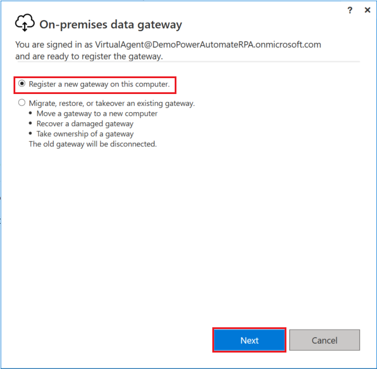

Cloud flows use an Application Programming Interface, or API, as a bridge to send information back and forth to data sources and issue commands. This is how you can use Power Automate to send emails, grab files, and generate approvals. Desktop flows are contained on your desktop and cannot be accessed via API. For these flows, you need to create a gateway. A gateway allows services in the cloud, like Outlook to connect to and trigger events and information located on your specific desktop. You will have to define a gateway for any desktop, which you will be using to run desktop flows.

Visit [Power Automate](https://flow.microsoft.com/?azure-portal=true) and select **My flows**, **Install**, and **On-premises data gateway**.

> [!div class="mx-imgBorder"]
> 

Once the download completes, select the file to open and run the installer. After completing installation, input your email address to sign in. Next, choose **Register a new gateway on this computer** and **Next**.

> [!div class="mx-imgBorder"]
> 

Choose a name for your gateway. The recommended name is the name of your computer followed by the word "gateway." Next, choose a recovery key. Keep this key in a safe location as you can use it later to recover your gateway if necessary. Select **Configure**.

> [!div class="mx-imgBorder"]
> 

Your data gateway is installed and ready to use! Feel free to close out of the dialogue box.