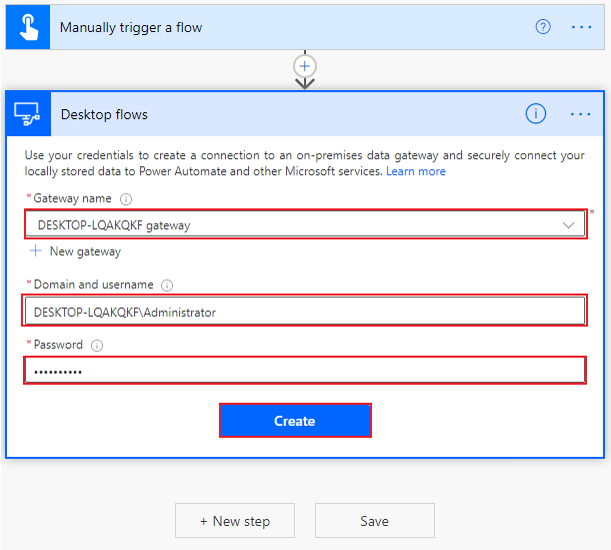

Now that you have established a gateway connection and built a desktop flow, it's time to build a cloud flow with which to connect. Cloud flows are stored and run on the cloud, as opposed to desktop flows, which are stored and run on a desktop. Cloud flows have the advantage of hundreds of predefined connections with thousands of triggers and actions at your disposal. Desktop flows, however, can work in desktop programs without a predefined connection or existing actions, so both have their benefits. Combining these two allows you to gain the benefits of both.

To begin creating your cloud flow, open [Power Automate](https://flow.microsoft.com/?azure-portal=true) and select **My flows** and then **Cloud flows**.

> [!div class="mx-imgBorder"]
> 

Next select **New flow** and then **Instant cloud flow**.

> [!div class="mx-imgBorder"]
> 

Name your flow. Here we have used the name "Manual trigger Desktop flow to enter invoice". Choose **Manually trigger a flow**, then select **Create**.

> [!div class="mx-imgBorder"]
> 

Once the screen changes to the flow builder, select **New step** and then search for and select **Run a flow built with Power Automate Desktop**.

> [!div class="mx-imgBorder"]
> 

Use the dropdown under Gateway name to select the gateway you defined in the previous unit.

If you don't see your gateway, you may need to delete this step and recreate it in order to refresh the list. If your gateway still does not appear, you may need to restart the gateway on your PC and retry.

The next two fields request your credentials to log into your computer. If you are unsure what to put in the Domain and username field, you can open a Command Prompt window by opening Start, typing CMD and pressing enter. Once the command prompt opens, type "Set user" and press Enter.

Several lines of code will appear. Take the user domain and the username and separate them by a backward slash as seen below. Select **Create**.

> [!div class="mx-imgBorder"]
> 

Now you have configured the basic connection to your desktop from your cloud flow. The next unit will work to configure the specific desktop flow you previously created.