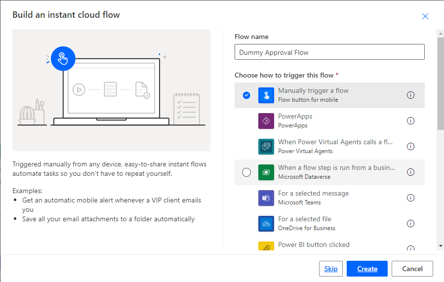
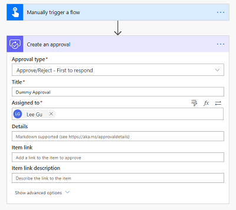
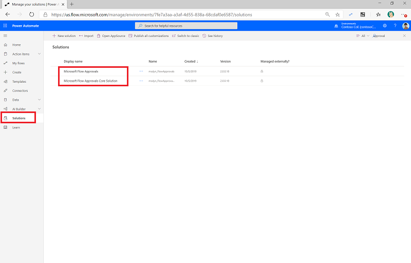

After you have become familiar with your environments and resources, your next step is to consider governance processes for your apps. This step requires gathering additional information about your apps from your makers, audits from specific connectors, or app usage.

The breakdown of the governance components for the audit process is as follows:

-   Developer Compliance Center (canvas app)

-   Compliance Detail Request (flow)

Multiple governance components are provided in the CoE Starter Kit; each will require configuration to install. The installation instructions in this article have been segmented based on the set of components that should be grouped and installed together. Dependencies on other segments are outlined in each section.

## Initialize flow approval tables in your environment

These flows in the solution use the built-in Approval actions of Power Automate and therefore require it having been installed on the environment.

- *Admin | Archive and Clean Up v2 (Start Approval for Apps)*

- *Admin | Archive and Clean Up v2 (Start Approval for Flows)*

- *Admin | Archive and Clean Up v2 (Check Approval)*

- *Admin | Archive and Clean Up v2 (Clean Up and Delete)*

 If you are installing the solution in a new environment, or one in which Approvals have not been used in the past, then the Approval tables must be initialized before you can install the solution. The easiest way to do this is to create a "dummy" approval flow.

1.  Go to [Power Automate](https://flow.microsoft.com/) and select your CoE environment.

1. Select **+ New** > **Instant (From Blank)**.

1. Pick **manually trigger a flow** as the trigger, and enter *Admin | Dummy Approval Flow* as the name.

	

1. Select **+ New Step** to add an approval action to the flow, and then search for and select **Create an approval**.

1. Select a dummy title, and enter your email address under **Assigned To**.

	

1. In the upper-right corner, select **Test**, and then select **I'll perform the trigger action**.

1. Select **Save & Test**

1. Select **Run Flow**

	> [!Note] 
	> This flow can take up to ten minutes to run initially. After it runs, you can delete the flow because it won't be needed anymore.

1. Select **Solutions** on the left side panel, and you should now see two new Flow Approvals solutions. Note that the presence of these solutions was the point of this step, and the way you know it succeeded.

	

## Import the solution

The Core Components solution is required for the Audit and Report Components solution, or any other component in the starter kit, to work.

1.  Follow the instructions that are detailed under Set up core components.

1.  Import the CenterOfExcellenceAuditComponents_x_x_x_xx_managed.zip file.

1.  Create a new connection to all connectors.

	> [!div class="mx-imgBorder"]
	> 

1.  Update the Environment Variable values. Environment variables are used to store application and flow configuration data, meaning that you only have to set the value once for each environment and that it will be used in all necessary flows and apps in that environment.

	|     Name                             |     Current value                                                                                                                                                                                                                                                                                          |
	|--------------------------------------|------------------------------------------------------------------------------------------------------------------------------------------------------------------------------------------------------------------------------------------------------------------------------------------------------------|
	|     Cleanup Old Objects App URL         |     (optional) URL to the Cleanup Old Objects App canvas app, if you are using this app                                                                                                                                                  |
	|     Flow Approvals URL    |     Link to the CoE Envt's approvals page from [Power Automate](https://flow.microsoft.com/)    |
	                                                                                         

