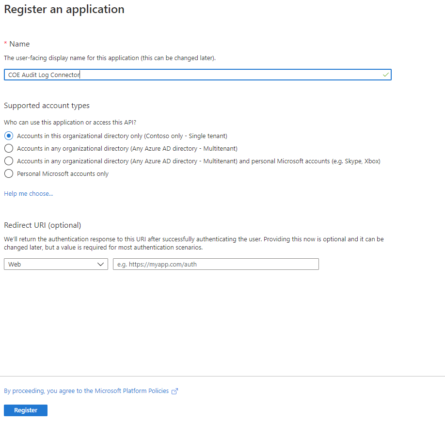
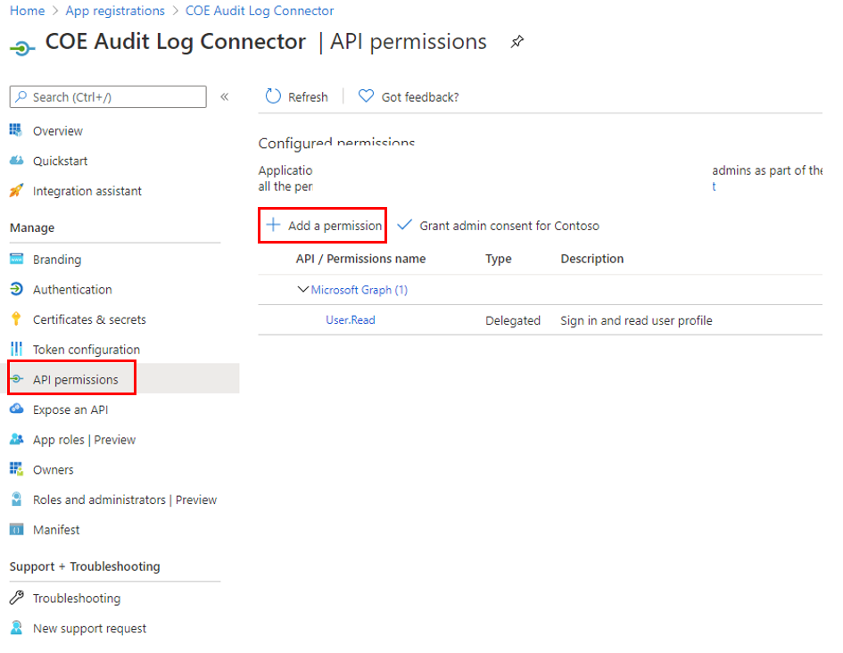
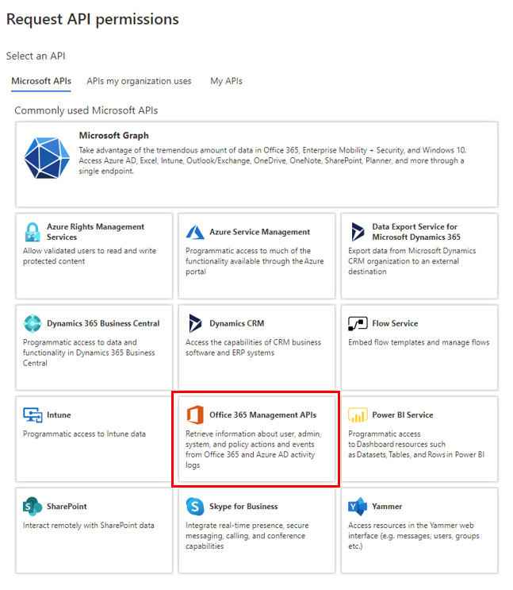
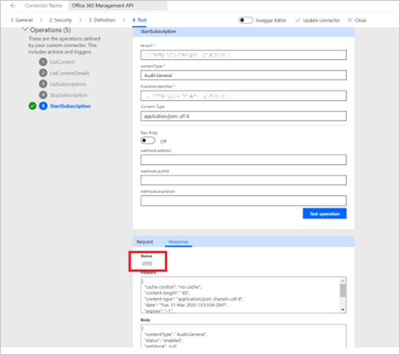
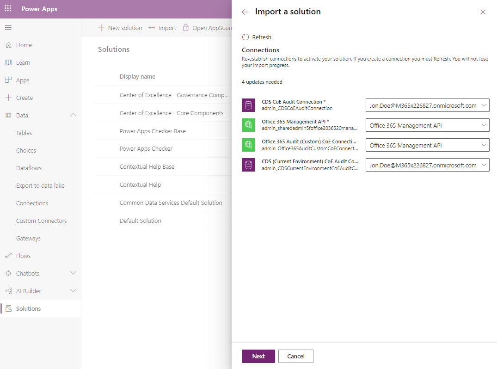
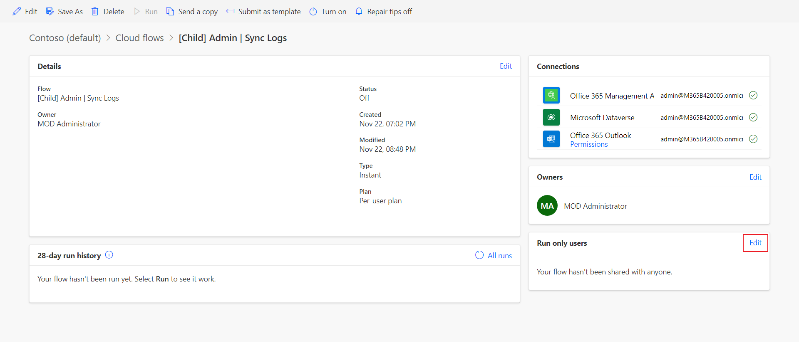

The Audit Log Sync flow connects to the Microsoft 365 audit log to gather telemetry data such as unique users and launches for apps. The flow uses a custom connector to connect to the audit log. In the following instructions, you'll set up the custom connector and configure the flow.

> [!NOTE]
> The Center of Excellence (CoE) Starter Kit will work without this flow, but the usage information in the Power BI dashboard will be blank.

## Before you use the audit log connector

Before using the audit log connector, you will need to meet the following prerequisites:

-  Microsoft 365 audit log search must be turned on for the audit log connector to work.

-  You must have access to the audit log. The Microsoft Power Platform Service Admin role doesn't give you access to the audit log.

-  Your tenant must have a subscription that supports unified audit logging.

## Connect to the audit log by using an Azure AD app registration

The Microsoft 365 Management APIs use Azure Active Directory (Azure AD) to provide authentication services that you can use to grant rights for your application to access them.

### Create an Azure AD app registration for the Microsoft 365 Management API

Use the following steps to set up an Azure AD app registration that will be used in a custom connector and Power Automate flow to connect to the audit log:

1.  Sign in to portal.azure.com.

1.  Go to Azure Active Directory, and then search for and select **App registrations**.

	> [!div class="mx-imgBorder"]
	> 

1.  Select **+ New Registration**.

1.  Enter a name (such as **Microsoft 365 Management**), but don't change any other setting. Select **Register**.

	> [!div class="mx-imgBorder"]
	> 

1.  Select **API permissions > + Add a permission**.

	> [!div class="mx-imgBorder"]
	> 

1.  Select **Office 365 Management APIs** and then configure permissions as follows:

    a.  Select **Delegated permissions** and then select **ActivityFeed.Read**.

	> [!div class="mx-imgBorder"]
	> 

	b.  Select **Application permissions** and then select **ActivityFeed.Read** and **ServiceHealth.Read**.

	> [!div class="mx-imgBorder"]
	> 

	c.  Select **Add permissions**.

1.  Select **Grant admin consent for (your organization)**.

    The API permissions now reflect delegated ActivityFeed.Read and application ActivityFeed.Read and ServiceHealth.Read permissions, with a status of **Granted for (your organization)**.

	> [!div class="mx-imgBorder"]
	> 

1.  Select **Certificates & secrets**.

1.  Select **+ New client secret**.

	> [!div class="mx-imgBorder"]
	> 

1. Add a description and expiration (in line with your organization's policies), and then select **Add**.

1. Copy and paste the secret to a text document in Windows Notepad for now.

1. Select **Overview** and then copy and paste the application (client) ID and directory (tenant) ID values to the same text document. Note which GUID is for which value; you'll need these values in the next step as you configure the custom connector.

1. Leave the Azure portal open because you'll need to make configuration updates after you have set up the custom connector.

### Set up the custom connector

Now, you'll configure and set up a custom connector that uses Microsoft 365 Management APIs.

1.  Go to **make.powerapps.com > Data > Custom Connectors**. The Office 365 Management API custom connector will be listed on this page; it has been imported with the core components solution.

1.  Select the **Edit** pencil icon.

	> [!div class="mx-imgBorder"]
	> 

1.  Leave the **1. General** page as-is and then select **2. Security**.

	> [!div class="mx-imgBorder"]
	> 

1.  Select **Edit** at the bottom of the **OAuth 2.0** area to edit the authentication parameters.

	> [!div class="mx-imgBorder"]
	> 

1.  Paste the application (client) ID that you copied from the app registration into the **Client ID** field.

1.  Paste the client secret that you copied from the app registration into the **Client secret** field.

1.  Don't change the **Tenant ID** field.

1.  Set the **Resource URL** field to [https://manage.office.com](https://manage.office.com/?azure-portal=true).

1.  Copy the **Redirect URL** into your text document in Notepad.

1. Select **Update Connector**.

## Update Azure AD app registration with the redirect URL

Follow these steps to update the Azure AD app registration with the redirect URL:

1.  Go back to the Azure portal and your app registrations.

1.  Under **Overview**, select **Add a Redirect URI**.

1.  Select **+ Add a platform > Web**.

1.  Enter the URL that you copied from the **Redirect URL** section of the custom connector.

1.  Select **Configure**.

### Start a subscription to audit log content

Go back to the custom connector to set up a connection to the custom connector and then start a subscription to the audit log content, as described in the following steps.

> [!IMPORTANT] 
> You must complete these steps for subsequent steps to work. If you don't create a new connection and test the connector at this point, setting up the flow and child flow in later steps will fail.

1.  On the **Custom Connector** page, select **4. Test**.

1.  Select **+ New connection** and then sign in with your account.

1.  In the **Operations** drop-down menu, select **Start Subscription**.

	> [!div class="mx-imgBorder"]
	> 

### Set up the Power Automate flow

A Power Automate flow uses the custom connector, queries the audit log daily, and writes the Power Apps launch events to a Microsoft Dataverse table, which is then used in the Power BI dashboard to report on sessions and unique users of an app.

1.  Follow the instructions in Set up core components to download the solution.

1.  Go to make.powerapps.com.

1.  Import the Center of Excellence audit logs solution (CenterofExcellenceAuditLogs_x_x_x_xxx_managed.zip).

1.  Establish connections to activate your solution. If you create a new connection, you must select **Refresh**. You won't lose your import progress.

	> [!div class="mx-imgBorder"]
	> 

1.  In the **Tenant ID** field, paste the ID that you copied for directory (tenant) ID.

	> [!div class="mx-imgBorder"]
	> 

1.  Open the Center of Excellence - Audit Log solution and select **Admin | [Child] Admin | Sync Logs**.

1.  Edit the **Run only users** settings.

	> [!div class="mx-imgBorder"]
	> 

1.  For both connections (the custom connector and Dataverse), change the value to **Use this connection** (userPrincipalName@company.com). If no connection is available for any of the connectors, go to **Data > Connections** and then create one for the connector.

	> [!div class="mx-imgBorder"]
	> 

1.  Select **Save** and then close the flow's **Details** tab.

1. (Optional) Edit the **Admin | Sync Audit Logs** flow to update the time interval at which the log clusters should be retrieved. The default is set to one-day intervals (from the options of **Month**, **Week**, **Day**, **Hour**, **Minute**, or **Second**).

1. (Optional) Edit the **Admin | Sync Audit Logs** flow to update the start time and end time during which the logs will be read. The maximum is seven days in the past, and the end time must be after the start time. Use a positive number in the **Interval** field.
