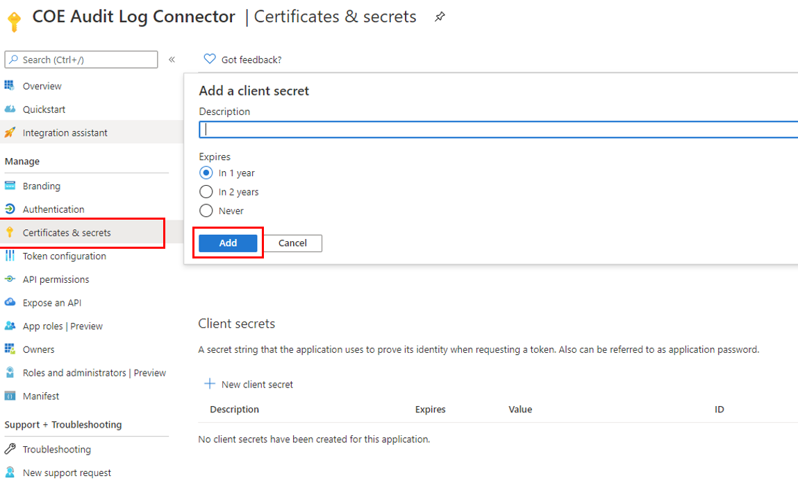
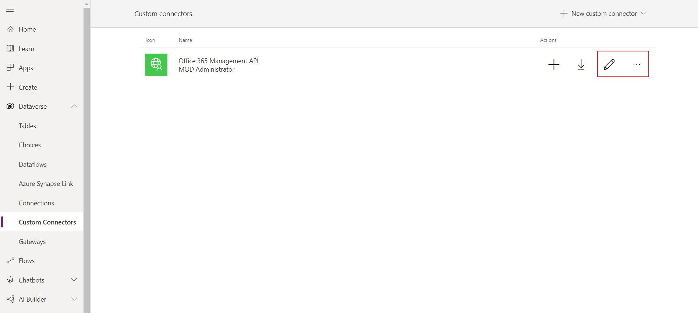
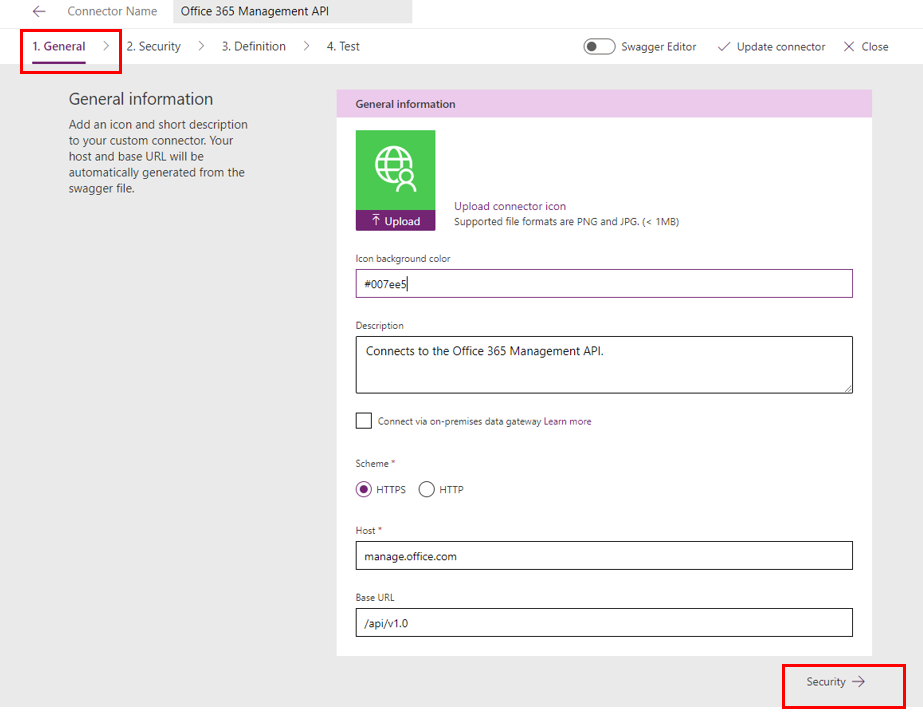
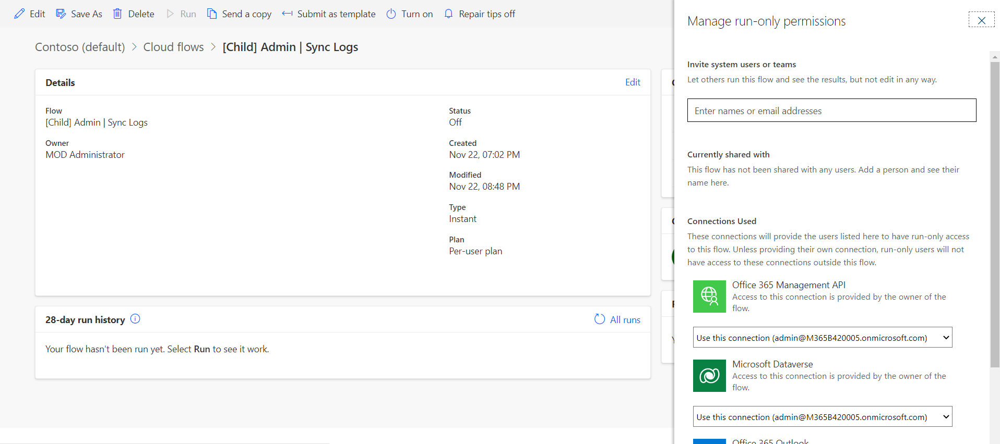

The Audit Log Sync flow connects to the Microsoft 365 audit log to gather telemetry data such as unique users and launches for apps. The flow uses a custom connector to connect to the Audit Log. In the following instructions, you'll set up the custom connector and configure the flow.

> [!NOTE]
> The Center of Excellence (CoE) Starter Kit will work without this flow, but the usage information in the Power BI dashboard will be blank.

## Before you use the audit log connector

You need the following three pre-requisites:

1.  Microsoft 365 audit log search must be turned on for the audit log connector to work.

1.  You must have access to the audit log. The Microsoft Power Platform Service Admin role doesn't give you access to the audit log.

1.  Your tenant must have a subscription that supports unified audit logging.

## Connect to the audit log by using an Azure AD app registration

The Microsoft 365 Management APIs use Azure Active Directory (Azure AD) to provide authentication services that you can use to grant rights for your application to access them.

### Create an Azure AD app registration for the Microsoft 365 Management API

Using these steps, you'll set up an Azure AD app registration that will be used in a custom connector and Power Automate flow to connect to the audit log

1.  Sign in to portal.azure.com.

1.  Go to Azure Active Directory and search for App registration. Click on it.

	> [!div class="mx-imgBorder"]
	> 

1.  Select + New Registration.

1.  Enter a name (for example, Microsoft 365 Management), don't change any other setting, and then select Register.

	> [!div class="mx-imgBorder"]
	> 

1.  Select API Permissions > + Add a permission.

	> [!div class="mx-imgBorder"]
	> 

1.  Select Office 365 Management API, and configure permissions as follows:

    1.  Select Delegated permissions, and then select ActivityFeed.Read.

	> [!div class="mx-imgBorder"]
	> 

	1.  Select Application permissions, and then select ActivityFeed.Read and ServiceHealth.Read.

	> [!div class="mx-imgBorder"]
	> 

	1.  Select Add permissions.

1.  Select Grant Admin Consent for (your organization).

    The API permissions now reflect delegated ActivityFeed.Read, and application ActivityFeed.Read and ServiceHealth.Read permissions, with a status of Granted for (your organization).

	> [!div class="mx-imgBorder"]
	> 

1.  Select Certificates and secrets.

1.  Select + New client secret.

	> [!div class="mx-imgBorder"]
	> 

1. Add a description and expiration (in line with your organization's policies), and then select Add.

1. Copy and paste the Secret to a text document in Notepad for the time being.

1. Select Overview and copy and paste the application (client) ID and directory (tenant) ID values to the same text document; be sure to make a note of which GUID is for which value. You'll need these values in the next step as you configure the custom connector.

1. Leave the Azure portal open, because you'll need to make some configuration updates after you set up the custom connector.

### Set up the custom connector

Now you'll configure and set up a custom connector that uses the Microsoft 365 Management APIs.

1.  Go to make.powerapps.com > Data > Custom Connectors. The Office 365 Management API custom connector will be listed here; it has been imported with the core components solution.

1.  Select Edit.

	> [!div class="mx-imgBorder"]
	> 

1.  Leave the 1. General page as-is, and then select 2. Security.

	> [!div class="mx-imgBorder"]
	> 

1.  Select Edit at the bottom of the OAuth 2.0 area to edit the authentication parameters.

	> [!div class="mx-imgBorder"]
	> 

1.  Paste the application (client) ID you copied from the app registration into Client ID.

1.  Paste the client secret you copied from the app registration into Client secret.

1.  Don't change the Tenant ID.

1.  Set the Resource URL to [https://manage.office.com](https://manage.office.com/?azure-portal=true).

1.  Copy the Redirect URL into your text document in Notepad.

1. Select Update Connector.

## Update Azure AD app registration with the redirect URL

1.  Go back to the Azure portal and your app registrations.

1.  Under Overview, select Add a Redirect URI.

1.  Select + Add a platform > Web.

1.  Enter the URL you copied from the Redirect URL section of the custom connector.

1.  Select Configure.

### Start a subscription to audit log content

Go back to the custom connector to set up a connection to the custom connector and start a subscription to the audit log content, as described in the following steps.

**Important: You must complete these steps for subsequent steps to work. If you don't create a new connection and test the connector here, setting up the flow and child flow in later steps will fail.**

1.  On the Custom Connector page, select 4. Test.

1.  Select + New connection, and then sign in with your account.

1.  Under Operations, select Start Subscription.

	> [!div class="mx-imgBorder"]
	> 

### Set up the Power Automate flow

A Power Automate flow uses the custom connector, queries the audit log daily, and writes the Power Apps launch events to a Microsoft Dataverse table, which is then used in the Power BI dashboard to report on sessions and unique users of an app.

1.  Follow the instructions in Setup core components to download the solution.

1.  Go to make.powerapps.com.

1.  Import the Center of Excellence audit logs solution (CenterofExcellenceAuditLogs_x_x_x_xxx_managed.zip).

1.  Establish connections to activate your solution. If you create a new connection, you must select Refresh. You won't lose your import progress.

	> [!div class="mx-imgBorder"]
	> 

1.  Paste in the ID you copied for directory (tenant) ID for the Tenant ID.

	> [!div class="mx-imgBorder"]
	> 

1.  Open the Center of Excellence - Audit Log solution and select Admin | [Child] Admin | Sync Logs.

1.  Edit the Run only users settings.

	> [!div class="mx-imgBorder"]
	> 

1.  For both connections (the custom connector and Dataverse), change the value to Use this connection (userPrincipalName@company.com). If there is no connection for any of the connectors, go to Data > Connections, and create one for the connector.

	> [!div class="mx-imgBorder"]
	> 

1.  Select Save, and then close the Flow details tab.

1. (Optional) Edit the Admin | Sync Audit Logs flow to update the time interval at which the log clusters should be retrieved. The default is set to one-day intervals (from the options of Month, Week, Day, Hour, Minute, or Second).

1. (Optional) Edit the Admin | Sync Audit Logs flow to update the start time and end time during which the logs will be read. The maximum is seven days in the past, and the end time must be after the start time. Use a positive number in the interval field.
