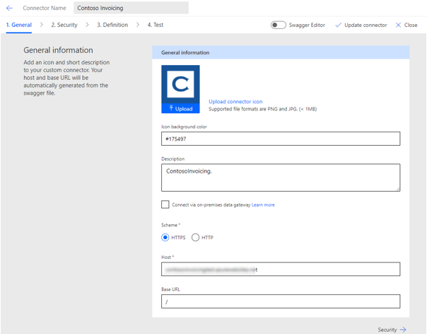
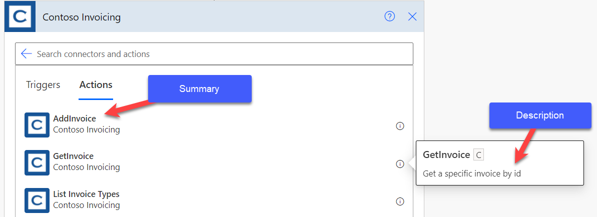
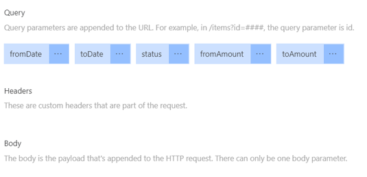
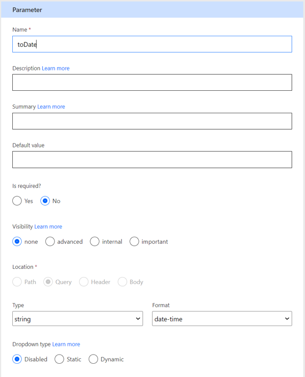
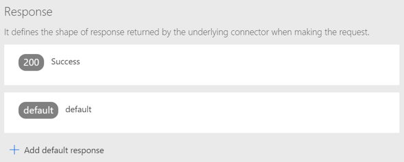
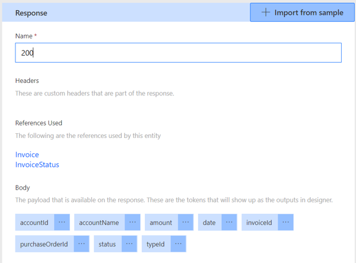
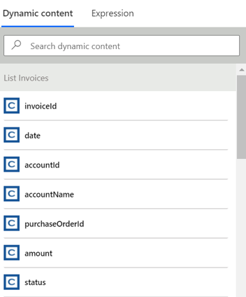
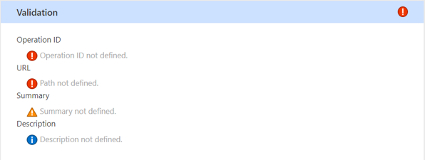
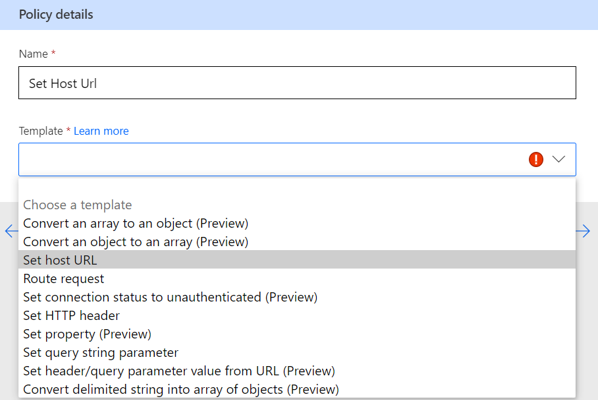

This topic continues explaining the basics of custom connectors by taking an in-depth look at some available configuration options.

## Connector naming and general information

One of the first decisions that you will make is the name of your connector. The name should be unique and clarify what the connector is to the consumer. You are limited to 30 characters for this name, and you can elaborate more in the **Description** field. The **Icon background color** field can also help you visually identify your connector. These fields are important because they show when the user is selecting the connector to use, and these visual cues help a user work more efficiently. If you plan to submit your connector for certification, make sure that you review the stricter requirements in the [Instructions on submitting your connector to Microsoft](https://docs.microsoft.com/connectors/custom-connectors/certification-submission/?azure-portal=true#title) documentation.

> [!div class="mx-imgBorder"]
> 

## Action and trigger naming

After a user has narrowed down to your connector, they will pick an action or trigger to use from the connector. The **Operation ID**, **Summary**, and **Description** fields help you describe each action and trigger. The operation ID is used internally, must be unique, and can't contain spaces. Using camel case, such as GetInvoice, will help simplify your ability to read the ID if you are looking at markup for the definition. The lack of spaces in names can be difficult for makers who use screen readers, but using camel case will help make your definitions more accessible for them.

The **Summary** field is important because it shows up in the list of actions and triggers when you are selecting the one to use. We recommend that you are descriptive enough so that you can tell what the action or trigger does. For example, the GetInvoice action description could be *Get a specific invoice by ID*. Frequently, makers will find the action by searching, so having descriptive names can help them find the right action quickly.

The following image shows where the summary and description elements are used when you select an action or trigger.

> [!div class="mx-imgBorder"]
> 

After you have selected an action or trigger, you will be able to see both summary and description elements on each action card in the designer.

> [!div class="mx-imgBorder"]
> 

In the previous images, notice that the naming patterns are inconsistent, where some names have spaces in the summary and some do not. You can fix that error by updating the fields in the portal or, if you own the API, you can ask the developer to update what they provide on the Open API definition that you import. Be aware that if you manually make changes in the portal and then import the Open API definition again, it will overwrite your changes.

## Action visibility

You can set the **Visibility** option on an action to influence how the action will show in the maker experience.

> [!div class="mx-imgBorder"]
> 

- **None** - This option is the default. The action will display normally.

- **Advanced** - The action will be available but not prioritized.

- **Internal** - The action will be hidden.

- **Important** - The action will be prioritized and will show first.

For example, if you import an Open API definition with 10 actions, and you don't want users to see/use two of them initially, you could select the **internal** option to hide them. This approach is a useful way to handle operations that are used to support dynamic connector metadata. It can also allow you to hide the actions initially and then make them visible later as users request them. Hiding the actions would keep the list that's visible to users as minimal as possible.

Actions that are selected as **important** are shown first. The user needs to select the connector to show any that are selected as **none** or **advanced**. This approach is best used when you have numerous actions and many are not frequently used.

## Request

The request defines what parameters/data will be passed into the operation when the action invokes the operation on the API. When you import an Open API definition or a Postman collection, it will configure the request query, headers, and body settings. You can also import manually by importing from the sample.

The following image shows an example of what the screen looks like when you're looking at the definition.

> [!div class="mx-imgBorder"]
> 

This configuration is important because it translates into what the user sees when they use the action.

> [!div class="mx-imgBorder"]
> 

By editing each of the parameters, or by having the API developer provide more details, you can make the user experience better when you are using the action. Selecting the ellipsis (**...**) on each parameter will show you the following edit screen.

> [!div class="mx-imgBorder"]
> 

The fields and options that you should review and change are:

- **Name** - Do not change; this field must match what the API is expecting.

- **Summary** - Make this field user-friendly, for example, **toDate** would be **To Date**.

- **Description** - This field contains a sentence that describes the parameter. It will be used as a placeholder text for the field.

- **Default value** - This field is an optional default value, but it must be provided if you set visibility to **internal** and make the parameter required.

- **Is required** - Make sure to set this option if API requires a value. This option enables a visual red asterisk next to the field.

- **Visibility** - This parameter works like the visibility option on the previously discussed action. If you have parameters that are not used often, select the **advanced** option.

- **Type and Format** - Make sure that these fields are appropriate because the parameter that's importing from samples makes assumptions that are not always correct.

- **Dropdown type** - Use this parameter to configure a static or dynamic list of values to help make user selection easier and more predictable.

The following image shows an example of what the screen would look like after you fix the **From Date** parameter.

> [!div class="mx-imgBorder"]
> 

## Response

The response defines what you expect to be returned from the API. Unlike the request, which has only a single definition, you can have different responses based on the HTTP status. For example, if your API call generates an error, the body will contain the error details instead of whatever your API returns. You can also have a default response, which is a catch-all response if one isn't available for a specific HTTP status.

> [!div class="mx-imgBorder"]
> 

Selecting one of the responses will reveal the details and, similar to the process with a request, you can edit these items for easier consumption.

> [!div class="mx-imgBorder"]
> 

The items in the response correspond to what shows in the **Dynamic content** panel.

> [!div class="mx-imgBorder"]
> 

Similar to the request, make sure that you've included good names and descriptions because they can help make using the values easier.

## Validation

Notice that a validation section similar to the following image appears at the bottom of the screen.

> [!div class="mx-imgBorder"]
> 

Make sure that this screen doesn't show errors, and then take the time to resolve issues that are listed.

> [!div class="mx-imgBorder"]
> 

## Other settings

This module didn't cover other settings such as triggers, references, and policies.

Triggers can be configured if the API supports either polling or webhook events. When defined, triggers allow you to use your connector as the trigger for a Power Automate flow.

References define reusable parameters and are typically created when you import the definition and it defines a reusable parameter. References can also be handcrafted by using the built-in swagger editor.

Policies can be used to change the behaviors of actions and triggers. Policies are created by using one of the pre-built policy templates.

These advanced topics are covered in detail later in this learning path.

> [!div class="mx-imgBorder"]
> 
