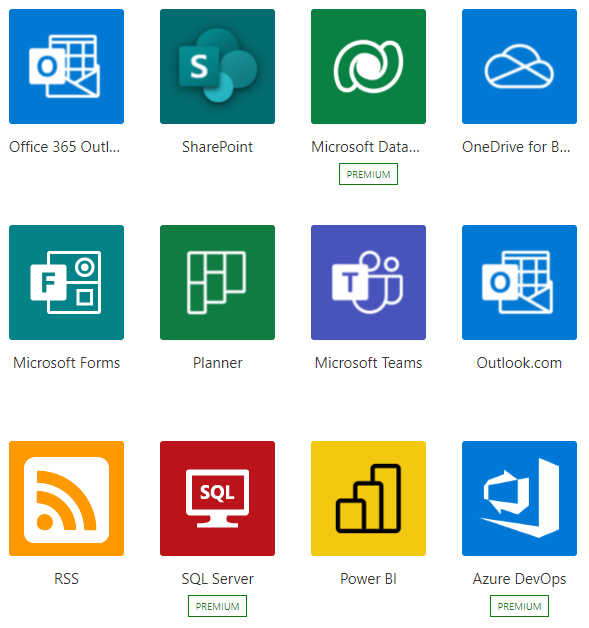
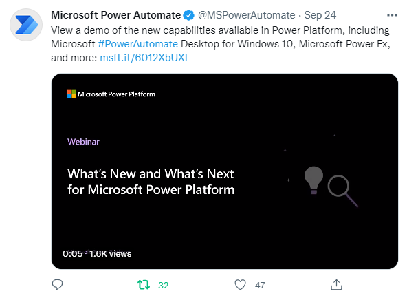
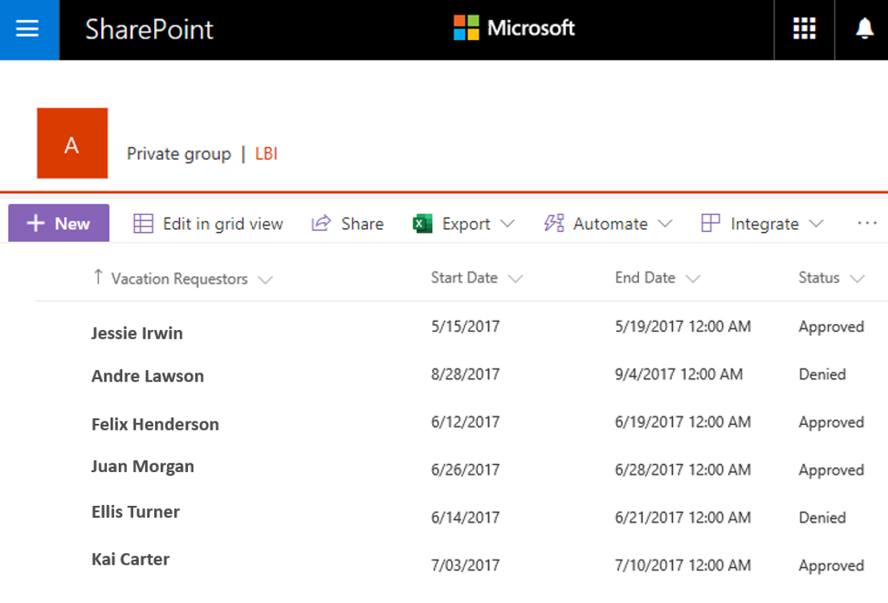
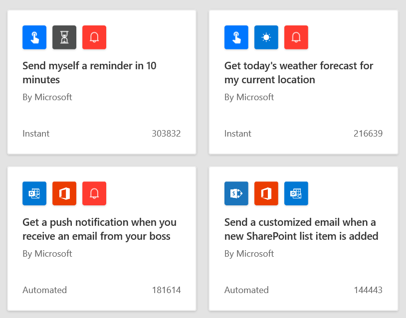
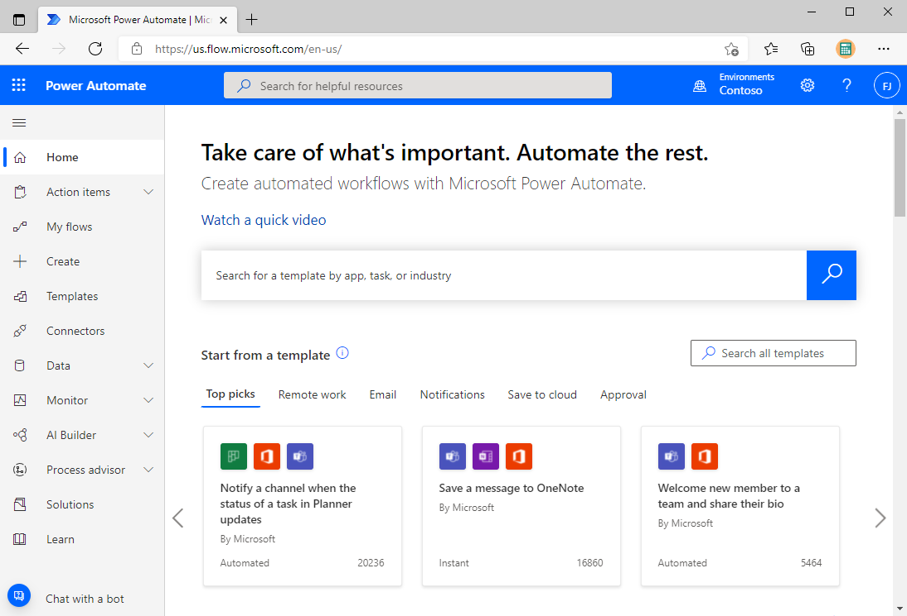

Welcome to Power Automate! In this module, you'll learn how to build flows.

If you're a beginner with Power Automate, this module will get you going. If you already have some experience, this module will tie concepts together and fill in the gaps.

## Learning objectives

In this module, you will:

- Learn what Power Automate is and how it can be used
- Create a flow that automatically saves email attachments
- Learn how to create a button flow to send yourself a reminder
- Create a flow that runs on a schedule
- Create a flow that posts tweets
- Share a flow that your team can use

## What is Power Automate?

Power Automate is an online workflow service that automates actions across the most common apps and services. For example, you can create a flow that adds a lead to Microsoft Dynamics 365 and a record in MailChimp whenever someone with more than 100 followers tweets about your company.

When you sign up, you can connect to more than 500 services, and can manage data either in the cloud or in on-premises sources like SharePoint and Microsoft SQL Server. The list of applications you can use with Power Automate grows constantly.

## What can you do with Power Automate?

You can use Power Automate to automate workflows between your favorite applications and services, sync files, get notifications, collect data, and much more.

For example, you can automate these tasks:

- Instantly respond to high-priority notifications or emails.
- Capture, track, and follow up with new sales leads.
- Copy all email attachments to your OneDrive for Business account.
- Collect data about your business, and share that information with your team.
- Automate approval workflows.

A common use of Power Automate is to receive notifications. For example, you can instantly receive an email or a push notification on your phone whenever a sales lead is added to Dynamics 365 or Salesforce.

You can also use Power Automate to copy files. For example, you can ensure that any file that's added to Dropbox is automatically copied to SharePoint, where your team can find it.

You can monitor what people are saying about your business by creating a flow that runs whenever someone sends a tweet with a certain hashtag. The flow can add details about each tweet to a Facebook post, a SQL Server database, a SharePoint list, or even a Microsoft Excel file that's hosted on OneDrive for Business–-whichever service works for you.

You can create actions to connect the data you collect to Microsoft Power BI, spot trends in that data, and ask questions about it.

The following example shows a flow that saves tweets with the hashtag #MicrosoftFlow to an Excel file.

Also, you can automate approval loops for things like vacation requests on a SharePoint list.

For more ideas, browse our list of templates. Templates help you build flows by making a few configuration changes. For example, you can use templates to easily build flows to send yourself weather forecasts, reminders at regular intervals, or phone notifications whenever your manager sends you mail.

Have an idea for a flow that you don't see in the list? Create your own from scratch and, if you want, share it with the community!

## Where can I create and administer a flow?

You can create a flow and perform administrative tasks in a browser or, if you download the Power Automate mobile app, on your phone.

Here are some of the tasks you can perform with the mobile app:

- Turn flows on or off from wherever you are.
- See when a flow has failed.
- Review detailed run history reports.
- View and filter runs by notification type.

## A brief tour of Power Automate

Let's jump into Power Automate, and we'll show you around. We have tons of information for you to learn about how to use Power Automate.

When you sign in to Power Automate, you'll find these menus:

- **Action items**, where you can manage approvals and business process flows.
- **My flows**, where your flows reside.
- **Create**, where you start a new flow.
- **Templates**, where you can take a look at some of the most popular templates. These should give you some great ideas for flows you want to try.
- **Connectors**, where you can connect from one service to another.
- **Data**, where you can access entities, connections, custom connectors and gateways.
- **Monitor**, where you can view the activity of all your cloud and desktop flows.
- **AI Builder**, where you can build AI models and view the models you created or that have been shared with you.
- **Process advisor**, where you can create processes to help your organization better understand places to streamline workflows. 
- **Solutions**, where you can manage your solutions.
- **Learn**, where you can find information that will help you quickly ramp up on Power Automate.

For now, let's focus on the **?** menu next to your login, which has these options:

- **Documentation** is where our advanced topics reside. If you want to really understand a feature or function, you can do a deep dive here to figure things out.
- **Learn** has learning paths to guide you through using Power Automate, all the way from beginning techniques to advanced scenarios.
- **Support** is a great landing place to find help.
- **Roadmap** is where you can get a glimpse into what will be made in the next product update.
- **Community** is a place to plug into and find out how other people use Power Automate.
- **Give Feedback** taps into a community of power users, and is where you can send comments and questions to developers and other experienced users.
- **Blog** keeps you up to date about the most recent developments and releases in the Power Automate ecosystem.
- **Desktop flows** provides an introduction to Power Automate Desktop.
- **Pricing** can help you choose the right plan for you or your business.
- **Power Automate Desktop** is where you can download Power Automate Desktop and install it on your machine.
- **Power Automate for Mobile** provides information about the mobile app and the platforms it is available on.
- **Data Gateway** provides an overview of the on-premises data gateway.

## What's next?

Let's take a look at the different types of flows that are available in Power Automate.

> [!VIDEO https://www.microsoft.com/videoplayer/embed/RWGzz0] 

