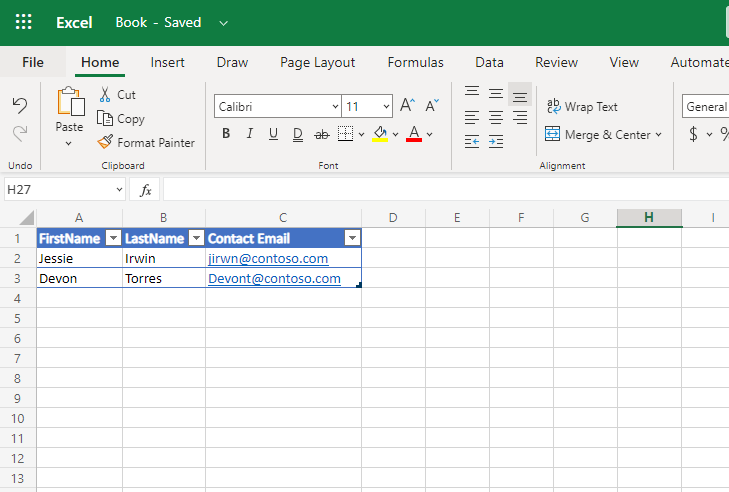
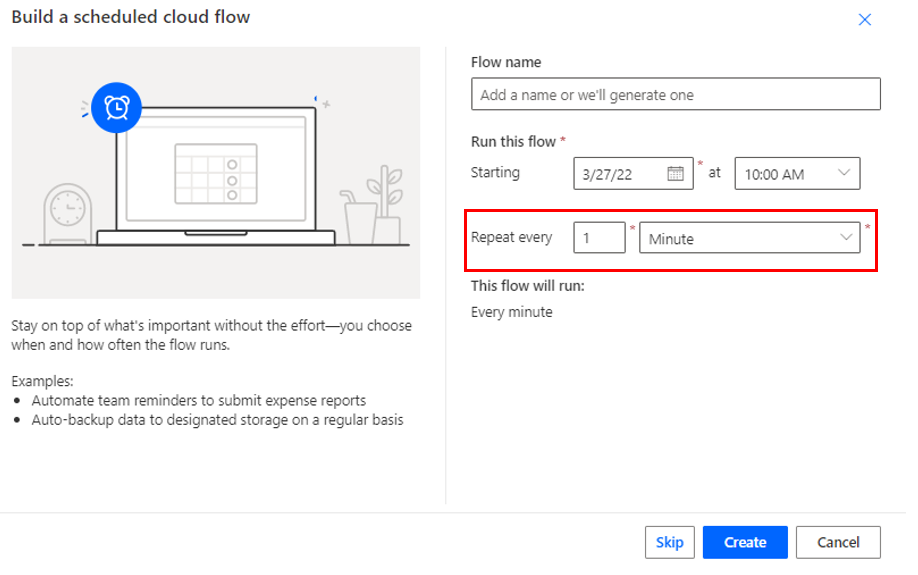
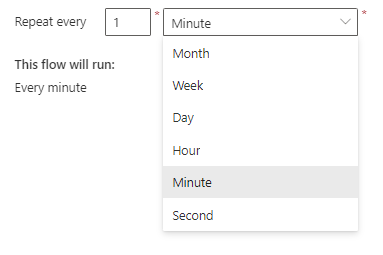
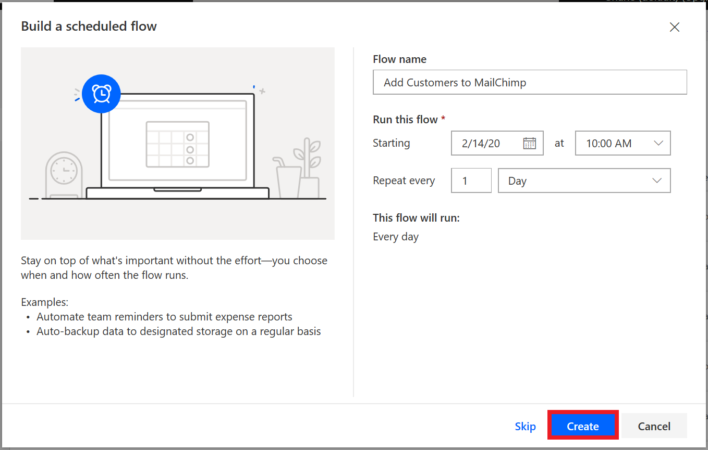
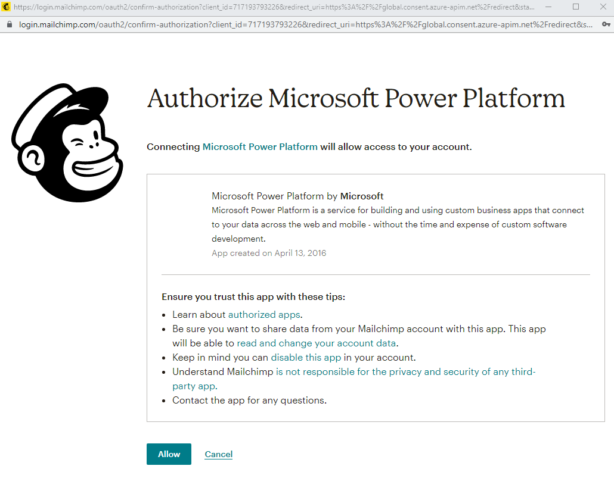
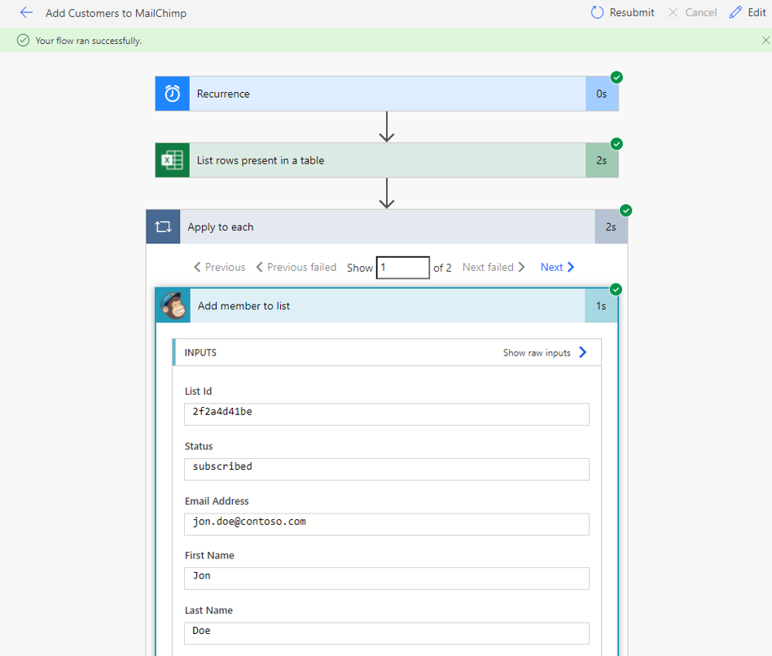

In this unit, you'll learn how to build prescheduled flows by using a trigger called *recurrence*. You'll build a flow for the Contoso marketing team that automatically pulls customer email addresses from a Microsoft Excel workbook on Microsoft OneDrive. You'll then set up the flow so that any new email addresses that anyone adds to the workbook are added to a MailChimp customer list once a day.

## Prerequisites

For this scenario, you’ll need to make an Excel file with a table that contains the following columns: ContactEmail, FirstName, and LastName. Save the Excel file in OneDrive for Business. You'll connect to this file in step 9.

Here’s what the Excel table looks like
    

## Create a scheduled flow

1. Sign in to [Power Automate](https://ms.flow.microsoft.com) by using your organizational account.

1. Select **My flows**.

1. Select **New**, and then select **Scheduled cloud flow**.

    By default you have the option to repeat every 1 minute, however, you have the option to change it and the options available are **Minute**, **Week**, **Day**, **Hour** and **Second**.

    > [!NOTE]
    > Be mindful of the repeating module you select and how often you would like the flows to run.
  
      

      

1. Name your flow and under **Run this flow** set the flow to repeat every one Day.

1. Select **Create**.

    

1. Select **New step**, to add an action.

1. In the search field, enter *excel*, select the **Excel Online (Business)** service, and then select the **List rows present in a table** action.

1. In the **Location** field, select the drop-down arrow and select **OneDrive for Business**.

1. In the **Document Library** field, select the drop-down arrow and select **OneDrive**.

1. In the **File name** field, select the folder button, and then select the Excel file to use.

1. In the **Table name** box, select the drop-down arrow, and then browse to and select the worksheet to use.

    

1. Select **New step**, and then select **Add an action**.

1. In the search field, enter *chimp*, select the **MailChimp** service, and then select the **MailChimp - Add member to list** action.

    > [!NOTE]
    > MailChimp is a premium connector. Depending on your Power Automate license, you might need to sign up for a trial to use this connector. A MailChimp account is required to complete the following steps where a one-time sign-in is required.

    > [!div class="mx-imgBorder"]
    > 

    > [!div class="mx-imgBorder"]
    > 

1. In the **List Id** field, select the desired MailChimp mailing list. In the **Status** field, select *subscribed*.

1. In the **Email Address** field, use the dynamic content feature to add the **ContactEmail** field.

     Your **Add member to list** action will automatically be added inside an **Apply to each**. This location is by design and has occurred because multiple members need to be added. You’ll notice **Value** is added to **Select an out from previous stages**.

1. Use the dynamic content feature to fill in the **First name** and **Last name** fields.

    

And there you have it!

This flow will now run once a day. It will:

- Get the new rows from the Excel worksheet

- Grab the email address and name from each row

- Enter the email address and name in the Contoso MailChimp mail list

- Save you both time and money

Here’s what a successful flow run looks like
    
