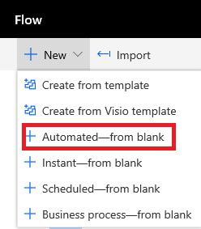

You can create a flow that automatically performs one or more actions after it's triggered by an event. For example, the flow can notify you by email when someone posts a tweet that includes a keyword that you specify. In this example, posting a tweet is the event (also known as a *trigger*), and sending an email notification is the action. In this unit, you'll learn how to create this example flow.

## Prerequisites

* An account on [flow.microsoft.com](https://flow.microsoft.com)
* A Twitter account
* Microsoft Office 365

## Specify an event to start the flow

First, you must select the trigger (event) that starts the flow.

1. Sign in to [Power Automate](https://flow.microsoft.com) by using your organizational account.
1. Select **My flows**.
1. Select **New**, and then select **Automated--from blank**.

    

1. Select **Search hundreds of connectors and triggers**.
1. In the search field, enter *twitter*, select the **Twitter** connector, and then select the **Twitter - When a new tweet is posted** trigger.

    

1. If you haven't already connected your Twitter account to Power Automate, select **Sign in to Twitter**, and then enter your credentials.
1. In the **Search text** box, enter the keyword to find.

    

## Specify an action

1. Select **New step**, and in the search field, enter *send email*, and then select the **Office 365 Outlook - Send an email** action.

    

1. If you're prompted to sign in, select the sign-in button, and then enter your credentials.
1. In the **To** field, enter or paste your email address, and then select your name in the list of contacts that appears.

    

1. In the **Subject** field, enter **New tweet from:** followed by a space.

    

1. In the list of dynamic content, select the **Tweeted by** token to add a placeholder for it.

    

1. Select the **Body** field, and then, in the list of dynamic content, select the **Tweet text** token to add a placeholder for it.
1. Optional: Add more tokens, other content, or both to the body of the email.
1. Select **Save** to save the flow.
1. Post a tweet that includes the keyword that you specified, or wait for someone else to post such a tweet.

    Within a minute after the tweet is posted, an email message will notify you of the new tweet.
