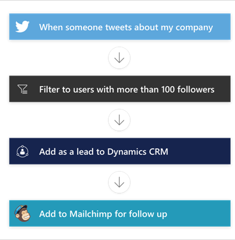
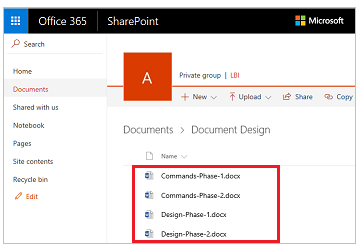
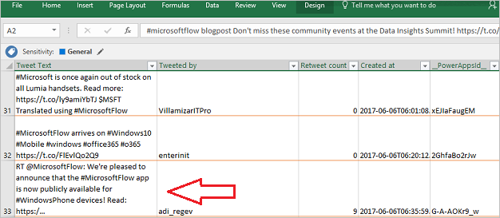
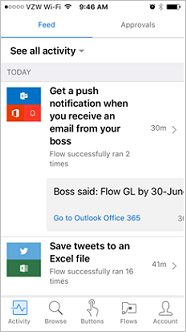

Welcome to Microsoft Flow! In this module, you'll learn how to build two flows:

- A flow that automatically saves email attachments to your Microsoft OneDrive for Business account.
- A flow that collects proposed tweets on a Microsoft SharePoint list and then, if they're approved, posts them.

If you're a beginner with Microsoft Flow, this module will get you going. If you already have some experience, this module will tie concepts together and fill in the gaps.

## What is Microsoft Flow?
Microsoft Flow is an online workflow service that automates events (known as *workflows*) across the most common apps and services. For example, you can create a flow that adds a lead to Microsoft Dynamics 365 and a record in MailChimp whenever someone with more than 100 followers tweets about your company.

When you sign up, you can connect to more than 100 services, and can manage data either in the cloud or in on-premises sources like SharePoint and Microsoft SQL Server. The list of applications and services that you can use with Microsoft Flow grows constantly.

## What can you do with Microsoft Flow?

You can use Microsoft Flow to automate workflows between your favorite applications and services, sync files, get notifications, collect data, and much more. 

For example, you can automate these tasks:

* Instantly respond to high-priority notifications or emails.
* Capture, track, and follow up with new sales leads.
* Copy files from one service to another.
* Copy all email attachments to your OneDrive for Business account.
* Collect data about your business, and share that information with your team.
* Automate approval workflows.

A common use of Microsoft Flow is to receive notifications. For example, you can instantly receive an email or a push notification on your phone whenever a sales lead is added to Dynamics 365 or Salesforce.

You can also use Microsoft Flow to copy files. For example, you can ensure that any file that's added to Dropbox is automatically copied to SharePoint, where your team can find it.

 

 

You can monitor what people are saying about your business by creating a flow that runs whenever someone sends a tweet with a certain hashtag. The flow can add details about each tweet to a SQL Server database, a SharePoint list, or even a Microsoft Excel file that's hosted on OneDrive for Business–whichever service works for you. 

You can create actions to connect the data you collect to Microsoft Power BI, spot trends in that data, and ask questions about it.

Finally, you can automate approval loops for things like vacation requests on a SharePoint list.

For more ideas, browse our list of templates. Templates help you build flows in just a few steps. For example, you can easily build flows to send yourself weather forecasts, reminders at regular intervals, or phone notifications whenever your manager sends you mail.

Have an idea for a flow that you don't see in the list? Create your own from scratch and, if you want, share it with the community!

## Where can I create and administer a flow?

You can create a flow and perform administrative tasks in a browser or, if you download the Microsoft Flow mobile app, on your phone.

Here are some of the tasks you can perform:

* Turn flows on or off from wherever you are.
* See when a flow has failed.
* Review detailed run history reports.
* View and filter runs by notification type.

## A brief tour of Microsoft Flow
Let's jump into the tool, and we'll show you around. We have tons of information for you to learn about how to use Microsoft Flow.

On the home page, you'll find these menus:

* **My flows**, where your flows reside.
* **Templates**, where you can take a look at some of the most popular templates. These should give you some great ideas for flows you want to try.
* **Approvals**, where you can automate and streamline your approval process.
* **Connectors** (formerly called Services), where you can connect from one service to another.
* **Learn**, where you can find information that will help you quickly ramp up on Microsoft Flow.

For now, let's focus on the **Learn** menu, which has these options:

* **Guided Learning** can walk you through using Microsoft Flow, all the way from beginning techniques to advanced scenarios.
* **Documentation** is where our advanced topics reside. If you want to really understand a feature or function, you can do a deep dive here to figure things out.
* **Support** is a great landing place to find help.
* **Community** is a place to plug into and find out how other people use Microsoft Flow.
* **Give Feedback** taps into a community of power users, and is where you can send comments and questions to developers and other experienced users.
* **Blog** keeps you up to date about the most recent developments and releases in the Microsoft Flow ecosystem.
* **Pricing** can help you choose the right plan for you or your business.

## What's next?
Now that you have a taste of what Microsoft Flow is and what it can do, let's take a look at what makes a flow.