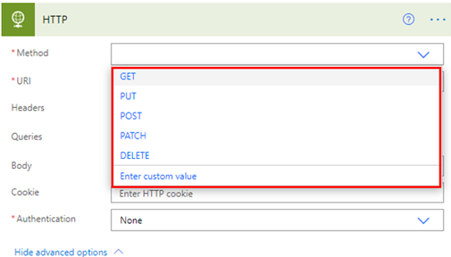
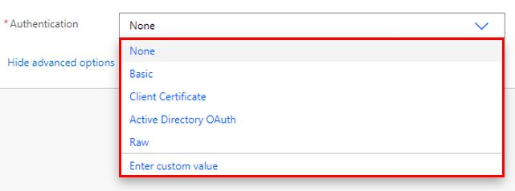
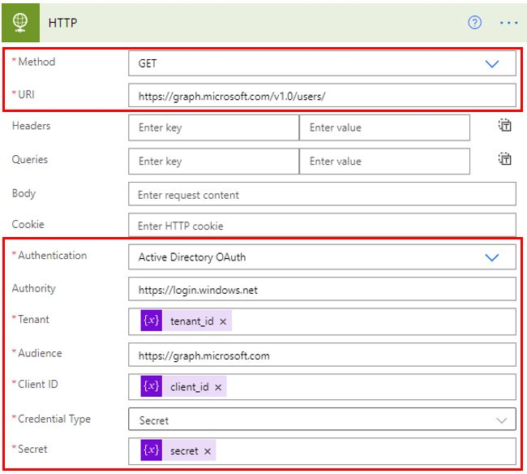

The **Premium HTTP** connection is built-in Power Apps and Power Automate and is provided by Microsoft.

> [!div class="mx-imgBorder"]
> 

The HTTP connector provides the users the option to connect to a service or a data source that a direct connector is not available for. The connection can be made as a **GET, PUT, POST, PATCH, and DELETE** method. It uses a **Uniform Resource Identifier (URI)** to connect.

> [!div class="mx-imgBorder"]
> 

Basic, Client Certificate, Active Directory OAuth and Raw are the authentication options provided as shown in the image below.

> [!div class="mx-imgBorder"]
> 

An example of using an HTTP connector is making a connection to **Microsoft Graph** to gather user information. As the below screenshots show, you use the **GET** method, URI to grap.microsoft.com and the **Active Directory OAuth** authentication to get the desired information in a secure manner.

> [!div class="mx-imgBorder"]
> 

There is also **HTTP + Swagger.**

> [!div class="mx-imgBorder"]
> 

Swagger allows you to describe the structure of your API so that you can get the desired data and receive it in a format that can be manipulated easily.
