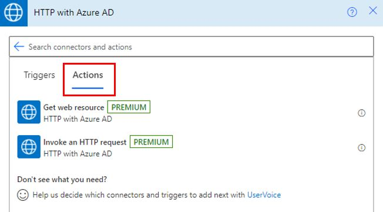
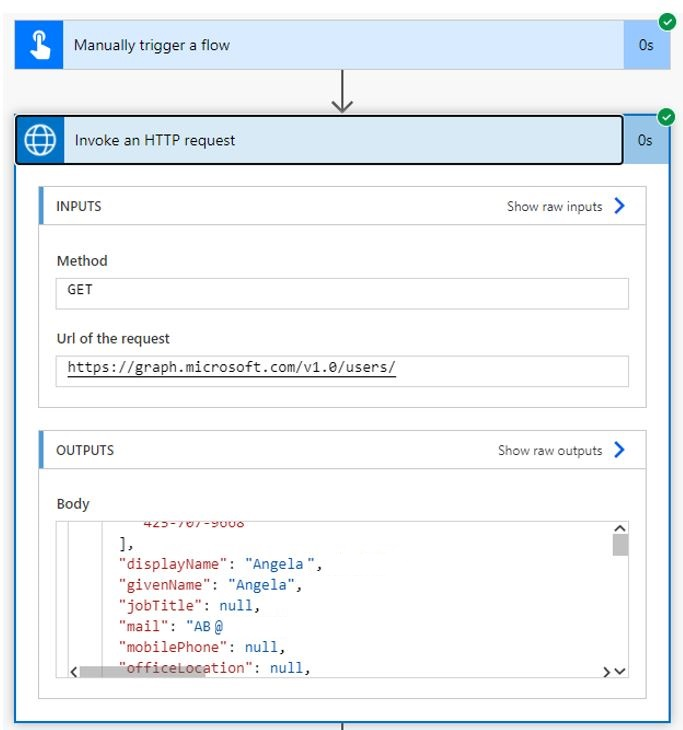

The premium HTTP with Azure AD connector is used to fetch resources from various web services that are authenticated by Microsoft Azure Active Directory (Azure AD) or from an on-premises web service.

> [!div class="mx-imgBorder"]
> 

The connector doesn't have triggers; hence, it needs another connector like the Microsoft Forms connector, SharePoint connector, or you can manually trigger the flow.

> [!div class="mx-imgBorder"]
> 

The following screenshot shows the only two actions that are currently available: **Get web resource** and **Invoke an HTTP request**.

> [!div class="mx-imgBorder"]
> 

You can use the **Get web resource** action to retrieve web resources by issuing an **HTTP GET** request.

> [!div class="mx-imgBorder"]
> 

The **Invoke an HTTP request** helps you access data from an endpoint by using one of the known HTTP verbs, such as **GET**, **DELETE**, **PATCH**, **POST**, and **PUT**.

> [!div class="mx-imgBorder"]
> 

Current known issues and limitations of the HTTP with Azure AD connector are:

-   The connector encodes the request body into base64 encoding; hence, it should be used to call network services that expect the request body in this format. You can't use this connector to call a network service that expects the request body in raw binary format.

-   If you get an error similar to **{ "error": { "code": "Forbidden", "message": "" } }**, it could be because this connector has a limited set of scopes. If your scenario requires something more advanced, make sure that you use the HTTP connector or create a custom connector.

The throttling limit for the **API** calls per connection is **100 calls** for every **60 seconds**.

An example of the limitations with the HTTP with Azure AD connector is invoking an HTTP request to Microsoft Graph to get user information.

> [!div class="mx-imgBorder"]
> 
