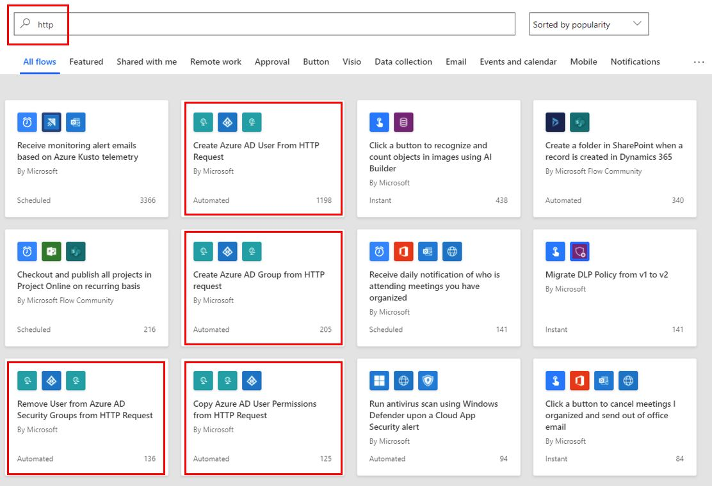

This connector can use incoming API calls as triggers and actions.

> [!div class="mx-imgBorder"]
> 

When used as a trigger it will automatically generate the URL, which can be used as a POST method.

> [!div class="mx-imgBorder"]
> 

Once it is saved the URL is generated.

> [!div class="mx-imgBorder"]
> 

There are a few templates available in Power Automate which use both the **When an HTTP request is received** and **Response.**

> [!div class="mx-imgBorder"]
> 

> [!div class="mx-imgBorder"]
> 
